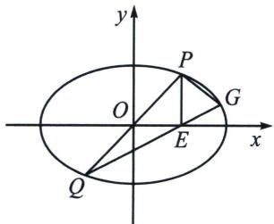

<!-- question-source:start -->
例13 (2019·新课标Ⅱ)已知点A(-2,0)，B(2,0)，动点M(x,y)满足直线AM与BM的斜率之积

为 $-\frac{1}{2}$ . 记M的轨迹为曲线C.

(1)求 C 的方程，并说明 C 是什么曲线；

(2)过坐标原点的直线交 C 于 P，Q 两点，点 P 在第一象限， $PE \perp x$ 轴，垂足为 E，连结 QE 并延长交 C 于点 G.

(i)证明： $\triangle PQG$ 是直角三角形；

(ii) 求 $\triangle PQG$ 面积的最大值.

(1)由题意得 $\frac{y}{x + 2} \times \frac{y}{x - 2} = -\frac{1}{2}$ , 整理得曲线 $C$ 的方程: $\frac{x^2}{4} + \frac{y^2}{2} = 1 (y \neq 0)$ , 所以曲线 $C$ 是焦点在 $x$ 轴上不含长轴端点的椭圆;

(2)解法一(仿射): (i)设 $P(x_{1}, y_{1})$ , 则 $Q(-x_{1}, -y_{1}), E(x_{1}, 0)$ , 所以 $k_{PQ} = \frac{2y_{1}}{2x_{1}} = \frac{y_{1}}{x_{1}}, k_{QG} = \frac{y_{1}}{2x_{1}}$ , 即 $k_{PQ} = 2k_{QG}$ . 作 $\left\{ \begin{array}{l} x' = x \\ y' = \sqrt{2}y \end{array} \right.$ , 则 $(x')^{2} + (y')^{2} = 4, k_{P'Q'} = \sqrt{2}k_{PQ}, k_{Q'G'} = \sqrt{2}k_{QG}, k_{P'G'} = \sqrt{2}k_{PG}$ , 所以 $k_{P'Q'} = 2k_{Q'G'}$ . 又因为 $k_{P'G'} \cdot k_{Q'G'} = -1$ , 所以 $k_{P'G'} \cdot k_{P'Q'} = -2$ , 则 $k_{PG} \cdot k_{PQ} = -1$ , 即 $PQ \perp PG$ , $\triangle PQG$ 是直角三角形.

（ii）设 $k_{P'Q'} = k$ ， $\angle P'Q'G' = \alpha$ ，则 $k_{Q'G'} = \frac{k}{2} (k > 0)$ ， $\tan \alpha = \frac{k - \frac{k}{2}}{1 + k\cdot\frac{k}{2}} = \frac{1}{\frac{2}{k} + k}\in \left(0,\frac{1}{2\sqrt{2}}\right]$ ，所以 $S_{\triangle P'Q'G'}$ $= \frac{1}{2}\cdot |Q'G'|\cdot |P'G'| = \frac{4\sin\alpha\cdot 4\cos\alpha}{2} = \frac{8\sin\alpha\cos\alpha}{\sin^2\alpha + \cos^2\alpha} = \frac{8}{\tan\alpha + \frac{1}{\tan\alpha}}\leqslant \frac{16\sqrt{2}}{9}$ （当 $\tan \alpha = \frac{1}{2\sqrt{2}}$ 时取等），所以 $S_{\triangle PQG} = \frac{\sqrt{2}}{2} S_{\triangle P'Q'G'}\leqslant \frac{16}{9}.$
<!-- question-source:end -->

![[高中/总复习/专题/2026版高中《mst老唐说题》圆锥曲线专题（数学）/下册/第13章_新定义下的斜率调整与仿射/第二节_仿射法与面积转化/五_直径三角形面积最值问题/例题/answers/Q00048894A1.md]]
