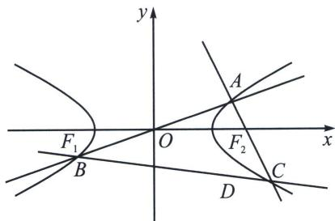

<!-- question-source:start -->
例14（2024·大连期末）已知双曲线 $Q: \frac{x^2}{a^2} - y^2 = 1$ 的离心率为 $\frac{\sqrt{5}}{2}$ ，经过坐标原点 $O$ 的直线 $l$ 与双曲线 $Q$ 交于 $A, B$ 两点，点 $A(x_1, y_1)$ 位于第一象限， $C(x_2, y_2)$ 是双曲线 $Q$ 右支上一点， $AB \perp AC$ ，设 $D(x_1, -\frac{3y_1}{2})$

(1)求双曲线 $Q$ 的标准方程;

(2)求证：C，D，B三点共线；

(3)若 $\triangle ABC$ 面积为 $\frac{48}{7}$ ，求直线 $l$ 的方程.

(1)由双曲线 $Q: \frac{x^2}{a^2} - y^2 = 1$ 的离心率为 $\frac{\sqrt{5}}{2}$ , 所以 $e = \frac{\sqrt{a^2 + 1}}{a} = \frac{\sqrt{5}}{2}$ , 解得 $a = 2$ , 所以双曲线 $Q$ 的标准方程为 $\frac{x^2}{4} - y^2 = 1$ .

(2)证明：由 $A(x_{1},y_{1})$ 得 $B(-x_1, - y_1)$ ，又 $C(x_{2},y_{2})$ ，下面我们证明第三定义 $k_{AC}k_{BC} = \frac{1}{4}$ 由于 $A(x_{1},y_{1}),C(x_{2},y_{2})$ 在双曲线上，所以 $\frac{x_1^2}{4} -y_1^2 = 1,\frac{x_2^2}{4} -y_2^2 = 1,$

相减得 $\frac{x_1^2 - x_2^2}{4} = y_1^2 - y_2^2 \Rightarrow k_{AC}k_{BC} = \frac{(y_1 - y_2)(y_1 + y_2)}{(x_1 - x_2)(x_1 + x_2)} = \frac{1}{4}$ ，由于 $AB \perp AC$ ，所以 $k_{AB}k_{AC} = -1$

所以 $k_{BC} = -\frac{1}{4} k_{AB}$ ，又由于 $k_{BD} = \frac{-\frac{3y_1}{2} + y_1}{x_1 + x_1} = -\frac{1}{4}\frac{y_1}{x_1} = -\frac{1}{4} k_{AB}$ ，所以 $C, D, B$ 三点共线，

(3)设 $A\left(\frac{2}{\cos\alpha}, \tan\alpha\right)$ , $S_{\triangle ABC} = 2|OA|^2\tan\angle ABC = 2\left(\frac{4}{\cos^2\alpha} + \tan^2\alpha\right)\frac{\frac{5k_{OA}}{4}}{1 - \frac{k_{OA}^2}{4}} = \frac{\frac{5}{4}\sin\alpha(\sin^2\alpha + 4)}{\cos^2\alpha\left(1 - \frac{1}{16}\sin^2\alpha\right)} = \frac{48}{7}$ , 所以 $35\sin\alpha(\sin^2\alpha + 4) = 12(1 - \sin^2\alpha)(16 - \sin^2\alpha) = 12[(\sin^2\alpha + 4)^2 - 25\sin^2\alpha]$ , 所以 $\frac{35}{12} = \frac{\sin^2\alpha + 4}{\sin\alpha} - 25\frac{\sin\alpha}{\sin^2\alpha + 4}$ , 换元令 $t = \frac{\sin^2\alpha + 4}{\sin\alpha} \geqslant 5$ , 即 $12t^2 - 35t - 300 = 0$ , $t = \frac{20}{3}$ 或 $t = -\frac{15}{4}$ (舍) 所以 $3\sin^2\alpha - 20\sin\alpha + 12 = 0$ , 所以 $\sin\alpha = \frac{2}{3}$ , $k_{OA} = \frac{\sin\alpha}{2} = \frac{1}{3}$ , 故直线 $l$ 方程为 $y = \frac{1}{3}x$ .

# 14 章 新定义下的面积转化 XINDINGYIXIADEMIANJIZHUANHUA
<!-- question-source:end -->

![[高中/总复习/专题/2026版高中《mst老唐说题》圆锥曲线专题（数学）/下册/第13章_新定义下的斜率调整与仿射/第二节_仿射法与面积转化/五_直径三角形面积最值问题/例题/answers/Q00048895A1.md]]
