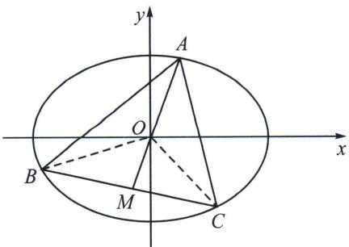
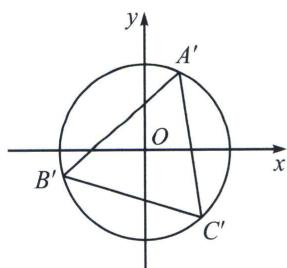

> [!faq]- 《圆锥曲线专题(下册)》例题解析
>
> > [!success]- **【答案】** 详见解析
>
> > [!note]- **【解析】**
> > 解析 (1) $\frac{x^{2}}{2}+y^{2}=1.$
> >
> > 
> >
> > 
> >
> > (2)
> > 解法一(联立韦达): 如图所示, 由于 $\overrightarrow{OA} + \overrightarrow{OB} + \overrightarrow{OC} = 0$ , 则 $\overrightarrow{OA} = -2\overrightarrow{OM}$ .
> >
> > (i) 当 $AB \perp x$ 轴，则此时 $A\left(\frac{\sqrt{2}}{2}, \pm \frac{\sqrt{3}}{2}\right)$ ，则 $S_{\triangle ABC} = \frac{\sqrt{3}}{2} \cdot \frac{3\sqrt{2}}{2} = \frac{3\sqrt{6}}{4}$ ;
> >
> > (ii) 当 AB 斜率存在时，设 AB 的方程为 $y = kx + m$ ， $\left\{\begin{aligned}\frac{x^{2}}{2} + y^{2} &= 1 \\ y &= kx + m\end{aligned}\right.$ ， $(2k^{2} + 1)x^{2} + 4kmx + 2(m^{2} - 1) &= 0$
> >
> > $x_{A} + x_{B} = -\frac{4km}{2k^{2} + 1}$ ，代入 $y_{A} + y_{B} = k(x_{A} + x_{B}) + 2m = \frac{2m}{2k^{2} + 1}$ ，所以 $C\left(\frac{4km}{2k^2 + 1}, - \frac{2m}{2k^2 + 1}\right)$
> >
> > 将 C 点坐标代入椭圆得： $(4km)^{2}+2(2m)^{2}=2(2k^{2}+1)^{2}$ ，即 $4m^{2}=2k^{2}+1$ ，
> >
> > $S_{\triangle AOB} = \frac{\frac{1}{2}\cdot 2\sqrt{2}\cdot|m|\sqrt{2k^2 + 1 - m^2}}{2k^2 + 1} = \frac{\sqrt{6}}{4}$ ，则有 $S_{\triangle ABC} = \frac{3\sqrt{6}}{4}$ 综上所述 $S_{\triangle ABC} = \frac{3\sqrt{6}}{4}$
> >
> > 解法二(坐标面积公式转化): 设 $A(x_{1}, y_{1}), B(x_{2}, y_{2}), C(x_{3}, y_{3})$ .
> >
> > 由 $\overrightarrow{OA} +\overrightarrow{OB} +\overrightarrow{OC} = 0$ 可得 $\left\{ \begin{array}{l}x_{1} + x_{2} + x_{3} = 0\\ y_{1} + y_{2} + y_{3} = 0 \end{array} \right.$ 变形得： $\left\{ \begin{array}{l}(x_1 + x_2)^2 = x_3^2\\ 2(y_1 + y_2)^2 = 2y_3^2 \end{array} \right.$ 相加得： $x_{1}x_{2} + 2y_{1}y_{2} = -1$
> >
> > 所以 $(x_{1}y_{2} - x_{2}y_{1})^{2} = x_{1}^{2}\left(1 - \frac{x_{2}^{2}}{2}\right) + y_{1}^{2}(2 - 2y_{2}^{2}) - 2x_{1}x_{2}y_{1}y_{2} = 2 - \frac{1}{2} (x_{1}x_{2} + 2y_{1}y_{2})^{2} = \frac{3}{2}.$
> >
> > $$
> > S _ {\triangle A B C} = 3 S _ {O A B} = \frac {3}{2} | x _ {1} y _ {2} - x _ {2} y _ {1} | = \frac {3 \sqrt {6}}{4}.
> > $$
> >
> > 解法三(仿射): 令 $\left\{ \begin{array}{l} x' = x \\ y' = \sqrt{2} y \end{array} \right.$ 进行仿射变换, 则仿射后方程为 $x'^2 + y'^2 = 2$ . 如图所示, 圆心 $O$ 既是变换后三角形 $A'B'C'$ 的重心又是外心, 则 $\triangle A'B'C'$ 是等边三角形, 此时其面积为 $S' = \frac{3\sqrt{3}}{4} a^2 = \frac{3\sqrt{3}}{2}$ , $S = \frac{S'}{\sqrt{2}} = \frac{3\sqrt{6}}{4}$
