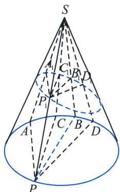

## 第二节 仿射法与面积转化

关于化椭为圆的仿射法，在处理面积问题时候能够达到出奇制胜，我们可以通过仿射法来理解问题，同时也可以按照一些三角换元来解读，现在课本上已经出现仿射法，高考直接用也不担心被扣分。

我们用不同倾斜度的平面与此圆锥面相截，就可得到各种类型的圆锥截线(conicsections)，我们介绍了比利时数学家 G. P. Dandelin 用纯几何方法证明了圆锥截线就是二次曲线，圆锥面的各种截线，凡是不退化的，都能与作为底圆的二阶点列相互射影(射影中心为圆锥的顶点)，因而它们都是二阶点列，我们统称圆锥曲线(conic，或二次曲线).

如图所示, 以圆锥的顶点 $S$ 作为射影中心, $SA 、 SB 、 SC 、 SD$ 作为二阶线束, 在不同的截面进行下形成的各种二阶点列, 所以, 我们通过二阶点列的交比不变性, 来进行化椭为圆的仿射变换, 主要针对高考一些问题的化繁为简。

![[高中/总复习/专题/2026版高中《mst老唐说题》圆锥曲线专题（数学）/下册/第13章_新定义下的斜率调整与仿射/第二节_仿射法与面积转化/一_仿射法与面积变化/一_仿射法与面积变化.md]]
![[高中/总复习/专题/2026版高中《mst老唐说题》圆锥曲线专题（数学）/下册/第13章_新定义下的斜率调整与仿射/第二节_仿射法与面积转化/二_切点圆面积最值/二_切点圆面积最值.md]]
![[高中/总复习/专题/2026版高中《mst老唐说题》圆锥曲线专题（数学）/下册/第13章_新定义下的斜率调整与仿射/第二节_仿射法与面积转化/三_斜率积仿射直角面积定值/三_斜率积仿射直角面积定值.md]]
![[高中/总复习/专题/2026版高中《mst老唐说题》圆锥曲线专题（数学）/下册/第13章_新定义下的斜率调整与仿射/第二节_仿射法与面积转化/四_重心三角形面积定值问题/四_重心三角形面积定值问题.md]]
![[高中/总复习/专题/2026版高中《mst老唐说题》圆锥曲线专题（数学）/下册/第13章_新定义下的斜率调整与仿射/第二节_仿射法与面积转化/五_直径三角形面积最值问题/五_直径三角形面积最值问题.md]]
