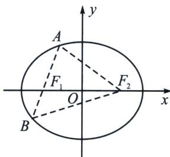

## 一、焦长转化为面积和差

1. 焦长公式：A 是椭圆 $\frac{x^{2}}{a^{2}} + \frac{y^{2}}{b^{2}} = 1 (a > b > 0)$ 上一点， $F_{1}$ 、 $F_{2}$ 是左、右焦点， $\angle AF_{1}F_{2}$ 为 $\alpha\alpha$ ，AB 过 $F_{1}$ ，c 是椭圆半焦距，则
（1） $|AF_{1}| = \frac{b^{2}}{a - c\cos\alpha}$ ;
（2） $|BF_{1}| = \frac{b^{2}}{a + c\cos\alpha}$ ;
（3） $|AB| = \frac{2ab^{2}}{a^{2} - c^{2}\cos^{2}\alpha} = \frac{2ab^{2}}{b^{2} + c^{2}\sin^{2}\alpha}$ .

证明过程利用余弦定理或者复数变换，考试遇到大题一定要证明.

2. 面积之和: ① $S_{\triangle ABF_2} = \frac{|AB|h}{2} = \frac{1}{2} \cdot \frac{2ab^2}{a^2 - c^2\cos^2\alpha} \cdot 2c\sin \alpha = \frac{2ab^2c\sin \alpha}{b^2 + c^2\sin^2\alpha}$ ,

② $S_{\triangle AOB}=\frac{|AB|h_{2}}{2}=\frac{ab^{2}c\sin\alpha}{b^{2}+c^{2}\sin^{2}\alpha},$

最值问题: $S_{\triangle ABF_2} = \frac{|AB|h}{2} = \frac{1}{2} \cdot \frac{2ab^2}{a^2 - c^2 \cos^2 \alpha} \cdot 2c \sin \alpha = \frac{2ab^2 c \sin \alpha}{b^2 + c^2 \sin^2 \alpha} = \frac{2ab^2 c}{\frac{b^2}{\sin \alpha} + c^2 \sin \alpha}$ 分母属于一个对勾函数模型, 取得最值的条件在于 $b$ 与 $c$ 的大小比较, 或者说离心率范围.

①当 $c \geqslant b$ ，即 $e \geqslant \frac{\sqrt{2}}{2}$ 时， $\frac{b^2}{\sin\alpha} + c^2 \sin\alpha \geqslant 2bc$ ，当仅当 $\sin\alpha = \frac{b}{c}$ 时等号成立，此时 $S_{\triangle ABF_2\max} = \frac{2ab^2c}{2bc} = ab$ .

②当 c<b，即 $e<\frac{\sqrt{2}}{2}$ 时， $\frac{b^{2}}{\sin\alpha}+c^{2}\sin\alpha\geqslant b^{2}+c^{2}=a^{2}$ ，当 $\sin\alpha=1$ 时等号成立，此时 $S_{\triangle ABF_{2}\max}=\frac{2b^{2}c}{a}$ .

3. 面积之差: $\left| {S}_{{A}{F}_{1}{F}_{2}} - {S}_{{B}{F}_{1}{F}_{2}}\right|  = \frac{2c \cdot  \sin \alpha \left| {\left| A{F}_{1}\right|  - \left| B{F}_{1}\right| }\right| }{2} = \frac{2bc\sin \alpha \cos \alpha }{{b}^{2}\cos ^{2}\alpha  + {a}^{2}\sin ^{2}\alpha } = \frac{2bc}{{a}^{2}\tan \alpha  + \frac{{b}^{2}}{\tan \alpha }} \leq  \frac{e}{a} =$

e，当且仅当 $\tan\alpha=\pm\frac{b}{a}$ 时等号成立.

![[高中/总复习/专题/2026版高中《mst老唐说题》圆锥曲线专题（数学）/下册/第14章_新定义下的面积转化/第一节_过焦点弦的面积问题/一_焦长转化为面积和差/例题/Q00048899.md]]
![[高中/总复习/专题/2026版高中《mst老唐说题》圆锥曲线专题（数学）/下册/第14章_新定义下的面积转化/第一节_过焦点弦的面积问题/一_焦长转化为面积和差/例题/Q00048900.md]]
![[高中/总复习/专题/2026版高中《mst老唐说题》圆锥曲线专题（数学）/下册/第14章_新定义下的面积转化/第一节_过焦点弦的面积问题/一_焦长转化为面积和差/例题/Q00048901.md]]
![[高中/总复习/专题/2026版高中《mst老唐说题》圆锥曲线专题（数学）/下册/第14章_新定义下的面积转化/第一节_过焦点弦的面积问题/一_焦长转化为面积和差/例题/Q00048902.md]]
![[高中/总复习/专题/2026版高中《mst老唐说题》圆锥曲线专题（数学）/下册/第14章_新定义下的面积转化/第一节_过焦点弦的面积问题/一_焦长转化为面积和差/例题/Q00048903.md]]
![[高中/总复习/专题/2026版高中《mst老唐说题》圆锥曲线专题（数学）/下册/第14章_新定义下的面积转化/第一节_过焦点弦的面积问题/一_焦长转化为面积和差/例题/Q00048904.md]]
