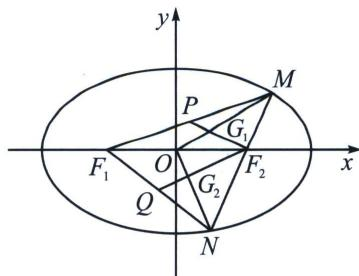

<!-- question-source:start -->
例6（2024·华大新高考联盟模拟）已知椭圆 $C: \frac{x^2}{a^2} + \frac{y^2}{b^2} = 1 (a > b > 0)$ 短轴长为 2，左、右焦点分别为 $F_1, F_2$ ，过点 $F_2$ 的直线 $l$ 与椭圆 $C$ 交于 $M, N$ 两点，其中 $M, N$ 分别在 $x$ 轴上方和下方， $\overrightarrow{MP} = \overrightarrow{PF_1}, \overrightarrow{NQ} = \overrightarrow{QF_1}$ ，直线 $PF_2$ 与直线 $MO$ 交于点 $G_1$ ，直线 $QF_2$ 与直线 $NO$ 交于点 $G_2$ .

(1) 若 $G_{1}$ 坐标为 $\left(\frac{1}{3}, \frac{1}{6}\right)$ ，求椭圆 C 的方程；

(2) 若 $4S_{\triangle MNG_2} \leqslant 3S_{\triangle NF_1G_1} \leqslant 5S_{\triangle MNG_2}$ , 求实数 $a$ 的取值范围.

<!-- question-source:end -->

![[高中/总复习/专题/2026版高中《mst老唐说题》圆锥曲线专题（数学）/下册/第14章_新定义下的面积转化/第一节_过焦点弦的面积问题/一_焦长转化为面积和差/例题/answers/Q00048904A1.md]]
