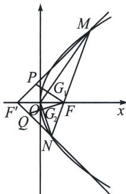

<!-- question-source:start -->
例5 (湖北省“高中名校联盟·圆创教育”联盟2025届高三下学期5月模拟T18)已知F为抛物线 $\Gamma: y^{2}=2px(p>1)$ 的焦点， $M(x_{0}, y_{0})$ 为 $\Gamma$ 在第一象限上的动点，当 $y_{0}=1$ 时， $|MF|=\frac{5}{4}$ . 设 $\Gamma$ 的准线与x轴交于点 $F$ ， $MF$ 与 $\Gamma$ 交于点 $N$ ， $\overrightarrow{MP} = 2\overrightarrow{PF'}$ ， $\overrightarrow{NQ} = 2\overrightarrow{QF'}$ ， $MO$ 与 $FP$ 交于点 $G_{1}$ ， $NO$ 与 $FQ$ 交于点 $G_{2}$

(1)求 $\Gamma$ 的方程;

(2)求 $G_{1}$ 的轨迹方程;

(3) 若 $2S_{\triangle MNG_1} \leqslant 3S_{\triangle NF'G_1} \leqslant 4S_{\triangle MNG_2}$ , 求 $y_0$ 的取值范围.
<!-- question-source:end -->

![[高中/总复习/专题/2026版高中《mst老唐说题》圆锥曲线专题（数学）/下册/第14章_新定义下的面积转化/第一节_过焦点弦的面积问题/一_焦长转化为面积和差/例题/answers/Q00053241A1.md]]
