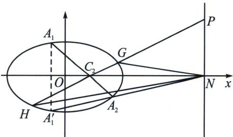

> [!faq]- 《圆锥曲线专题(下册)》例题解析
>
> > [!success]- **【答案】** 详见解析
>
> > [!note]- **【解析】**
> > 解析 (1)设动圆 $M$ 的半径为 $r$ , 由题意得圆 $C_1$ 和圆 $C_2$ 的半径分别为 7, 1, 因为 $M$ 与 $C_1, C_2$ 都内切, 所以 $|MC_1| = 7 - r, |MC_2| = r - 1$ , 所以 $|MC_1| + |MC_2| = 7 - r + r - 1 = 6$ , 又 $C_1(-1,0), C_2(1,0)$ , 故 $|C_2C_1| = 2 < 6 = |MC_1| + |MC_2|$ , 所以圆心 $M$ 的轨迹是以 $C_1, C_2$ 为焦点的椭圆, 设 $\Gamma$ 的方程为: $\frac{x^2}{a^2} + \frac{y^2}{b^2} = 1 (a > b > 0)$ , 则 $2a = 6, 2c = 2$ , 所以 $b^2 = a^2 - c^2 = 8$ , 故 $\Gamma$ 的方程为: $\frac{x^2}{9} + \frac{y^2}{8} = 1$ ; (2)(i)证明: 设 $A_1(x_1, y_1), A_2(x_2, y_2), P(9, t) (t \neq 0)$ , 由题意中的性质可得, 切线 $PA_1$ 方程为 $\frac{xx_1}{9} + \frac{yy_1}{8} = 1$ , 切线 $PA_2$ 方程为 $\frac{xx_2}{9} + \frac{yy_2}{8} = 1$ , 因为两条切线都经过点 $P(9, t) (t \neq 0)$ , 所以 $x_2 + \frac{ty_2}{8} = 1$ , 故直线 $A_1A_2$ 的方程为: $x + \frac{ty}{8} = 1$ , 所以直线 $A_1A_2$ 的斜率为 $-\frac{8}{t}$ . 又 $k_{PC_2} = \frac{t - 0}{9 - 1} = \frac{t}{8}, \frac{t}{8} \times \left(-\frac{8}{t}\right) = -1$ , 所以直线 $A_1A_2 \perp PC_2$ ;
> >
> > 
> >
> > （ii）由（i）知直线 $A_{1}A_{2}$ 的方程为： $x + \frac{ty}{8} = 1$ ，过定点 $C_{2}(1,0)$ ，令 $A_{1}(x_{1},y_{1})$ ， $A_{1}'(x_{1}, - y_{1})$ ， $A_{2}(x_{2},y_{2})$ ， $\overrightarrow{A_1C_2} = \lambda \overrightarrow{C_2A_2} \Leftrightarrow \frac{x_1 + \lambda x_2}{1 + \lambda} = 1$ ，在直线 $A_{1}A_{2}$ 上存在一点 $Q$ ，使 $\overrightarrow{A_1Q} = -\lambda \overrightarrow{QA_2}$ ，所以 $\left\{ \begin{array}{l} \frac{x_1 + \lambda x_2}{1 + \lambda} = 1 \\ \frac{y_1 + \lambda y_2}{1 + \lambda} = 0 \end{array} \right.$ ，故 $\left\{ \begin{array}{l} \frac{x_1^2}{9} + \frac{y_1^2}{8} = 1 \\ \frac{y_1 - \lambda y_2}{1 - \lambda} = y_Q \end{array} \right.$ ，两式相减得： $\frac{(x_1 + \lambda x_2)(x_1 - \lambda x_2)}{9(1 + \lambda)(1 - \lambda)} + \frac{(y_1 + \lambda y_2)(y_1 - \lambda y_2)}{8(1 + \lambda)(1 - \lambda)} = 1$ ，即 $x_Q = 9$ ，所以 $\left\{ \begin{array}{l} x_1 + \lambda x_2 = (1 + \lambda) \\ x_1 - \lambda x_2 = 9(1 - \lambda) \\ y_1 + \lambda y_2 = 0 \end{array} \right.$ ，即 $\left\{ \begin{array}{l} x_1 = 5 - 4\lambda \\ x_2 = 5 - \frac{4}{\lambda} \\ y_1 + \lambda y_2 = 0 \end{array} \right.$ ，因为 $A_{1}'$ 、 $A_{2}$ 、 $N$ 三点共线，所以 $\frac{-y_1}{x_1 - x_N} = \frac{y_2}{x_2 - x_N}$ ，所以 $x_N = 9$ ，令 $\angle GC_2N = \alpha$ ，根据焦长公式 $|S_1 - S_2| = \frac{(|GC_2| - |HC_2|) \cdot 8\sin\alpha}{2} = 4\left(\frac{8}{3 - \cos\alpha} - \frac{8}{3 + \cos\alpha}\right) \cdot \sin\alpha = \frac{64\sin\alpha\cos\alpha}{9\sin^2\alpha + 8\cos^2\alpha} = \frac{64}{9 \cdot \frac{\sin\alpha}{\cos\alpha} + 8\frac{\cos\alpha}{\sin\alpha}} \leqslant \frac{8\sqrt{2}}{3}$ ，当仅当 $k^2 = \tan^2\alpha = \frac{8}{9}$ 等号成立。所以 $S_1 - S_2$ 的取值范围为 $\left[-\frac{8\sqrt{2}}{3}, \frac{8\sqrt{2}}{3}\right]$ 。
