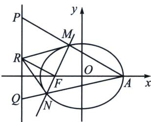

<!-- question-source:start -->
例16（2023·湖北模拟）已知椭圆 $\frac{x^{2}}{9}+\frac{y^{2}}{5}=1$ 的右顶点为A，左焦点为F，过点F作斜率不为零的直线l交椭圆于M，N两点，连接AM，AN分别交直线 $x=-\frac{9}{2}$ 于P，Q两点，过点F且垂直于MN的直线交直线 $x=-\frac{9}{2}$ 于点R.

(1)求证：点 $R$ 为线段 $PQ$ 的中点；

(2)记 $\triangle MPR$ ， $\triangle MRN$ ， $\triangle NRQ$ 的面积分别为 $S_{1}$ ， $S_{2}$ ， $S_{3}$ ，试探究：是否存在实数 $\lambda$ 使得 $\lambda S_{2}=S_{1}+S_{3}$ ？若存在，请求出实数 $\lambda$ 的值；若不存在，请说明理由。

<!-- question-source:end -->

![[高中/总复习/专题/2026版高中《mst老唐说题》圆锥曲线专题（数学）/下册/第14章_新定义下的面积转化/第一节_过焦点弦的面积问题/七_焦点准线关联与面积比值转化/例题/answers/Q00053251A1.md]]
