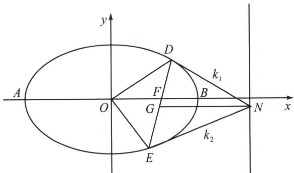

> [!faq]- 《圆锥曲线专题(下册)》例题解析
>
> > [!success]- **【答案】** 详见解析
>
> > [!note]- **【解析】**
> > 解析 (1)设椭圆的半焦距为 $c(c > 0)$ . 由题意知 $\left\{ \begin{array}{l} a^{2} = b^{2} + c^{2} \\ \frac{c}{a} = \frac{1}{2} \\ \frac{1}{a^{2}} + \frac{9}{4b^{2}} = 1 \end{array} \right.$ , 解得 $a = 2, b = \sqrt{3}$ , 所以 $C$ 的方程为 $\frac{x^2}{4} + \frac{y^2}{3} = 1$ .
> >
> > 
> >
> > (2)(i)令 $\angle DFB = \alpha$ ， $S_{\triangle DOE} = \frac{|DE|h}{2} = \frac{ab^2c\sin\alpha}{b^2 + c^2\sin^2\alpha} = \frac{6\sin\alpha}{3 + \sin^2\alpha} = \frac{6}{\frac{3}{\sin\alpha} + \sin\alpha}\in \left(0,\frac{3}{2}\right]$ ，当且仅当 $\sin \alpha$
> >
> > =1 取得最大.
> >
> > (ii) $x_{D} = c + |DF|\cos \alpha = 1 + \frac{3\cos\alpha}{2 + \cos\alpha}, y_{D} = |DF|\sin \alpha = \frac{3\sin\alpha}{2 + \cos\alpha}$ ，同理 $x_{E} = c - |DF|\cos \alpha = 1 - \frac{3\cos\alpha}{2 - \cos\alpha}$ ， $y_{E} = -|DF|\sin \alpha = \frac{-3\sin\alpha}{2 - \cos\alpha}$ ，所以 $y_{N} = \frac{y_{D} + y_{E}}{2}, k_{1} = -\frac{y_{D} - y_{N}}{4 - x_{D}}, k_{2} = \frac{y_{N} - y_{E}}{4 - x_{E}}$
> >
> > 所以 $|k_{1} - k_{2}| = |y_{D} - y_{N}|\cdot \left|\frac{1}{4 - x_{D}} +\frac{1}{4 - x_{E}}\right| = \frac{2}{3}|y_{D} - y_{N}| = \frac{1}{3}|y_{D} - y_{E}| = \frac{4\sin\alpha}{3 + \sin^{2}\alpha}$ ，所以 $\frac{S}{|k_1 - k_2|} =$ $\frac{3}{2}$ 为定值.
