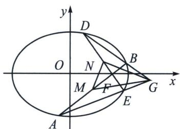

<!-- question-source:start -->
例7 (2024·九省联考 T18)已知椭圆 C: $\frac{x^{2}}{a^{2}} + \frac{y^{2}}{b^{2}} = 1 (a > b > 0)$ ，过右焦点 F 的直线 l 交 C 于 A, B 两点，过点 F 与 l 垂直的直线交 C 于 D, E 两点，其中 B, D 在 x 轴上方，M, N 分别为 AB, DE 的中点。当 $l \perp x$ 轴时， $|AB| = \sqrt{2}$ ，椭圆 C 的离心率为 $\frac{\sqrt{2}}{2}$ 。

(1)求椭圆 C 的标准方程;

(2)证明：直线 $MN$ 过定点，并求定点坐标；

(3)设 G 为直线 AE 与直线 BD 的交点，求 $\triangle GMN$ 面积的最小值.

(1)因为当 $l \perp x$ 轴时, $|AB| = \sqrt{2} = 2\frac{b^2}{a}$ , 椭圆 $C$ 的离心率为 $\frac{\sqrt{2}}{2}$ , 解得 $b = c = 1$ , $a = \sqrt{2}$ ,

则椭圆 C 的标准方程为 $\frac{x^{2}}{2} + y^{2} = 1$ ;

(2)证明：B，D 在 x 轴上方，直线 l 斜率存在且不为 0，

$k_{AB}=\frac{y_{2}-y_{1}}{x_{2}-x_{1}}=-\frac{x_{1}+x_{2}}{2(y_{1}+y_{2})}=-\frac{x_{M}}{2y_{M}}$ ，同时满足 $k_{AB}=\frac{y_{M}}{x_{M}-1}$ ，同理 $k_{DE}=-\frac{x_{N}}{2y_{N}}$ ，且同时满足 $k_{DE}=$ $\frac{y_{N}}{x_{N}-1},\left\{\begin{aligned}-\frac{x_{M}}{2y_{M}}\cdot\frac{y_{N}}{x_{N}-1}&=-1\\-\frac{y_{M}}{x_{M}-1}\cdot\frac{x_{N}}{2y_{N}}&=-1\end{aligned}\right.\Rightarrow\left\{\begin{aligned}x_{MYN}=2x_{NYM}-2y_{M}\\ x_{NYM}=2x_{MYN}-2y_{N}\end{aligned}\right.\Rightarrow x_{MYN}-x_{NYM}=\frac{2}{3}(y_{N}-y_{M})\Rightarrow MN$ 过点 $\left(\frac{2}{3},0\right)$ ;

(3)因为 $M, N$ 分别为 $AB, DE$ 的中点，所以 $S_{\triangle GMN} = S_{\triangle GDM} - S_{\triangle DMN} - S_{\triangle GDN} = \frac{1}{2} S_{\triangle GAD} - \frac{1}{2} S_{\triangle DEM} - \frac{1}{2} S_{\triangle GDE} = \frac{1}{2} S_{\triangle ADE} - \frac{1}{2} S_{\triangle MDE} = \frac{1}{2} \cdot \frac{1}{2} \cdot |DE| \cdot |AM| = \frac{1}{8} |DE| \cdot |AB|$ ，利用焦长公式， $|AB| = \frac{2ab^2}{b^2 + c^2 \sin^2 \alpha} = \frac{2\sqrt{2}}{1 + \sin^2 \alpha}$ ；同理 $|DE| = \frac{2\sqrt{2}}{1 + \cos^2 \alpha}$ ， $S_{\triangle GMN} = \frac{1}{8} \cdot \frac{8}{(1 + \cos^2 \alpha)(1 + \sin^2 \alpha)} = \frac{1}{2 + \left(\frac{\sin 2\alpha}{2}\right)^2} \geqslant \frac{48}{2 + \frac{1}{4}} = \frac{4}{9}$ ，当且仅当 $\alpha = \frac{\pi}{4}$ 或 $\alpha = \frac{3\pi}{4}$ 时取等， $S_{\triangle GMN_{\min}} = \frac{4}{9}$ .
<!-- question-source:end -->

![[高中/总复习/专题/2026版高中《mst老唐说题》圆锥曲线专题（数学）/下册/第14章_新定义下的面积转化/第一节_过焦点弦的面积问题/二_焦点弦中点连线隐藏定点与面积转化/例题/answers/Q00048905A1.md]]
