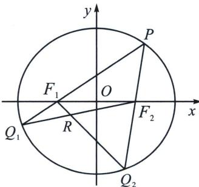

<!-- question-source:start -->
例12 (2025·成都外国语)已知椭圆 $\Gamma: \frac{x^2}{4} + \frac{y^2}{3} = 1$ 的左、右焦点分别为 $F_1$ 、 $F_2$ ，设 $P$ 是第一象限内椭圆 $\Gamma$ 上一点， $PF_1$ 、 $PF_2$ 的延长线分别交椭圆 $\Gamma$ 于点 $Q_1$ 、 $Q_2$ ，直线 $Q_1F_2$ 与 $Q_2F_1$ 交于点 $R$ .

(1)当 $PF_{2}$ 垂直于 x 轴时，求直线 $Q_{1}Q_{2}$ 的方程；

(2)记 $\triangle F_{1}Q_{1}R$ 与 $\triangle F_{2}Q_{2}R$ 的面积分别为 $S_{1}$ 、 $S_{2}$ ，求 $S_{2}-S_{1}$ 的最大值.

(1)由椭圆 $\Gamma: \frac{x^2}{4} + \frac{y^2}{3} = 1$ 的方程可得 $a^2 = 4, b^2 = 3$ , 可得 $c^2 = a^2 - b^2 = 4 - 3 = 1$ ,

可得 a=2, c=1，可得 $F_{1}(-1,0)$ ， $F_{2}(1,0)$ ，当 $PF_{2}$ 垂直于 x 轴时，则 $Q_{2}$ 的纵坐标为 $y=-\frac{b^{2}}{a}=-\frac{3}{2}$ ，所以 $Q_{2}\left(1,\frac{\frac{3}{2}}{1-(-1)}-\frac{3}{2}\right)$ ， $P\left(1,\frac{3}{2}\right)$ ，所以 $k_{PF_{1}}=\frac{\frac{3}{2}}{1-(-1)}$ ，直线 $PF_{1}$ 的方程为： $y=\frac{3}{4}(x+1)$ ，
联立 $\left\{\begin{aligned}y&=\frac{3}{4}(x+1)\\ \frac{x^{2}}{4}&+\frac{y^{2}}{3}=1\end{aligned}\right.$ ，解得 $\left\{\begin{aligned}x&=1\\ y&=\frac{3}{2}\end{aligned}\right.$ 或 $\left\{\begin{aligned}x&=-\frac{13}{7}\\ y&=-\frac{9}{14}\end{aligned}\right.$ ，则 $Q_{1}\left(-\frac{13}{7},-\frac{9}{14}\right)$ ，所以 $k_{Q_{1}Q_{2}}=\frac{-\frac{3}{2}+\frac{9}{14}}{1+\frac{13}{7}}=-\frac{3}{10}$ ，
所以直线 $Q_{1}Q_{2}$ 的方程为 $y+\frac{3}{2}=-\frac{3}{10}(x-1)$ ，即 $3x+10y+12=0$ ;
(2)设 $P(x_{0},y_{0})(x_{0}>0,y_{0}>0)$ ， $Q_{1}(x_{1},y_{1})$ ， $Q_{2}(x_{2},y_{2})$ 解法一（坐标齐次化）：P、 $F_{1}$ 、 $Q_{1}$ 三点共线，则 $x_{0}y_{1}-x_{1}y_{0}=-(y_{1}-y_{0})①$ 利用 $x_{0}^{2}y_{1}^{2}-x_{1}^{2}y_{0}^{2}=(x_{0}y_{1}-x_{1}y_{0})(x_{0}y_{1}+x_{1}y_{0})$ ，利用 $x_{0}^{2}=4-\frac{4}{3}y_{0}^{2}$ ， $x_{1}^{2}=4-\frac{4}{3}y_{1}^{2}$ ， $x_{2}^{2}=4-\frac{4}{3}y_{2}^{2}$ 可得 $x_{1}y_{0}+x_{0}y_{1}=-4(y_{1}+y_{0})②$ ，综合①②可得： $y_{1}=\frac{-3y_{0}}{5+2x_{0}}$ ，同理可得 $y_{2}=\frac{-3y_{0}}{5-2x_{0}}$ 所以 $S_{2}-S_{1}=S_{\triangle Q_{2}F_{1}F_{2}}-S_{\triangle Q_{1}F_{1}F_{2}}=\frac{1}{2}|F_{1}F_{2}|×|y_{2}|-\frac{1}{2}|F_{1}F_{2}|×|y_{1}|=\frac{12x_{0}y_{0}}{25-4x_{0}^{2}}$ 令 $x_{0}=2\cos\theta,\quad y_{0}=\sqrt{3}\sin\theta,\quad 0<\theta<\frac{\pi}{2}$

则 $S_{2} - S_{1} = \frac{24\sqrt{3}\sin\theta\cos\theta}{25 - 16\cos^{2}\theta} = \frac{24\sqrt{3}\sin\theta\cos\theta}{25\sin^{2}\theta + 9\cos^{2}\theta} \leqslant \frac{24\sqrt{3}\sin\theta\cos\theta}{2\times 5\sin\theta\times 3\cos\theta} = \frac{4\sqrt{3}}{5}$ ，当且仅当 $25\sin^2\theta = 9\cos^2\theta$ 时等号成立，所以 $S_{2} - S_{1}$ 的最大值为 $\frac{4\sqrt{3}}{5}$ .
<!-- question-source:end -->

![[高中/总复习/专题/2026版高中《mst老唐说题》圆锥曲线专题（数学）/下册/第14章_新定义下的面积转化/第一节_过焦点弦的面积问题/五_隐藏的焦弦常数与三角形面积比值转化/例题/answers/Q00048910A1.md]]
