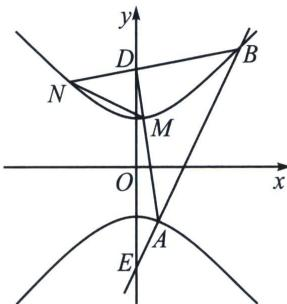

> [!faq]- 《圆锥曲线专题(下册)》例题解析
>
> > [!success]- **【答案】** 详见解析
>
> > [!note]- **【解析】**
> > 解析 (1) 当 $k=0$ 时, 此时直线 $l$ 为 $y=-2$ , 代入双曲线可得, $x^{2}=4-a^{2}$ , 从而 $x=\pm\sqrt{4-a^{2}}$ , 因此 $|AB|=2\sqrt{4-a^{2}}=2\sqrt{3}$ , 解得 $a^{2}=1$ , 故双曲线方程为 $y^{2}-x^{2}=1$ .
> >
> > 
> >
> > (2)(i)依题意, 直线 $l$ 的斜率存在, 设 $A(x_{1}, y_{1})$ , $B(x_{2}, y_{2})$ , 不妨与上支交于点 $B$ , 直线 $AB: y = kx - 2$ , 联立 $\left\{ \begin{array}{l} y = kx - 2, \\ y^{2} - x^{2} = 1, \end{array} \right.$ 得 $(k^{2} - 1)x^{2} - 4kx + 3 = 0$ , 则 $x_{1} + x_{2} = \frac{4k}{k^{2} - 1}$ , $x_{1}x_{2} = \frac{3}{k^{2} - 1}$ , $\Delta = 16k^{2} - 12(k^{2} - 1) = 4(k^{2} + 3) > 0$ , 注意到直线 $l$ 与上, 下两支交于 $B$ , $A$ 两点, 故 $x_{1}x_{2} = \frac{3}{k^{2} - 1} > 0$ , 即 $k^{2} > 1$ . 注意到 $BD$ 与双曲线上支交于两点, 因此 $k_{BD}^{2} < 1$ , 即 $\left(\frac{y_{2} - 2}{x_{2}}\right)^{2} < 1$ , 即 $y_{2}^{2} - 4y_{2} + 4 < x_{2}^{2} = y_{2}^{2} - 1$ ,
> >
> > 即 $y_{2} > \frac{5}{4}$ ，因此 $k^2 = \left(\frac{y_2 + 2}{x_2}\right)^2 = \frac{y_2^2 + 4y_2 + 4}{y_2^2 - 1} = 1 + \frac{4y_2 + 5}{y_2^2 - 1} < 1 + \frac{10}{\frac{25}{16} - 1} = \frac{169}{9}$ 故 $1 < k^2 < \frac{169}{9}$ ，即斜率 $k$
> >
> > 的取值范围是 $\left(-\frac{13}{3},-1\right)\cup\left(1,\frac{13}{3}\right)$ .
> >
> > (ii) 令 $\overrightarrow{AD} = \lambda \overrightarrow{DM}$ , $\overrightarrow{AE} = \mu \overrightarrow{EB}$ , $\overrightarrow{BD} = r \overrightarrow{DN}$ , 由于 $\frac{S_1}{S_2} = \left|\frac{DM \cdot DN}{DA \cdot DB}\right| = -\frac{x_M}{x_A} \cdot \frac{x_N}{x_B} = -\frac{1}{\lambda} \cdot \frac{1}{r} = \frac{9}{71}$ ,
> >
> > 根据定比点差可知： $y_{A}=\frac{2+\frac{1}{2}}{2}+\frac{2-\frac{1}{2}}{2}\lambda=\frac{-2-\frac{1}{2}}{2}+\frac{-2+\frac{1}{2}}{2}\mu\Rightarrow\lambda+\mu=-\frac{10}{3}$ （类似焦弦常数），
> >
> > $y_{B} = \frac{2 + \frac{1}{2}}{2} +\frac{2 - \frac{1}{2}}{2} r = \frac{-2 - \frac{1}{2}}{2} +\frac{-2 + \frac{1}{2}}{2}\frac{1}{\mu}\Rightarrow r + \frac{1}{\mu} = -\frac{10}{3}$ （类似焦弦常数），
> >
> > 所以 $\lambda r = -\frac{71}{9} = \left(-\frac{10}{3} -\frac{1}{\mu}\right)\left(-\frac{10}{3} -\mu\right)\Rightarrow \mu +\frac{1}{\mu} = -6$ ，由（i）可知， $x_{1} + x_{2} = \frac{4k}{k^{2} - 1},$
> >
> > 所以 $y_{A} + y_{B} = k(x_{1} + x_{2}) - 4 = \frac{4k^{2}}{k^{2} - 1} -4 = -\frac{5}{2} -\frac{3}{4}\left(\mu +\frac{1}{\mu}\right) = 2$ ，故 $k^2 = 3$ ，解得 $k = \pm \sqrt{3}$
> >
> > 从而 $AB$ 的方程为 $y = \sqrt{3} x - 2$ 或 $y = -\sqrt{3} x - 2$ .
