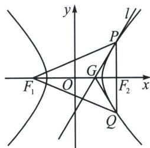

<!-- question-source:start -->
例17（江西省重点高中协作体2025届高三第二次联考T18）已知点 $P(x_0, y_0)$ 是双曲线 $C: \frac{x^2}{4} - \frac{y^2}{5} = 1$ 的图象上第一象限的任意一点， $F_1$ 、 $F_2$ 分别为 $C$ 的左右焦点。直线 $l: \frac{x_0 x}{4} - \frac{y_0 y}{5} = 1$ ，直线 $l$ 交 $x$ 轴于点 $G$ 。

(1)已知 $PF_{2} \perp x$ 轴，求直线 l 方程；

(2)求证: 直线 $l$ 为 $\angle F_{1} P F_{2}$ 的角平分线;

(3)若直线 $PF_{2}$ 交 $C$ 于另一点 $Q$ ，且 $\frac{S_{\triangle PGF_1}}{S_{\triangle QGF_2}} = \frac{16}{11}$ ，求直线 $l$ 和直线 $QF_{1}$ 斜率之积.

(1)由题知 $F_{1}(-3,0)$ , $F_{2}(3,0)$ , 因为 $PF_{2} \perp x$ 轴, $P$ 在第一象限, 所以 $x_{0}=3$ , 将 $x_{0}=3$ 代入双曲线方程可得 $y_{0}=\frac{5}{2}$ , 所以直线 $l$ 方程为 $\frac{3x}{4}-\frac{\frac{5}{2}y}{5}=1$ , 整理可得 $3x-2y-4=0$ ,

(2) 因为 $F_{1}(-3,0)$ , $F_{2}(3,0)$ , $|PF_{1}| = \sqrt{(x_{0} + 3)^{2} + y_{0}^{2}} = \sqrt{(x_{0} + 3)^{2} + 5\left(\frac{x_{0}^{2}}{4} - 1\right)} = \frac{3}{2} x_{0} + 2,$

$\left|PF_{2}\right|=\sqrt{(x_{0}-3)^{2}+y_{0}^{2}}=\sqrt{(x_{0}-3)^{2}+5\left(\frac{x_{0}^{2}}{4}-1\right)}=\frac{3}{2}x_{0}-2$ ，又直线 $l:\frac{x_{0}x}{4}-\frac{y_{0}y}{5}=1$ ，所以 $G\left(\frac{4}{x_{0}},0\right)$ ，
则 $\left|GF_{1}\right|=3+\frac{4}{x_{0}}$ ， $\left|GF_{2}\right|=3-\frac{4}{x_{0}}$ ，所以 $\frac{\left|PF_{1}\right|}{\left|PF_{2}\right|}=\frac{\frac{3}{2}x_{0}+2}{\frac{3}{2}x_{0}-2}=\frac{3x_{0}+4}{3x_{0}-4}$ ， $\frac{\left|GF_{1}\right|}{\left|GF_{2}\right|}=\frac{3+\frac{4}{x_{0}}}{3-\frac{4}{x_{0}}}=\frac{3x_{0}+4}{3x_{0}-4}$ ，所以 $\frac{\left|PF_{1}\right|}{\left|PF_{2}\right|}=\frac{\left|GF_{1}\right|}{\left|GF_{2}\right|}$ ，在 $\triangle PGF_{1}$ 中， $\frac{\left|PF_{1}\right|}{\sin\angle PGF_{1}}=\frac{\left|GF_{1}\right|}{\sin\angle GPF_{1}}①$ ，在 $\triangle PGF_{2}$ 中， $\frac{\left|PF_{2}\right|}{\sin\angle PGF_{2}}=\frac{\left|GF_{2}\right|}{\sin\angle GPF_{2}}②$ ，

又 $\angle PGF_{1} + \angle PGF_{2} = \pi$ ，联立①②可得 $\sin \angle GPF_{1} = \sin \angle GPF_{2}$ ，因为 $\angle GPF_{1} + \angle GPF_{2} = \angle F_{1}PF_{2}$ $\in (0,\pi)$

所以 $\angle GPF_{1} = \angle GPF_{2}$ ，所以直线 $l$ 为 $\angle F_{1}PF_{2}$ 的角平分线.

(3)令 $\overrightarrow{PF_{2}}=\lambda\overrightarrow{F_{2}Q}$ ，设 $P(x_{1},y_{1})$ ， $Q(x_{2},y_{2})$ ，根据定比点差（自证）可知 $\left\{\begin{aligned}&x_{1}=\frac{3+\frac{4}{3}}{2}+\frac{3-\frac{4}{3}}{2}\lambda\\&x_{2}=\frac{3+\frac{4}{3}}{2}+\frac{3-\frac{4}{3}}{2\lambda}\end{aligned}\right.$ $\frac{S_{\triangle PGF_{1}}}{S_{\triangle QGF_{2}}}=\frac{|PF_{1}|}{|PF_{2}|}\cdot\frac{|PF_{2}|\sin\alpha}{|QF_{2}|\sin\alpha}=\frac{|PF_{1}|}{|QF_{2}|}=\frac{ex_{1}+a}{ex_{2}-a}=\frac{\frac{3}{2}\left(\frac{13}{6}+\frac{5\lambda}{6}\right)+2}{\frac{3}{2}\left(\frac{13}{6}+\frac{5}{6\lambda}\right)-2}=\frac{16}{11}$ ，所以 $55\lambda^{2}+151\lambda-80=0$ ，
所以 $(5\lambda+16)(11\lambda-5)=0$ ，所以 $\lambda=\frac{5}{11}$ 或 $\lambda=-\frac{16}{5}$ （交于两支，舍去），解得 $x_{1}=\frac{28}{11}$ ，代入双曲线，则 $y_{1}=\frac{5\sqrt{15}}{11}$ ， $y_{2}=-\sqrt{15}$ ， $x_{2}=4$ ，所以 $k_{l}\cdot k_{QF_{1}}=\frac{5x_{0}}{4y_{0}}\cdot\frac{y_{1}}{x_{1}+3}=\frac{5}{4}\times\frac{28}{5\sqrt{15}}\times\frac{-\sqrt{15}}{7}=-1.$
<!-- question-source:end -->

![[高中/总复习/专题/2026版高中《mst老唐说题》圆锥曲线专题（数学）/下册/第14章_新定义下的面积转化/第一节_过焦点弦的面积问题/八_焦半径与定比点差转化面积比值/例题/answers/Q00048915A1.md]]
