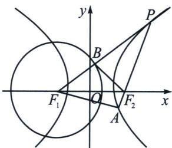

<!-- question-source:start -->
例18（2023·温州模拟）已知点 $F_{1}$ ， $F_{2}$ 分别是双曲线 $C_{1}: x^{2} - y^{2} = 2$ 的左右焦点，过 $F_{2}$ 的直线交双曲线右支于 $P$ ， $A$ 两点，点 $P$ 在第一象限.

(1)求点 P 横坐标的取值范围;

(2)线段 $PF_{1}$ 交圆 $C_{2}:(x+2)^{2}+y^{2}=8$ 于点 B，记 $\triangle PF_{2}B,\triangle AF_{2}F_{1},\triangle PAF_{1}$ 的面积分别为 $S_{1},S_{2},S$ ，求 $\frac{S}{S_{1}}+\frac{S}{S_{2}}$ 的最小值.

<!-- question-source:end -->

![[高中/总复习/专题/2026版高中《mst老唐说题》圆锥曲线专题（数学）/下册/第14章_新定义下的面积转化/第一节_过焦点弦的面积问题/八_焦半径与定比点差转化面积比值/例题/answers/Q00053253A1.md]]
