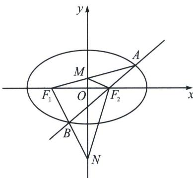

<!-- question-source:start -->
例15 (2019·上海)已知椭圆 $\frac{x^{2}}{8} +\frac{y^{2}}{4} = 1$ ， $F_{1}$ ， $F_{2}$ 为左、右焦点，直线 $l$ 过 $F_{2}$ 交椭圆于 $A$ ， $B$ 两点.

(1)若直线 l 垂直于 x 轴，求 $\left| AB \right|$ ;

(2) 当 $\angle F_{1}AB = 90^{\circ}$ 时，A 在 x 轴上方时，求 A、B 的坐标；

(3)若直线 $AF_{1}$ 交 $y$ 轴于 $M$ ，直线 $BF_{1}$ 交 $y$ 轴于 $N$ ，是否存在直线 $l$ ，使得 $S_{\triangle F_1AB} = S_{\triangle F_1MN}$ ，若存在，求出直线 $l$ 的方程；若不存在，请说明理由.

(1)依题意, $F_{2}(2,0)$ , 当 $AB \perp x$ 轴时, 则 $A(2, \sqrt{2})$ , $B(2, -\sqrt{2})$ , 得 $|AB| = 2\sqrt{2}$ ;

(2)设 $A(x_{1},y_{1})$ ，因为 $\angle F_1AB = 90^\circ (\angle F_1AF_2 = 90^\circ)$ ，所以 $\overrightarrow{AF_1}\cdot \overrightarrow{AF_2} = (x_1 + 2,y_1)\cdot (x_1 - 2,y_1) = x_1^2 -4 + y_1^2 = 0,$

又 A 在椭圆上，满足 $\frac{x_{1}^{2}}{8} + \frac{y_{1}^{2}}{4} = 1$ ，即 $y_{1}^{2} = 4\left(1 - \frac{x_{1}^{2}}{8}\right)$ ，所以 $x_{1}^{2} - 4 + 4\left(1 - \frac{x_{1}^{2}}{8}\right) = 0$ ，解得 $x_{1} = 0$ ，即 $A(0, 2)$ .
直线 AB: $y = -x + 2$ ，联立 $\left\{\begin{aligned}y &= -x+2\\ \frac{x^{2}}{8}+\frac{y^{2}}{4}&=1\end{aligned}\right.$ ，解得 $B\left(\frac{8}{3}, -\frac{2}{3}\right)$ ;

(3)设 $A(x_{1},y_{1}),B(x_{2},y_{2}),M(0,y_{3}),N(0,y_{4})$ ，则 $S_{\triangle F_1AB} = \frac{1}{2}|F_1F_2|\cdot |y_1 - y_2| = 2|y_1 - y_2|$ $S_{\triangle F_1MN} = \frac{1}{2}|F_1O|\cdot |y_3 - y_4| = |y_3 - y_4|$

由直线 $AF_{1}$ 的方程： $y = \frac{y_1}{x_1 + 2} (x + 2)$ ，得 $M$ 纵坐标 $y_{3} = \frac{2y_{1}}{x_{1} + 2}$ ；

由直线 $BF_{1}$ 的方程： $y=\frac{y_{2}}{x_{2}+2}(x+2)$ ，得 N 的纵坐标 $y_{4}=\frac{2y_{2}}{x_{2}+2}$ .

$$
Z _ {F _ {2} A} = (x _ {1} - 2) + y _ {1} \mathrm{i} = r _ {1} (\cos \theta + i \sin \theta), Z _ {F _ {2} B} = (x _ {2} - 2) + y _ {2} \mathrm{i} = r _ {2} (\cos (\pi + \theta) + i \sin (\pi + \theta)),
$$

所以 $\left\{ \begin{array}{l} x_{1} = 2 + r_{1}\cos \theta \\ y_{1} = r_{1}\sin \theta \end{array} \right.$ ， $\left\{ \begin{array}{l} x_{2} = 2 - r_{2}\cos \theta \\ y_{2} = -r_{2}\sin \theta \end{array} \right.$ ，代入椭圆方程得： $\left\{ \begin{array}{l} r_{1} = \frac{2}{\sqrt{2} + \cos \theta} \\ r_{2} = \frac{2}{\sqrt{2} - \cos \theta} \end{array} \right.$ ，若 $S_{\triangle F_1AB} = S_{\triangle F_1MN}$ ，则

$2\left|y_{1}-y_{2}\right|=\left|y_{3}-y_{4}\right|$ ，所以 $2\left|y_{1}-y_{2}\right|=\frac{2\left|y_{1}x_{2}-y_{2}x_{1}+2(y_{1}-y_{2})\right|}{(2+x_{1})(2+x_{2})}=\frac{2\left|y_{1}x_{2}-y_{2}x_{1}+2(y_{1}-y_{2})\right|}{(2+x_{1})(2+x_{2})}$

由于 A、 $F_{2}$ 、B 三点共线，所以 $x_{1}y_{2}-x_{2}y_{1}=2(y_{2}-y_{1})$ ，

$$
2 \left| y _ {1} - y _ {2} \right| = \frac {2 \left| y _ {1} x _ {2} - y _ {2} x _ {1} + 2 (y _ {1} - y _ {2}) \right|}{(2 + x _ {1}) (2 + x _ {2})} = \frac {8 \left| (y _ {1} - y _ {2}) \right|}{(2 + x _ {1}) (2 + x _ {2})} \Rightarrow (2 + x _ {1}) (2 + x _ {2}) = (4 + r _ {1} \cos \theta) (4 - r _ {2} \cos \theta)
$$

$= 4$ ，所以 $\cos^2\theta = \frac{3}{4}$ ，所以存在直线 $x + \sqrt{3} y - 2 = 0$ 或 $x - \sqrt{3} y - 2 = 0$ 满足题意
<!-- question-source:end -->

![[高中/总复习/专题/2026版高中《mst老唐说题》圆锥曲线专题（数学）/下册/第14章_新定义下的面积转化/第一节_过焦点弦的面积问题/六_焦弦的截距与面积转化问题/例题/answers/Q00048913A1.md]]
