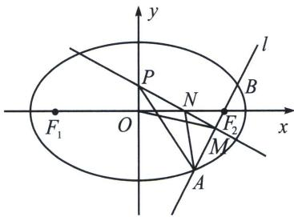

<!-- question-source:start -->
例9 (2024·重庆期末)已知椭圆 $C: \frac{x^2}{a^2} + \frac{y^2}{b^2} = 1 (a > b > 0)$ 的左右焦点为 $F_1$ 、 $F_2$ ，且 $|F_1 F_2| = 4$ ，直线 $l$ 过 $F_2$ 且与椭圆 $C$ 相交于 $A$ 、 $B$ 两点，当 $F_2$ 是线段 $AB$ 的中点时， $|AB| = \frac{2 \sqrt{6}}{3}$ .

(1)求椭圆 C 的标准方程;

(2)当线段 $AB$ 的中点 $M$ 不在 $x$ 轴上时, 设线段 $AB$ 的中垂线与 $x$ 轴交于点 $N$ , 与 $y$ 轴交于点 $P$ , $O$ 为椭圆的中心, 记 $\triangle OMN$ 的面积为 $S_{1}$ , $\triangle APM$ 的面积为 $S_{2}$ , 当 $\frac{S_{1}}{S_{2}}$ 取得最大值时, 求直线 $l$ 的方程.

(1)由于 $|F_{1}F_{2}| = 4$ ，所以 $2c = 4$ ，则右焦点的坐标为 $(2,0)$ ，当 $x = 2$ 时，代入椭圆方程为 $y = \frac{b^{2}}{a}$ ，故当 $F_{2}$ 是线段 $AB$ 的中点时，此时 $AB \perp x$ 轴，故 $|AB| = \frac{2b^{2}}{a} = \frac{2\sqrt{6}}{3}$ ，又 $a^{2} = b^{2} + c^{2}$ ，联立即可解得 $a = \sqrt{6}$ ， $b = \sqrt{2}$ ， $c = 2$ ，椭圆 $C$ 的标准方程为 $\frac{x^{2}}{6} + \frac{y^{2}}{2} = 1$ ；

(2)设 $AB$ 倾斜角为 $\alpha$ ，则 $|AB| = \frac{2\sqrt{6}}{1 + 2\sin^2\alpha}$ ， $|NF_2| = \frac{e}{2} |AB| = \frac{2}{1 + 2\sin^2\alpha}$ （证明过程请自己完成）， $S_1 = \frac{|ON|\cdot|MN|\cos\alpha}{2}$ ， $S_2 = \frac{|AM|\cdot|PN|}{2}$ ， $\frac{S_1}{S_2} = \frac{|ON|\cdot|MN|\cos\alpha}{|AM|\cdot|PN|} = \frac{|ON|\cdot\frac{e}{2}|AB|\sin\alpha\cos\alpha}{\frac{|AB|}{2}\cdot\frac{|ON|}{\sin\alpha}} = e$ $\sin^2\alpha \cos \alpha = e(1 - \cos^2\alpha)\cos \alpha$ ，因为 $\sqrt[3]{2(1 - \cos^2\alpha)^2\cos^2\alpha} \leqslant \frac{(1 - \cos^2\alpha) + (1 - \cos^2\alpha) + 2\cos^2\alpha}{3}$ ，当且仅当 $\cos^2\alpha = \frac{1}{3}$ 时等号成立，此时 $k^2 = \tan^2\alpha = 2$ ，故直线 $l$ 的方程为 $y = \pm \sqrt{2}(x - 2)$ .
<!-- question-source:end -->

![[高中/总复习/专题/2026版高中《mst老唐说题》圆锥曲线专题（数学）/下册/第14章_新定义下的面积转化/第一节_过焦点弦的面积问题/四_焦弦中垂线与隐藏面积问题/例题/answers/Q00048907A1.md]]
