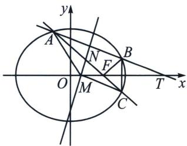
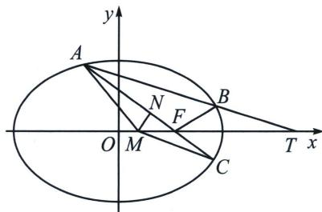

> [!faq]- 《圆锥曲线专题(下册)》例题解析
>
> > [!success]- **【答案】** 详见解析
>
> > [!note]- **【解析】**
> > 解析 (1)依题意可得 $\left\{ \begin{array}{l} e = \frac{c}{a} = \frac{\sqrt{3}}{3} \\ c = 1 \end{array} \right.$ ，解得 $\left\{ \begin{array}{l} a = \sqrt{3} \\ c = 1 \end{array} \right.$ ，所以 $b = \sqrt{a^2 - c^2} = \sqrt{2}$ ，所以椭圆方程为 $\frac{x^2}{3} + \frac{y^2}{2} = 1$ ；(2)(i)(定比点差)设 $A(x_1, y_1), B(x_2, y_2), \overrightarrow{AT} = \lambda \overrightarrow{TB}$ ，则 $\left\{ \begin{array}{l} \frac{x_1 + \lambda x_2}{1 + \lambda} = 3 \\ \frac{y_1 + \lambda y_2}{1 + \lambda} = 0 \end{array} \right.$ ①，存在点 $R$ ，使得 $\overrightarrow{AR} = -\lambda \overrightarrow{RB}$ ，则 $\left\{ \begin{array}{l} \frac{x_1 - \lambda x_2}{1 + \lambda} = x_R \\ \frac{y_1 - \lambda y_2}{1 + \lambda} = y_R \end{array} \right.$ ②，又由 $\left\{ \begin{array}{l} \frac{x_1^2}{3} + \frac{y_1^2}{2} = 1 \\ \frac{(\lambda x_2)^2}{3} + \frac{(\lambda y_2)^2}{2} = \lambda^2 \end{array} \right.$ 可得， $\frac{1}{3} \cdot \frac{x_1 + \lambda x_2}{1 + \lambda} \cdot \frac{x_1 - \lambda x_2}{1 - \lambda} + \frac{1}{2} \cdot \frac{y_1 + \lambda y_2}{1 + \lambda} \cdot \frac{y_1 - \lambda y_2}{1 - \lambda}$ $= 1$ ③，结合①②③可得， $\frac{x_T x_R}{4} = 1$ ，所以 $x_R = 1$ ，即 $\left\{ \begin{array}{l} x_1 = 2 + \lambda \\ x_2 = 2 + \frac{1}{\lambda} \\ y_1 + \lambda y_2 = 0 \end{array} \right.$ ， $k_{AF} + k_{BF} = \frac{y_1}{x_1 - 1} + \frac{y_2}{x_2 - 1} = \frac{y_1}{1 + \lambda} + \frac{\frac{y_1}{-\lambda}}{1 + \frac{1}{\lambda}} = 0$ ，所以 $k_{AF} + k_{BF} = 0$ ，即 $k_{CF} + k_{BF} = 0$ ，又因为 $B$ 、 $C$ 均在椭圆上，由椭圆的对称性可知 $|FB| = |FC|$ ，即△FBC为等腰三角形；
> >
> > 
> >
> > 
> >
> > （ii）
> > 解法一：设 $AB$ 的中点为 $N(x_0, y_0)$ ，则 $y_0 = \frac{y_1 + y_2}{2} = -\frac{6m}{2m^2 + 3}$ ， $x_0 = my_0 + 3 = \frac{9}{2m^2 + 3}$ ，所以 $N\left(\frac{9}{2m^2 + 3}, -\frac{6m}{2m^2 + 3}\right)$ ，所以 $AB$ 的垂直平分线为 $y + \frac{6m}{2m^2 + 3} = -m\left(x - \frac{9}{2m^2 + 3}\right)$ ，令 $y = 0$ 可得 $x = \frac{3}{2m^2 + 3}$ ，所以 $M\left(\frac{3}{2m^2 + 3}, 0\right)$ ，所以 $\triangle AMC$ 的面积 $S_{\triangle AMC} = \frac{1}{2}|MF| |y_1 + y_2| = \frac{1}{2}\left|1 - \frac{3}{2m^2 + 3}\right|\left|\frac{12m}{2m^2 + 3}\right| = \frac{12|m|^3}{(2m^2 + 3)^2}$ ，令 $t = |m| > \sqrt{3}$ ，设 $f(t) = \frac{12t^3}{(2t^2 + 3)^2}$ ， $(t > \sqrt{3})$ ，所以 $f'(t) = 12 \times \frac{3t^2(2t^2 + 3)^2 - 8t(2t^2 + 3)t^3}{(2t^2 + 3)^4} = \frac{12t^2(9 - 2t^2)}{(2t^2 + 3)^3}$ ，所以当 $\sqrt{3} < t < \frac{3\sqrt{2}}{2}$ 时 $f'(t) > 0$ ，当 $t > \frac{3\sqrt{2}}{2}$ 时 $f'(t) < 0$ ，所以 $f(t)$ 在 $\left(\sqrt{3}, \frac{3\sqrt{2}}{2}\right)$ 上单调递增，在 $\left(\frac{3\sqrt{2}}{2}, +\infty\right)$ 上单调递减，所以当 $t = \frac{3\sqrt{2}}{2}$ 时 $f(t)$ 取得最大值 $f(t)_{\max} = f\left(\frac{3\sqrt{2}}{2}\right) = \frac{9\sqrt{2}}{16}$ ，
> >
> > 解法二：设 $AC$ 中点为 $N$ ，则 $MN$ 为 $AC$ 中垂线，令 $\angle AFM = \alpha$ ，易证 $|MF| = \frac{e}{2} |AC| = \frac{\sqrt{3}}{6} |AC|$ （考试要证明）， $S_{\triangle AMC} = \frac{|AC| \cdot |MN|}{2} = \frac{1}{2} \cdot \frac{\sqrt{3}}{6} |AC|^2 \sin \alpha = \frac{4\sqrt{3} \sin \alpha}{(2 + \sin^2 \alpha)^2} = \frac{4\sqrt{3}}{\frac{4}{\sin \alpha} + 4 \sin \alpha + \sin^3 \alpha}$ ，令 $f(t) = t^3 + 4t + \frac{4}{t} (0 < t < 1)$ ， $f'(t) = 3t^2 + 4t - \frac{4}{t^2} = \frac{(3t^2 - 2)(t^2 + 2)}{t^2}$ ，易知当 $t = \sqrt{\frac{2}{3}}$ 时， $f(t)_{\min} = f(\sqrt{\frac{2}{3}}) = \frac{32\sqrt{6}}{9}$ ，
> >
> > 所以 $S_{\triangle AMC} \leqslant \frac{4\sqrt{3}}{\frac{32\sqrt{6}}{9}} = \frac{9\sqrt{2}}{16}$ .
