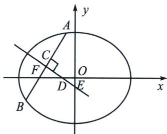
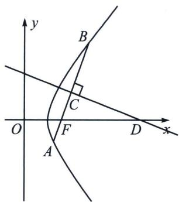
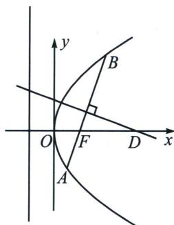

## 四、焦弦中垂线与隐藏面积问题

(1)设椭圆焦点弦 $AB$ 的中垂线与长轴的交点为 $D$ , 则 $|FD|$ 与 $|AB|$ 之比是离心率的一半 (如图)

(2)设双曲线焦点弦AB的中垂线与焦点所在轴的交点为D，则 $|FD|$ 与 $|AB|$ 之比是离心率的一半(如图)

(3)设抛物线焦点弦 $AB$ 的中垂线与对称轴的交点为 $D$ , 则 $|FD|$ 与 $|AB|$ 之比是离心率的一半 (如图)

(1)证明：根据椭圆焦长公式： $|BF|=\frac{b^{2}}{a-c\cos\alpha}$ ， $|AF|=\frac{b^{2}}{a+c\cos\alpha}$ ， $|AB|=\frac{2ab^{2}}{a^{2}-c^{2}\cos^{2}\alpha}$

$$
| C F | = \frac {| A B |}{2} - | A F | = \frac {| A F | + | B F |}{2} - | A F | = \frac {| B F | - | A F |}{2} = \frac {\frac {b ^ {2}}{a - c \cos \alpha} - \frac {b ^ {2}}{a + c \cos \alpha}}{2} = \frac {b ^ {2} c \cos \alpha}{a ^ {2} - c ^ {2} \cos^ {2} \alpha}
$$

$$
| D F | = \frac {| C F |}{\cos \alpha} = \frac {b ^ {2} c}{a ^ {2} - c ^ {2} \cos^ {2} \alpha}, \text {   故   } \frac {| D F |}{| A B |} = \frac {b ^ {2} c}{2 a b ^ {2}} = \frac {c}{2 a} = \frac {e}{2}.
$$

(2)证明：当直线 $AB$ 与双曲线交于一支时，证明过程同椭圆一致；当直线 $AB$ 与双曲线交于两支时，

$|BF|=\frac{b^{2}}{c\cos\alpha-a},\quad|AF|=\frac{b^{2}}{c\cos\alpha+a},\quad|AB|=\frac{2ab^{2}}{c^{2}\cos^{2}\alpha-a^{2}},\quad|CF|=\frac{b^{2}c\cos\alpha}{c^{2}\cos^{2}\alpha-a^{2}}$ ，其余过程与椭圆一致.

(3)证明：抛物线 $y^{2} = 2px (p > 0)$ 焦点弦公式： $|AF| = \frac{p}{1 + \cos\alpha}$ ； $|BF| = \frac{p}{1 - \cos\alpha}$ ； $|AB| = \frac{2p}{\sin^2\alpha}$ .

$|CF|=\frac{|AB|}{2}-|AF|=\frac{|AF|+|BF|}{2}-|AF|=\frac{|BF|-|AF|}{2}=\frac{p\cos\alpha}{\sin^{2}\alpha},\quad|DF|=\frac{|CF|}{\cos\alpha}=\frac{p}{\sin^{2}\alpha},$ 故 $\frac{|DF|}{|AB|}=\frac{1}{2}.$

我们以椭圆为例来表达线段长度，注意到 $|CD| = |FD|\sin \alpha$ ， $|OD| = c - |FD| = c - \frac{e|AB|}{2}$

<!-- source-part:5 pages:201-234 -->

故 $|CE|=|CD|+|DE|=\frac{e|AB|\sin\alpha}{2}+\frac{c-\frac{e|AB|}{2}}{\sin\alpha}$

$$
S _ {\triangle C F D} = \frac {| C F | \cdot | C D |}{2} = \frac {| D F | ^ {2} \cdot \sin \alpha \cos \alpha}{2} = \frac {e ^ {2} | A B | ^ {2} \sin 2 \alpha}{1 6};
$$

![[高中/总复习/专题/2026版高中《mst老唐说题》圆锥曲线专题（数学）/下册/第14章_新定义下的面积转化/第一节_过焦点弦的面积问题/四_焦弦中垂线与隐藏面积问题/例题/Q00053244.md]]
![[高中/总复习/专题/2026版高中《mst老唐说题》圆锥曲线专题（数学）/下册/第14章_新定义下的面积转化/第一节_过焦点弦的面积问题/四_焦弦中垂线与隐藏面积问题/例题/Q00053245.md]]
