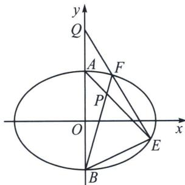

<!-- question-source:start -->
例1 (2024·渭南模拟)已知椭圆 $C: \frac{x^{2}}{9} + \frac{y^{2}}{b^{2}} = 1 (1 < b < 3)$ 的上、下顶点分别为 $A, B$ , 点 $P(t, 1)(t > 0)$ 在椭圆内, 且直线 $PA, PB$ 分别与椭圆 $C$ 交于 $E, F$ 两点, 直线 $EF$ 与 $y$ 轴交于点 $Q$ . 已知 $\tan \angle PAB = 3 \tan \angle PBA$ .

(1)求椭圆 C 的标准方程;

(2)设 $\triangle AQE$ 的面积为 $S_{1}$ ， $\triangle BQF$ 的面积为 $S_{2}$ ，求 $\frac{S_{1}}{S_{2}}$ 的取值范围.

(1) $\tan \angle PAB = \frac{t}{b - 1}$ , $\tan \angle PBA = \frac{t}{b + 1}$ , $t > 0$ , $1 < b < 3$ , 因为 $\tan \angle PAB = 3\tan \angle PBA$ , 所以 $\frac{t}{b - 1} = \frac{3t}{b + 1}$ , 解得: $b = 2$ , 所以椭圆方程 $C: \frac{x^2}{9} + \frac{y^2}{4} = 1$ ;

(2)极点极线背景分析：P 与 Q 是自极三角形上的两点，所以 $y_{P}y_{Q}=b^{2}=4$ ，所以 $y_{Q}=4$ ，

$\frac{S_1}{S_2} = \frac{|AQ| \cdot x_E}{|BQ| \cdot x_F} = \frac{x_E}{3x_F}$ , 令 $\overrightarrow{EQ} = \lambda \overrightarrow{QF}$ , 相切时取得最大值, $\lambda = -1$ , $EF$ 为上下两个顶点时, 取得最小 $\lambda = -3$ , $\frac{S_1}{S_2} = \frac{|AQ| \cdot x_E}{|BQ| \cdot x_F} = \frac{x_E}{3x_F} \in \left(\frac{1}{3}, 1\right)$ , 此为本题的最佳解答方法, 定比点差.
<!-- question-source:end -->

![[高中/总复习/专题/2026版高中《mst老唐说题》圆锥曲线专题（数学）/下册/第14章_新定义下的面积转化/第三节_面积比值转化问题/一_利用极点极线关系将坐标转化面积比/例题/answers/Q00048923A1.md]]
