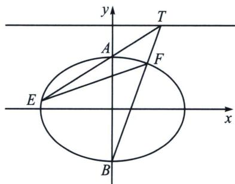

<!-- question-source:start -->
例2 (2024·重庆期末)已知点 $A(0, 2)$ 与 $B(0, -2)$ , 动点 $M(x, y)$ 满足直线 $AM$ , $BM$ 的斜率之积为 $-\frac{1}{2}$ , 则点 $M$ 的轨迹为曲线 $C$ .

(1)求曲线 C 的方程;

(2) 若点 $T$ 在直线 $y = 3$ 上, 直线 $TA$ , $TB$ 分别与曲线 $C$ 交于点 $E$ , $F$ , 求 $\triangle TAB$ 与 $\triangle TEF$ 面积之比的最大值.

<!-- question-source:end -->

![[高中/总复习/专题/2026版高中《mst老唐说题》圆锥曲线专题（数学）/下册/第14章_新定义下的面积转化/第三节_面积比值转化问题/一_利用极点极线关系将坐标转化面积比/例题/answers/Q00053259A1.md]]
