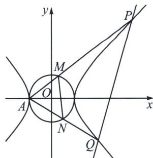

<!-- question-source:start -->
例15（广东省深圳市2023高二下学期期末）已知双曲线 $C: \frac{x^{2}}{a^{2}} - \frac{y^{2}}{b^{2}} = 1 (a > 0, b > 0)$ 的离心率为 $\sqrt{2}$ ，且 $C$ 的一个焦点到其一条渐近线的距离为 1.

(1) 求 C 的方程;

(2)设点 A 为 C 的左顶点，若过点 $(3,0)$ 的直线 l 与 C 的右支交于 P，Q 两点，且直线 AP，AQ 与圆 O: $x^{2}+y^{2}=a^{2}$ 分别交于 M，N 两点，记四边形 PQNM 的面积为 $S_{1}$ ， $\triangle AMN$ 的面积为 $S_{2}$ ，求 $\frac{S_{1}}{S_{2}}$ 的取值范围.

(1)由题可知 $bx - ay = 0$ 是双曲线 $C$ 的一条渐近线方程, 右焦点为 $(c, 0)$ , 所以右焦点到渐近线的距离 $d = \frac{|bc - a \cdot 0|}{\sqrt{a^2 + b^2}}$ , 又因为 $c^2 = a^2 + b^2$ , 所以 $d = b$ , 则依题意可得 $b = 1$ , 由离心率 $e = \frac{c}{a} = \sqrt{1 + \frac{b^2}{a^2}} = \sqrt{2}$ , 解得 $a = 1$ , 所以双曲线 $C$ 的方程为 $x^2 - y^2 = 1$ .

(2)如图所示，由
(1)知， $A(-1,0)$ ，

法一(齐次化): 将坐标系向左移动一个单位, 双曲线变为 $(x - 1)^{2} - y^{2} = 1$ , 令 $P^{\prime} Q^{\prime}: p x + q y = 1$ , 平移后由于 $P^{\prime} Q^{\prime}$ 过 $D^{\prime}(4,0)$ , 故 $P^{\prime} Q^{\prime}: \frac{1}{4} x + q y = 1$ , 联立得: $x^{2} - 2 x \left(\frac{1}{4} x + q y\right) - y^{2} = 0$ , 同除以 $x^{2}, \left(\frac{y}{x}\right)^{2} + 2 q \left(\frac{y}{x}\right) - \frac{1}{2} = 0$ ,

所以 $k_{AP} + k_{AQ} = -2q$ ， $k_{AP}k_{AQ} = -\frac{1}{2}$ ，设 AP: $x = m_{1}y - 1$ ，AQ: $x = m_{2}y - 1$ ，且 $|m_{1}| > 1$ ， $|m_{2}| > 1$ ，
所以 $\frac{1}{m_{1}}\cdot\frac{1}{m_{2}}=-\frac{1}{2}$ ，即 $m_{1}\cdot m_{2}=-2$ ，所以 $|m_{1}|\cdot|m_{2}|=2$ ，又因为 $|m_{2}|=\frac{2}{|m_{1}|}>1$ ，所以 $1<|m_{1}|<2$ ，
由 $\left\{\begin{aligned}&x=m_{1}y-1,\\ &x^{2}-y^{2}=1\end{aligned}\right.$ ，得 $(m_{1}^{2}-1)y^{2}-2m_{1}y=0$ ，所以 $y_{P}=\frac{2m_{1}}{m_{1}^{2}-1}$ ，同理可得 $y_{Q}=\frac{2m_{2}}{m_{2}^{2}-1}$ ，由 $\left\{\begin{aligned}&x=m_{1}y-1,\\ &x^{2}+y^{2}=1,\end{aligned}\right.$ 得 $(m_{1}^{2}+1)y^{2}-2m_{1}y=0$ ，所以 $y_{M}=\frac{2m_{1}}{m_{1}^{2}+1}$ ，同理可得 $y_{N}=\frac{2m_{2}}{m_{2}^{2}+1}$ ，

$$
\lambda \frac {S _ {\triangle A P Q}}{S _ {\triangle A M N}} = \frac {\frac {1}{2} | A P | | A Q | \sin \angle P A Q}{\frac {1}{2} | A M | | A N | \sin \angle M A N} = \frac {| A P |}{| A M |} \cdot \frac {| A Q |}{| A N |} = \frac {y _ {P}}{y _ {M}} \cdot \frac {y _ {Q}}{y _ {N}} = \frac {\frac {2 m _ {1}}{m _ {1} ^ {2} - 1}}{\frac {2 m _ {1}}{m _ {1} ^ {2} + 1}} \cdot \frac {\frac {2 m _ {2}}{m _ {2} ^ {2} - 1}}{\frac {2 m _ {2}}{m _ {2} ^ {2} + 1}}
$$

$= \frac{(m_1^2 + 1)(m_2^2 + 1)}{(m_1^2 - 1)(m_2^2 - 1)} = \frac{m_1^2m_2^2 + m_1^2 + m_2^2 + 1}{m_1^2m_2^2 - m_1^2 - m_2^2 + 1} = \frac{5 + (m_1^2 + m_2^2)}{5 - (m_1^2 + m_2^2)}$ ，令 $n = m_1^2 +m_2^2$ ，由 $|m_1|\cdot |m_2| = 2$ ， $1 <$

$|m_{1}|<2$ ，得 $n=m_{1}^{2}+\frac{4}{m_{1}^{2}}\in[4,5)$ ，所以 $\frac{S_{\triangle APQ}}{S_{\triangle AMN}}=\frac{5+n}{5-n}=\frac{10}{5-n}-1,n\in[4,5)$ ，令 $f(n)=\frac{10}{5-n}-1,n\in[4,5)$ ，因为 $f(n)$ 在区间 $[4,5)$ 上为增函数，所以 $f(n)$ 的取值范围为 $[9,+\infty)$ ，又因为 $\frac{S_{1}}{S_{2}}=\frac{S_{\triangle APQ}-S_{\triangle AMN}}{S_{\triangle AMN}}=\frac{S_{\triangle APQ}}{S_{\triangle AMN}}-1$ ，所以 $\frac{S_{1}}{S_{2}}$ 的取值范围为 $[8,+\infty)$ .
<!-- question-source:end -->

![[高中/总复习/专题/2026版高中《mst老唐说题》圆锥曲线专题（数学）/下册/第14章_新定义下的面积转化/第三节_面积比值转化问题/七_双圆锥曲线的双动点构造面积比/例题/answers/Q00048937A1.md]]
