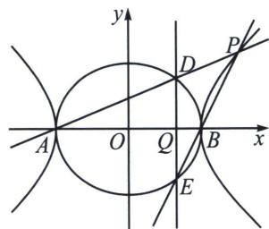

<!-- question-source:start -->
例17（25高二下·浙江阶段练习）已知离心率为 $\frac{\sqrt{7}}{2}$ 的双曲线 $C_{1}:\frac{x^{2}}{a^{2}}-\frac{y^{2}}{b^{2}}=1(a>0,b>0)$ 过椭圆 $C_{2}:\frac{x^{2}}{4}+\frac{y^{2}}{3}=1$ 的左，右顶点A，B.

(1)求双曲线 $C_1$ 的方程;

(2) $P(x_{0}, y_{0})(x_{0}>0, y_{0}>0)$ 是双曲线 $C_{1}$ 上一点，直线AP，BP与椭圆 $C_{2}$ 分别交于D，E，设直线DE与x轴交于 $Q(x_{Q}, 0)$ ，且 $x_{Q}=\lambda^{2}x_{0}\left(0<\lambda<\frac{1}{2}\right)$ ，记△BDP与△ABD的外接圆的面积分别为 $S_{1}$ ， $S_{2}$ ，求 $\sqrt{\frac{S_{1}}{S_{2}}}$ 的取值范围.

(1)由题意得： $\left\{ \begin{array}{l} \frac{c}{a} = \frac{\sqrt{7}}{2} \\ c^2 = a^2 + b^2 \\ a = 2 \end{array} \right.$ ，解得 $b = \sqrt{3}$ ，所以双曲线 $C_1$ 的方程为 $\frac{x^2}{4} - \frac{y^2}{3} = 1$ .

(2) 方法一: 设直线 $AP: y = \frac{y_0}{x_0 + 2} (x + 2), D(x_1, y_1)$ , 则 $\left\{ \begin{array}{l} y = \frac{y_0}{x_0 + 2} (x + 2) \\ 3x^2 + 4y^2 = 12 \end{array} \right.$ , 消 $y$ 得: $\left[3 + \frac{4y_0^2}{(x_0 + 2)^2}\right] x^2 + \frac{16y_0^2}{(x_0 + 2)^2} x + \frac{16y_0^2}{(x_0 + 2)^2} - 12 = 0$ , 得: $-2x_1 = \frac{16y_0^2 - 12(x_0 + 2)^2}{3(x_0 + 2)^2 + 4y_0^2}$ , 又因为 $P(x_0, y_0)$ 在双曲线上, 满足 $\frac{x_0^2}{4} - \frac{y_0^2}{3} = 1$ , 即 $4y_0^2 = 3x_0^2 - 12$ , 所以 $-x_1 = \frac{8y_0^2 - 6(x_0 + 2)^2}{3(x_0 + 2)^2 + 4y_0^2} = \frac{6x_0^2 - 24 - 6(x_0 + 2)^2}{3(x_0 + 2)^2 + 3x_0^2 - 12} = \frac{-24(x_0 + 2)}{6x_0(x_0 + 2)} = \frac{-4}{x_0}$ , 即 $x_1 = \frac{4}{x_0}$ . 同理设直线 $BP: y = \frac{y_0}{x_0 - 2}(x - 2), E(x_2, y_2)$ , 可得 $x_2 = \frac{4}{x_0}$ , 所以 $x_Q = \frac{4}{x_0}$ . 因为 $x_Q = \lambda^2 x_0$ , 所以 $\frac{4}{x_0} = \lambda^2 x_0$ , 因为 $x_0 > 0$ , 所以 $x_0 = \frac{2}{\lambda}$ . 把 $x_0 = \frac{2}{\lambda}$ 代入双曲线方程得 $\frac{\frac{4}{\lambda^2}}{4} - \frac{y_0^2}{3} = 1$ , 解得 $y_0 = \frac{\sqrt{3 - 3\lambda^2}}{\lambda}$ , 则点 $P\left(\frac{2}{\lambda}, \frac{\sqrt{3 - 3\lambda^2}}{\lambda}\right)$ . 设 $\triangle DBP$ 与 $\triangle ABD$ 的外接圆的半径分别为 $r_1, r_2$ , 由正弦定理得 $2r_1 = \frac{|PB|}{\sin\angle BDP}, 2r_2 = \frac{|AB|}{\sin\angle ADB}$ , 因为 $\angle ADB + \angle BDP = 180^\circ$ , 所以 $\sin\angle BDP = \sin\angle ADB$ . 则 $\sqrt{\frac{S_1}{S_2}} = \frac{r_1}{r_2} = \frac{|BP|}{|AB|} = \frac{\sqrt{\left(\frac{2}{\lambda} - 2\right)^2 + \frac{3}{\lambda^2} - 3}}{4} = \frac{\sqrt{7\left(\frac{1}{\lambda} - \frac{4}{7}\right)^2 - \frac{9}{7}}}{4}$ . 因为 $0 < \lambda < \frac{1}{2}$ , 所以 $\frac{1}{\lambda} > 2$ , 所以 $\sqrt{\frac{S_1}{S_2}} \in (\frac{\sqrt{13}}{4}, +\infty)$ .

$$
\left\{ \begin{array}{l} k _ {A D} \cdot k _ {B D} = - \frac {3}{4} \\ k _ {A P} \cdot k _ {B P} = \frac {3}{4} \end{array} \Leftrightarrow k _ {B D} = - k _ {B E} \right.
$$

$$
x _ {D} = x _ {E} = x _ {Q}
$$

$$
D (2 \cos \theta , \sqrt {3} \sin \theta)
$$

$$
k _ {A D} = k _ {A P} = \frac {\sqrt {3}}{2} \tan \frac {\theta}{2}
$$

$$
P \left(\frac {2}{\cos \theta}, \sqrt {3} \tan \theta\right)
$$

$$
\frac {x _ {Q}}{x _ {0}} = \frac {2 \cos \theta}{\frac {2}{\cos \theta}} = \cos^ {2} \theta = \lambda^ {2}
$$

$$
0 <   \lambda <   \frac {1}{2}
$$

$$
\theta \in
$$

$$
\left(\frac {\pi}{3}, \frac {\pi}{2}\right)
$$

$$
\triangle D B P
$$

$$
\triangle A B D
$$

$$
r _ {1}, r _ {2}
$$

$$
2 r _ {1} = \frac {| P B |}{\sin \angle B D P}, 2 r _ {2} =
$$

$$
\frac {| A B |}{\sin \angle A D B}
$$

$$
\angle A D B + \angle B D P = 1 8 0 ^ {\circ}
$$

$$
\sin \angle B D P = \sin \angle A D B
$$

则 $\sqrt{\frac{S_1}{S_2}} = \frac{r_1}{r_2} = \frac{|BP|}{|AB|} = \frac{\sqrt{\left(\frac{2}{\cos\theta} - 2\right)^2 + 3\tan^2\theta}}{4} = \frac{1}{4}\sqrt{\frac{7 - 8\cos\theta + \cos^2\theta}{\cos^2\theta}} = \frac{1}{4}\sqrt{\frac{7}{\cos^2\theta} - \frac{8}{\cos\theta} + 1}$ , 当 $\frac{1}{\cos\theta} = \frac{4}{7}$ 时取得整个函数最小值, 由于 $0 < \cos \theta < \frac{1}{2}$ , 故函数处于递减区间, $\sqrt{\frac{S_1}{S_2}} = \frac{1}{4}\sqrt{\frac{7}{\cos^2\theta} - \frac{8}{\cos\theta} + 1} > \frac{\sqrt{13}}{4}$ , 所以 $\sqrt{\frac{S_1}{S_2}} \in \left(\frac{\sqrt{13}}{4}, +\infty\right)$ .
<!-- question-source:end -->

![[高中/总复习/专题/2026版高中《mst老唐说题》圆锥曲线专题（数学）/下册/第14章_新定义下的面积转化/第三节_面积比值转化问题/七_双圆锥曲线的双动点构造面积比/例题/answers/Q00048939A1.md]]
