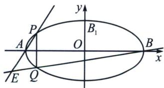
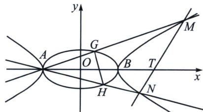
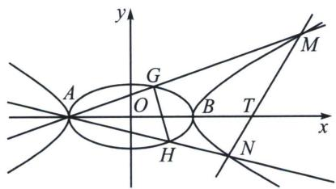

> [!faq]- 《圆锥曲线专题(下册)》例题解析
>
> > [!success]- **【答案】** 详见解析
>
> > [!note]- **【解析】**
> > 解析 (1)由题意： $a = 2$ ，设 $D(x,y)$ ，所以 $A(-2,0),B(2,0)$
> >
> > 由 $k_{DA} \cdot k_{DB} = -\frac{1}{4} \Rightarrow \frac{y}{x + 2} \cdot \frac{y}{x - 2} = -\frac{1}{4} \Rightarrow \frac{x^2}{4} + y^2 = 1.$ 故椭圆 $C_1: \frac{x^2}{4} + y^2 = 1.$
> >
> > (2)(i)如图
> >
> > 
> >
> > 
> >
> > 设 $P(x_0, y_0)$ ， $Q(x_0, -y_0)$ ， $x_0 \in [-2, 2]$ ，且 $\frac{x_0^2}{4} + y_0^2 = 1$ 。当 $x_0 \in \pm 2$ 时，
> >
> > 直线 $AP: \frac{y}{y_0} = \frac{x + 2}{x_0 + 2} \Rightarrow (x_0 + 2)y - y_0x - 2y_0 = 0$ ，直线 $BQ: \frac{y}{-y_0} = \frac{x - 2}{x_0 - 2} \Rightarrow (x_0 - 2)y + y_0x - 2y_0 = 0$
> >
> > 由 \( \left\{\begin{aligned}(x\_{0}+2)y-y\_{0}x-2y\_{0}&=0\\(x\_{0}-2)y+y\_{0}x-2y\_{0}&=0\end{aligned}\right.\Rightarrow\left\{\begin{aligned}x\_{0}&=\frac{4}{x}\\ y\_{0}&=\frac{2y}{x}\end{aligned}\right. \)  由 \( \frac{x\_{0}^{2}}{4}+y\_{0}^{2}&=1\Rightarrow\frac{4}{x^{2}}+\frac{4y^{2}}{x^{2}}=1\Rightarrow\frac{x^{2}}{4}-y^{2}=1. \)  另A，B两点也适合
> >
> > 上述方程. 故 E 点轨迹 $C_{2}$ 的方程为: $\frac{x^{2}}{4}-y^{2}=1$ .
> >
> > （ii）法一：如图若直线 MN 有斜率，则设 $l_{MN}$ ： $y=k(x-4)$ ，代入 $\frac{x^{2}}{4}-y^{2}=1$ 得： $x^{2}-4k^{2}(x-4)^{2}=4$ ，整理得： $(1-4k^{2})x^{2}+32k^{2}x-(64k^{2}+4)=0$ ，设 $M(x_{1},y_{1})$ ， $N(x_{2},y_{2})$ ，
> >
> > 由 $x_{1} + x_{2} = \frac{32k^{2}}{4k^{2} - 1} >0$ ， $x_{1}x_{2} = \frac{64k^{2} + 4}{4k^{2} - 1} >0$ ，所以 $k^2 >\frac{1}{4}$
> >
> > 设直线 $l_{AM}$ ： $y=\frac{y_{1}}{x_{1}+2}(x+2)$ ，将其代入 $\frac{x^{2}}{4}+y^{2}=1$ 得： $\frac{x^{2}}{4}+\left(\frac{y_{1}}{x_{1}+2}\right)^{2}\cdot(x+2)^{2}=1$ ，
> >
> > 整理得： $\left[(x_{1}+2)^{2}+4y_{1}^{2}\right]x^{2}+16y_{1}^{2}x+16y_{1}^{2}-4(x_{1}+2)^{2}=0,$
> >
> > $$
> > G \left(x _ {3}, y _ {3}\right), - 2 x _ {3} = \frac {1 6 y _ {1} ^ {2} - 4 (x _ {1} + 2) ^ {2}}{(x _ {1} + 2) ^ {2} + 4 y _ {1} ^ {2}} \Rightarrow x _ {3} = \frac {2 (x _ {1} + 2) ^ {2} - 8 y _ {1} ^ {2}}{(x _ {1} + 2) ^ {2} + 4 y _ {1} ^ {2}},
> > $$
> >
> > 同理设 $H(x_{4}, y_{4})$ ， $x_{4}=\frac{2(x_{2}+2)^{2}-8y_{2}^{2}}{(x_{2}+2)^{2}+4y_{2}^{2}}$ 。所以 $\frac{S_{1}}{S_{2}}=\frac{\frac{1}{2}|AM|\cdot|AN|\sin\angle MAN}{\frac{1}{2}|AG|\cdot|AH|\sin\angle GAH}=\frac{|AM|\cdot|AN|}{|AG|\cdot|AH|}=$
> >
> > $\frac{(x_1 + 2) \cdot (x_2 + 2)}{(x_3 + 2) \cdot (x_4 + 2)} = \frac{(x_1 + 2) \cdot (x_2 + 2)}{\frac{4(x_1 + 2)^2}{(x_1 + 2)^2 + 4y_1^2} \cdot \frac{4(x_2 + 2)^2}{(x_2 + 2)^2 + 4y_2^2}} = \frac{[(x_1 + 2)^2 + 4y_1^2] \cdot [(x_2 + 2)^2 + 4y_2^2]}{16(x_1 + 2)(x_2 + 2)}$ 因为 $4y_{1}^{2} = x_{1}^{2}$
> >
> > -4， $4y_{2}^{2}=x_{2}^{2}-4$ ，所以 $\frac{S_{1}}{S_{2}}=\frac{\left[(x_{1}+2)^{2}+x_{1}^{2}-4\right]\cdot\left[(x_{2}+2)^{2}+x_{2}^{2}-4\right]}{16(x_{1}+2)(x_{2}+2)}=\frac{(2x_{1}^{2}+4x_{1})\cdot(2x_{2}^{2}+4x_{2})}{16(x_{1}+2)(x_{2}+2)}=\frac{x_{1}x_{2}}{4}=$
> >
> > $\frac{16k^2 + 1}{4k^2 - 1} = 4 + \frac{5}{4k^2 - 1} > 4$ ，若直线 $MN$ 无斜率，则： $l_{MN}: x = 4$ ，所以 $M(4, \sqrt{3})$ ， $N(4, -\sqrt{3})$ 。
> >
> > 所以 $l_{AM}$ : $y=\frac{\sqrt{3}}{6}(x+2)$ ，由 $\left\{\begin{aligned}y&=\frac{\sqrt{3}}{6}(x+2)\\ \frac{x^{2}}{4}+y^{2}&=1\end{aligned}\right.$ 得 $G\left(1,\frac{\sqrt{3}}{2}\right)$ 。同理 $H\left(1,-\frac{\sqrt{3}}{2}\right)$ .
> >
> > 所以 $\frac{S_1}{S_2} = \frac{|AM| \cdot |AN|}{|AG| \cdot |AH|} = \frac{(4 + 2)^2}{(1 + 2)^2} = 4$ 综上可知： $\frac{S_1}{S_2} \geqslant 4.$
> >
> > 
> >
> > 解法二(对合): 设 $G(2\cos \theta_{1}, \sin \theta_{1})$ , $H(2\cos \theta_{2}, \sin \theta_{2})$ , $M\left(\frac{2}{\cos \theta_{1}}, \tan \theta_{1}\right)$ , $N\left(\frac{2}{\cos \theta_{2}}, \tan \theta_{2}\right)$ , $k_{AM} = k_{AG} = \frac{2\sin \theta_{1}}{1 + \cos \theta_{1}} = 2\tan \frac{\theta_{1}}{2} = 2t_{1}$ , $k_{AN} = k_{AH} = \frac{2\sin \theta_{2}}{1 + \cos \theta_{2}} = 2\tan \frac{\theta_{2}}{2} = 2t_{2}$ ,
> >
> > 所以 $MN: \frac{x}{2} (1 + t_1t_2) - y(t_1 + t_2) = 1 - t_1t_2$ ，代入点 $T(4,0)$ 得： $k_{AM}k_{AN} = t_1t_2 = -\frac{1}{3}$ ，
> >
> > $$
> > \frac {S _ {1}}{S _ {2}} = \frac {\frac {1}{2} | A M | | A N | \sin \angle P A Q}{\frac {1}{2} | A G | | A H | \sin \angle M A N} = \frac {| A M |}{| A G |} \cdot \frac {| A N |}{| A H |} = \frac {\tan \theta_ {1}}{\sin \theta_ {1}} \cdot \frac {\tan \theta_ {2}}{\sin \theta_ {2}} = \frac {1}{\cos \theta_ {1} \cos \theta_ {2}} = \frac {(1 + t _ {1} ^ {2}) (1 + t _ {2} ^ {2})}{(1 - t _ {1} ^ {2}) (1 - t _ {2} ^ {2})} =
> > $$
> >
> > $\frac{10 + 9(t_1^2 + t_2^2)}{10 - 9(t_1^2 + t_2^2)}$ ，由于 $t_1^2 + t_2^2 = t_1^2 + \frac{1}{9t_1^2} \geqslant \frac{2}{3}$ ，所以 $\frac{S_1}{S_2} = \frac{10 + 9(t_1^2 + t_2^2)}{10 - 9(t_1^2 + t_2^2)} = -1 + \frac{20}{10 - 9(t_1^2 + t_2^2)} = -1 + \frac{20}{10 - (9t_1^2 + \frac{1}{t_1^2})} \geqslant 4.$
