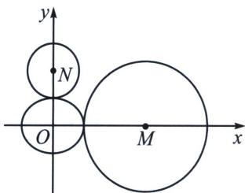
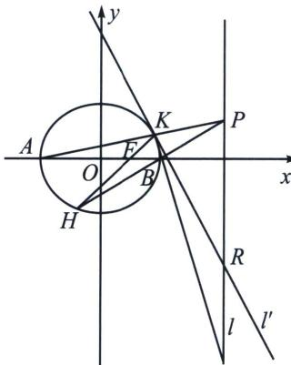
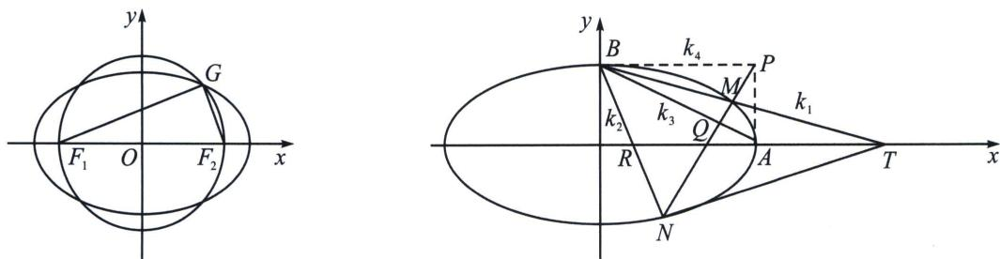

> [!faq]- 《圆锥曲线专题(下册)》例题解析
>
> > [!success]- **【答案】** 详见解析
>
> > [!note]- **【解析】**
> > 解析 (1)圆 $M: (x - 6)^{2} + y^{2} = 16$ 的圆心为 $(6,0)$ , 半径为 4; 圆 $N: x^{2} + (y - 2\sqrt{3})^{2} = 3$ 的圆心为 $(0, 2\sqrt{3})$ , 半径为 $\sqrt{3}$ ; 由题意椭圆 $E$ 与两圆都外切, 结合图形可知, $a = 2$ , $b = \sqrt{3}$ , 故椭圆 $E$ 的方程为 $\frac{x^{2}}{4} + \frac{y^{2}}{3} = 1$ .
> >
> > 
> >
> > 
> >
> > (2)(定比点差)设 $H(x_{1},y_{1})$ ， $K(x_{2},y_{2})$ ， $\overrightarrow{HF} = \lambda \overrightarrow{FK}$ ，则 $\left\{ \begin{array}{l} \frac{x_1 + \lambda x_2}{1 + \lambda} = 1 \\ \frac{y_1 + \lambda y_2}{1 + \lambda} = 0 \end{array} \right.$ ①，存在点 $R$ ，使得 $\overrightarrow{HR} = -\lambda$ $\overrightarrow{RK}$ ，则 $\left\{ \begin{array}{l} \frac{x_1 - \lambda x_2}{1 + \lambda} = x_R \\ \frac{y_1 - \lambda y_2}{1 + \lambda} = y_R \end{array} \right.$ ②，又由 $\left\{ \begin{array}{l} \frac{x_1^2}{4} + \frac{y_1^2}{3} = 1 \\ \frac{(\lambda x_2)^2}{4} + \frac{(\lambda y_2)^2}{3} = \lambda^2 \end{array} \right.$ 可得， $\frac{1}{4} \cdot \frac{x_1 + \lambda x_2}{1 + \lambda} \cdot \frac{x_1 - \lambda x_2}{1 - \lambda} + \frac{1}{3} \cdot \frac{y_1 + \lambda y_2}{1 + \lambda} \cdot \frac{y_1 - \lambda y_2}{1 - \lambda}$ $= 1$ ③，结合①②③可得， $\frac{x_F x_R}{4} = 1$ ，所以 $x_R = 1$ ，即 $\left\{ \begin{array}{l} x_1 = \frac{5}{2} + \frac{3}{2} \lambda \\ x_2 = \frac{5}{2} + \frac{3}{2} \lambda \\ y_1 + \lambda y_2 = 0 \end{array} \right.$ ，直线 $AK$ 的方程为 $y - 0 = \frac{y_2}{x_2 + 3}(x + 3)$ ，直线 $BH$ 的方程为 $y - 0 = \frac{y_1}{x_1 - 3}(x - 3)$ ，两式相除得 $x_P = 4$ ，故点 $P$ 在定直线 $l: x = 4$ 上. (3)①中题意知椭圆 $E$ 在点 $K(x_1, y_1)$ 处的切线斜率存在。故 $l' = x_1 x + y_1 y - 1$ （自证）。所以 $l' = 3x_1$
> >
> > (3)①由题意知椭圆 E 在点 $K(x_{1}, y_{1})$ 处的切线斜率存在，故 $l' : \frac{x_{1}x}{4} + \frac{y_{1}y}{3} = 1$ (自证)，所以 $k_{l'} = -\frac{3x_{1}}{4y_{1}}$ ,
> >
> > 
> >
> > 根据椭圆第三定义得： $k_{AK}k_{BK}=k_{1}k_{2}=-\frac{3}{4}$ ，且O为AB中点，所以 $\frac{1}{k_{1}}+\frac{1}{k_{2}}=\frac{2}{k_{OK}}=\frac{2x_{1}}{y_{1}}$ ，所以 $\frac{k_{1}+k_{2}}{k_{1}k_{2}}=\frac{k_{1}+k_{2}}{-\frac{3}{4}}=\frac{2x_{1}}{y_{1}}\Rightarrow k_{1}+k_{2}=-\frac{3x_{1}}{2y_{1}}=2k_{l}^{\prime}$ ，结合平行于y轴斜率公式，故R为PQ中点，结合极化恒等式可知： $\overrightarrow{KP}\cdot\overrightarrow{KQ}=\frac{1}{4}\left(\overrightarrow{KP}+\overrightarrow{KQ}\right)^{2}-\frac{1}{4}\left(\overrightarrow{KP}-\overrightarrow{KQ}\right)^{2}=\overrightarrow{KR}^{2}-\frac{1}{4}\overrightarrow{PQ}^{2}$ ，得证.
> >
> > $$
> > K (2 \cos \theta , \sqrt {3} \sin \theta), k _ {1} = \frac {\sqrt {3} \sin \theta}{2 \cos \theta + 2} = \frac {\sqrt {3}}{2} \tan \frac {\theta}{2} = \frac {\sqrt {3}}{2} t, k _ {2} = \frac {\sqrt {3} \sin \theta}{2 \cos \theta - 2} = - \frac {\sqrt {3}}{2 \tan \frac {\theta}{2}} = - \frac {\sqrt {3}}{2 t},
> > $$
> >
> > 所以 $AP: y = \frac{\sqrt{3}t}{2}(x + 2)$ ， $BQ: y = -\frac{\sqrt{3}}{2t}(x - 2)$ ，代入 $x = 4$ ，可得 $P(4, 3\sqrt{3}t)$ ， $Q(4, -\frac{\sqrt{3}}{t})$
> >
> > $S_{\triangle KPQ}=\frac{(4-2\cos\theta)\left|y_{P}-y_{Q}\right|}{2}=\sqrt{3}\cdot\frac{1+3t^{2}}{1+t^{2}}\cdot\left(3t+\frac{1}{t}\right)=\sqrt{3}\frac{(1+3t^{2})^{2}}{t(1+t^{2})}$ ，令 $f(t)=\frac{(1+3t^{2})^{2}}{t(1+t^{2})}$ ， $f^{\prime}(t)=\frac{(1+3t^{2})(3t^{4}+6t^{2}-1)}{t^{2}(1+t^{2})^{2}}$ ，当 $t_{0}^{2}=\frac{-3+2\sqrt{3}}{3}$ 时 $f^{\prime}(t_{0})=0$ ， $f(t)$ 在 $(0,t_{0})$ 单调递减，在 $(t_{0},+\infty)$ 单调递增， $f(t)_{\min}=f(t_{0})$ ，此时 $x=2\cos\theta=2\frac{1-t_{0}^{2}}{1+t_{0}^{2}}=2\sqrt{3}-2.$
