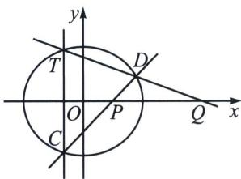
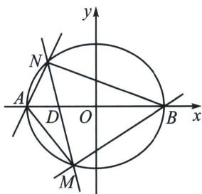

<!-- question-source:start -->
例3 (2025·江苏扬州高邮市月考 T19(25 陪跑课学员潘思宇提问))已知椭圆 $E: \frac{x^{2}}{a^{2}} + \frac{y^{2}}{b^{2}} = 1 (a > b > 0)$ 的一个焦点坐标是(1, 0)，短轴长是长轴长的 $\frac{\sqrt{3}}{2}$ .

(1)求椭圆 E 的方程;

(2)过点(0, -1)的直线 I 交椭圆 E 于 C, D 两点，与 x 轴交于 P 点，点 C 关于 x 轴的对称点为 T，直线 DT 交 x 轴于 Q 点，求证： $|OP| \cdot |OQ|$ 为定值；

(3)设椭圆 E 的左、右顶点分别为 A, B, 直线 m 交椭圆 E 于 M, N 两点 (M, N 与 A, B 均不重合), 记直线 AM 的斜率为 $k_{1}$ , 直线 BN 的斜率为 $k_{2}$ , 且 $k_{1}-2k_{2}=0$ , 设 $\triangle AMN$ , $\triangle BMN$ 的面积分别为 $S_{1}$ , $S_{2}$ , 求 $|S_{1}-S_{2}|$ 的最大值.

(1)因为的一个焦点坐标是(1.0)，短轴长是长轴长的 $\frac{\sqrt{3}}{2}$ ，所以 $c = 1, \frac{2b}{2a} = \frac{\sqrt{3}}{2}$ ，又 $a^2 = b^2 + c^2$ ，解得 $a = 2, b = \sqrt{3}$ ，则椭圆 $E$ 的方程为 $\frac{x^2}{4} + \frac{y^2}{3} = 1$ ；

(2)证明: 设 $C$ 、 $D$ 两点对应的半角参数为 $t_1$ 和 $t_2$ , 利用两点对合式 (步骤省略), $CD: \frac{x}{2}(1 - t_1 t_2) + \frac{y}{\sqrt{3}}(t_1 + t_2) = 1 + t_1 t_2$ , 过 $P(m, 0)$ , 所以 $t_1 t_2 = \frac{m - 2}{m + 2}$ , 由于 $T$ 、 $C$ 两点关于 $x$ 轴对称, 所以 $T$ 点对应参数 $t_3 = -t_1$ , $TD: \frac{x}{2} (1 + t_1 t_2) + \frac{y}{\sqrt{3}} (-t_1 + t_2) = 1 - t_1 t_2$ , 过 $Q(n, 0)$ , 所以 $t_1 t_2 = \frac{2 - n}{2 + n}$ , 所以 $\frac{m - 2}{m + 2} = \frac{2 - n}{2 + n}$ , 所以 $|OP| \cdot |OQ| = mn = 4$ ;

(3)设 $M(2\cos \theta_{1},\sqrt{3}\sin \theta_{1})$ ， $N(2\cos \theta_{2},\sqrt{3}\sin \theta_{2})$ ，则 $\sqrt{3}\sin \theta_{1} = \frac{2\sqrt{3}\tan\frac{\theta_{1}}{2}}{1 + \tan^{2}\frac{\theta_{1}}{2}} = \frac{2\sqrt{3}t_{1}}{1 + t_{1}^{2}},\sqrt{3}\sin \theta_{2} = \frac{2\sqrt{3}t_{2}}{1 + t_{2}^{2}},k_{1}$

$$
= \frac {\sqrt {3} \sin \theta_ {1}}{2 \cos \theta_ {1} + 2} = \frac {\sqrt {3}}{2} \tan \frac {\theta_ {1}}{2} = \frac {\sqrt {3}}{2} t _ {1}, k _ {2} = \frac {\sqrt {3} \sin \theta_ {2}}{2 \cos \theta_ {2} - 2} = - \frac {\sqrt {3}}{2} \frac {1}{\tan \frac {\theta_ {2}}{2}} = - \frac {\sqrt {3}}{2 t _ {2}}, k _ {1} = 2 k _ {2} \Rightarrow t _ {1} t _ {2} = - 2,
$$

对比 $MN: \frac{x}{2} (1 - t_1t_2) + \frac{y}{\sqrt{3}} (t_1 + t_2) = 1 + t_1t_2$ 可知： $x = -\frac{2}{3}$ ， $y = 0$ 为其所过定点，利用面积宽高模型， $|S_1 - S_2| = \frac{||BD| - |AD|| \cdot |y_1 - y_2|}{2} = \frac{2}{3} |y_1 - y_2| = \frac{4}{\sqrt{3}} \left|\frac{t_1}{1 + t_1^2} - \frac{t_2}{1 + t_2^2}\right| = \frac{4}{\sqrt{3}} \cdot \left|\frac{3(t_1 - t_2)}{5 + t_1^2 + t_2^2}\right| = 4\sqrt{3}$ $\left|\frac{t_1 + \frac{2}{t_1}}{5 + t_1^2 + \frac{4}{t_1^2}}\right|$ ，令 $m = \left|t_1 + \frac{2}{t_1}\right| \in [2\sqrt{2}, +\infty)$ ， $|S_1 - S_2| = 4\sqrt{3} \left|\frac{m}{m^2 + 1}\right| = 4\sqrt{3} \cdot \frac{1}{m + \frac{1}{m}} \leqslant \frac{8\sqrt{6}}{9}$ ，当且仅当 $|t_1| = \sqrt{2}$ 时等号成立；
<!-- question-source:end -->

![[高中/总复习/专题/2026版高中《mst老唐说题》圆锥曲线专题（数学）/下册/第14章_新定义下的面积转化/第三节_面积比值转化问题/二_隐藏定点的斜率关系构造面积最值问题/例题/answers/Q00048925A1.md]]
