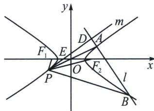

<!-- question-source:start -->
例5 (2024·南宁二模)已知双曲线 $C: \frac{x^2}{a^2} - \frac{y^2}{b^2} = 1 (a > 0, b > 0)$ 的左、右焦点分别为 $F_1, F_2$ ，双曲线 $C$ 的虚轴长为 2，有一条渐近线方程为 $y = \frac{\sqrt{3}}{3} x$ ，如图，点 $A$ 是双曲线 $C$ 上位于第一象限内的点，过点 $A$ 作直线 $l$ 与双曲线的右支交于另外一点 $B$ ，连接 $AO$ 并延长交双曲线左支于点 $P$ ，连接 $PF_1$ 与 $PF_2$ ，其中 $l$ 垂直于 $\angle F_1PF_2$ 的平分线 $m$ ，垂足为 $D$ .

(1)求双曲线 C 的标准方程;

(2)求证: 直线 $m$ 与直线 $OA$ 的斜率之积为定值;

(3)求 $\frac{S_{\triangle APB}}{S_{\triangle APD}}$ 的最小值.

<!-- question-source:end -->

![[高中/总复习/专题/2026版高中《mst老唐说题》圆锥曲线专题（数学）/下册/第14章_新定义下的面积转化/第三节_面积比值转化问题/二_隐藏定点的斜率关系构造面积最值问题/例题/answers/Q00053262A1.md]]
