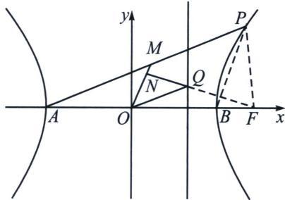

> [!faq]- 《圆锥曲线专题(下册)》例题解析
>
> > [!success]- **【答案】** 详见解析
>
> > [!note]- **【分析】**
> > 本题未单列分析。
>
> > [!note]- **【解析】**
> > 解析
> > 解得 $b^{2}=16,\quad c^{2}=25$ ，则双曲线C的标准方程为 $\frac{x^{2}}{9}-\frac{y^{2}}{16}=1$ ;
> > 
> > 背景分析：由中点弦可知： $k_{OM} \cdot k_{AP} = k_{OM} \cdot k_{OQ} = \frac{16}{9}$ ， $k_{OM} \cdot k_{NQ} = -1$ ，所以 $\frac{k_{OQ}}{k_{NQ}} = -\frac{16}{9} = \frac{y_{Q}}{x_{Q}} \cdot \frac{x_{Q} - m}{y_{Q}} \Rightarrow m = 5$ ，故 NQ 过右焦点，点 N 在以 OF 为直径的圆上.
> > 解答: 由
