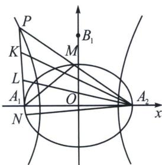

<!-- question-source:start -->
例10（湘豫名校联考2024—2025学年高三下学期第三次模拟考试T18）已知椭圆 $C_1: \frac{x^2}{25} + \frac{y^2}{9} = 1$ 的左、右顶点分别为 $A_1, A_2$ ，双曲线 $C_2: \frac{x^2}{a^2} - \frac{y^2}{b^2} = 1 (a > 0, b > 0)$ 以椭圆 $C_1$ 的长轴为实轴， $C_2$ 的渐近线方程为 $3x \pm 5y = 0$ .

(1)求双曲线 $C_2$ 的标准方程;

(2)在第二象限内取椭圆 $C_1$ 上的一点 $M$ , 连接 $A_2M$ 并延长, 与双曲线 $C_2$ 交于另一点 $P$ , 连接 $PA_1$ 并延长, 交椭圆 $C_1$ 于另一点 $N$ , 若 $\overrightarrow{A_2M} = \overrightarrow{MP}$ , 求四边形 $A_1NA_2M$ 的面积;

(3)在
(2)的条件下, 从直线 $A_{1} P$ 上取两个不同的点 $K$ , $L$ , 使得 $\triangle A_{2} K L$ 的面积为 45 , 问: $\angle K A_{2} L$ 的正切值是否存在最大值? 若存在, 请求出最大值; 若不存在, 请说明理由.

(1)椭圆 $C_1: \frac{x^2}{25} + \frac{y^2}{9} = 1$ ，其长轴在 $x$ 轴， $a_1 = 5$ ， $A_1$ 、 $A_2$ 是左右顶点，所以 $A_1(-5,0)$ ， $A_2(5,0)$ .

双曲线 $C_{2}$ 以椭圆长轴为实轴，所以双曲线实半轴 a=5 。双曲线渐近线方程 $3x\pm5y=0$ ，即 $y=\pm\frac{3}{5}x$ ，所以 $\frac{b}{a}=\frac{3}{5}$ ，a=5 ，则 b=3 ，方程为 $\frac{x^{2}}{25}-\frac{y^{2}}{9}=1$ 。

(2)设 $M(x_{0}, y_{0})$ ， $\overrightarrow{A_{2}M}=\overrightarrow{MP}$ ， $A_{2}(5, 0)$ ，根据中点坐标公式得 $P(2x_{0}-5, 2y_{0})$ 。M 在椭圆 $C_{1}$ ，P 在双曲线 $C_{2}$ ，代入方程得 $\left\{\begin{aligned}\frac{x_{0}^{2}}{25}+\frac{y_{0}^{2}}{9}&=1\\ \frac{(2x_{0}-5)^{2}}{25}-\frac{4y_{0}^{2}}{9}&=1\end{aligned}\right.$ ，消去 $y_{0}$ ：由 $\frac{x_{0}^{2}}{25}+\frac{y_{0}^{2}}{9}=1$ 得 $y_{0}^{2}=9\left(1-\frac{x_{0}^{2}}{25}\right)$ ，代入双曲线方程化简得 $2x_{0}^{2}-5x_{0}-25=0$ ，解得 $x_{0}=-\frac{5}{2}$ 或 $x_{0}=5(x_{0}=5$ 时 M 与 $A_{2}$ 重合，舍去）。把 $x_{0}=-\frac{5}{2}$ 代入椭圆方程得 $y_{0}=\frac{3\sqrt{3}}{2}$ ，所以 $M\left(-\frac{5}{2}, \frac{3\sqrt{3}}{2}\right)$ ， $P(-10, 3\sqrt{3})$ 。已知 $A_{1}(-5, 0)$ ，用两点式得直线 $PA_{1}$ 方程 $y=-\frac{3\sqrt{3}}{5}(x+5)$ ，代入椭圆方程 $\frac{x^{2}}{25}+\frac{y^{2}}{9}=1$ 得 $2x^{2}+15x+25=0$ ，解得 $x=-\frac{5}{2}$ 或 x=-5 (x=-5 是 $A_{1}$ 横坐标，舍去)，所以 $x_{N}=-\frac{5}{2}=x_{0}$ ，则 $MN\perp x$ 轴。四边形 $A_{1}NA_{2}M$ 面积 $S=2S_{\triangle A_{1}MA_{2}}=2\times\frac{1}{2}\times|A_{1}A_{2}| \times y_{0}=10\times\frac{3\sqrt{3}}{2}=15\sqrt{3}$ 。

(3)直线 $A_{1}P$ 方程 $3\sqrt{3}x + 5y + 15\sqrt{3} = 0$ ，根据点到直线距离公式， $A_{2}(5, 0)$ 到直线距离 d =

$\frac{|5 \times 3\sqrt{3} + 0 \times 5 + 15\sqrt{3}|}{\sqrt{(3\sqrt{3})^2 + 5^2}} = \frac{15\sqrt{39}}{13}$ . 已知 $S_{\triangle A_2KL} = \frac{1}{2} |KL| d = 45$ ，则 $|KL| = \frac{90}{d} = 2\sqrt{39}$ .

设 $\angle KA_{2}L = \theta$ ， $S_{\triangle KA_2L} = \frac{1}{2} A_2K\cdot A_2L\sin \theta = 45$ ，可得 $A_{2}K\cdot A_{2}L = \frac{90}{\sin\theta}.$

在 $\triangle KA_{2}L$ 中，根据余弦定理 $KL^{2}=A_{2}K^{2}+A_{2}L^{2}-2A_{2}K\cdot A_{2}L\cos\theta.$

由基本不等式 $A_{2}K^{2} + A_{2}L^{2}\geqslant 2A_{2}K\cdot A_{2}L$ （当且仅当 $A_{2}K = A_{2}L$ 时等号成立），可得 $KL^2\geqslant 2A_2K\cdot A_2L-$ $2A_{2}K\cdot A_{2}L\cos \theta = 2A_{2}K\cdot A_{2}L(1 - \cos \theta).$

已知 $KL = 2\sqrt{39}$ ，则 $KL^2 = 4\times 39$ ，所以 $4\times 39\geqslant 2\times \frac{90}{\sin\theta} (1 - \cos \theta)$ ，整理可得 $\frac{13}{15}\geqslant \frac{1 - \cos\theta}{\sin\theta}.$

利用三角函数的二倍角公式 $\cos \theta = \cos^2\frac{\theta}{2} -\sin^2\frac{\theta}{2},\sin \theta = 2\sin \frac{\theta}{2}\cos \frac{\theta}{2}$ ，对 $\frac{1 - \cos\theta}{\sin\theta}$ 进行化简：

$\frac{1 - \cos\theta}{\sin\theta} = \frac{\sin^2\frac{\theta}{2} + \cos^2\frac{\theta}{2} - (\cos^2\frac{\theta}{2} - \sin^2\frac{\theta}{2})}{2\sin\frac{\theta}{2}\cos\frac{\theta}{2}} = \frac{2\sin^2\frac{\theta}{2}}{2\sin\frac{\theta}{2}\cos\frac{\theta}{2}} = \frac{\sin\frac{\theta}{2}}{\cos\frac{\theta}{2}} = \tan \frac{\theta}{2},$ 所以 $\tan \frac{\theta}{2}\leqslant \frac{13}{15}$ ，当且

仅当 $A_{2}K = A_{2}L$ 时等号成立。因为 $\frac{13}{15} < 1$ ，且 $\tan \frac{\theta}{2} > 0$ （ $\theta$ 是三角形内角， $0 < \theta < \pi$ ，则 $0 < \frac{\theta}{2} < \frac{\pi}{2}$ ），所以 $0 < \frac{\theta}{2} < \frac{\pi}{4}$ ， $\tan \theta$ 存在最大值。根据正切的二倍角公式 $\tan \theta = \frac{2 \tan \frac{\theta}{2}}{1 - \tan^2 \frac{\theta}{2}}$ ，将 $\tan \frac{\theta}{2} = \frac{13}{15}$ 代入可得：

$$
(\tan \theta) _ {\max} = \frac {2 \times \frac {1 3}{1 5}}{1 - \left(\frac {1 3}{1 5}\right) ^ {2}} = \frac {\frac {2 6}{1 5}}{\frac {2 2 5 - 1 6 9}{2 2 5}} = \frac {\frac {2 6}{1 5}}{\frac {5 6}{2 2 5}} = \frac {2 6}{1 5} \times \frac {2 2 5}{5 6} = \frac {1 9 5}{2 8} \text {即} (\tan \angle K A _ {2} L) _ {\max} = \frac {1 9 5}{2 8}.
$$
<!-- question-source:end -->

![[高中/总复习/专题/2026版高中《mst老唐说题》圆锥曲线专题（数学）/下册/第14章_新定义下的面积转化/第三节_面积比值转化问题/五_由单动点三角换元构造面积比/例题/answers/Q00048932A1.md]]
