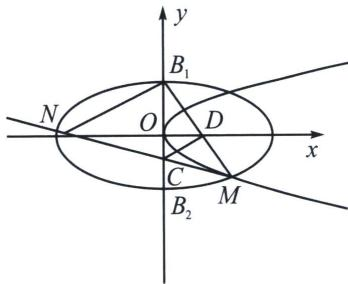

<!-- question-source:start -->
例12 (2023·鹿城区模拟)已知椭圆 $C_{1}: \frac{x^{2}}{4} + y^{2} = 1$ 的上、下顶点分别为 $B_{1}, B_{2}$ , 抛物线 $C_{2}: y^{2} = 2px$ , $(p > 0)$ 在点 $P(2, -2\sqrt{p})$ 处的切线 $l$ 交椭圆 $C_{1}$ 于点 $M, N$ , 交椭圆的短轴于点 $C$ . 直线 $MB_{1}$ 交 $x$ 轴于点 $D$ . (1)若点 $C$ 是 $OB_{2}$ 的中点, 求 $p$ 的值;

(2)设 $\triangle MCD$ 与 $\triangle MNB_{1}$ 的面积分别为 $S_{1}$ ， $S_{2}$ ，求 $\frac{S_{1}}{S_{2}}$ 的最大值.

<!-- question-source:end -->

![[高中/总复习/专题/2026版高中《mst老唐说题》圆锥曲线专题（数学）/下册/第14章_新定义下的面积转化/第三节_面积比值转化问题/五_由单动点三角换元构造面积比/例题/answers/Q00053269A1.md]]
