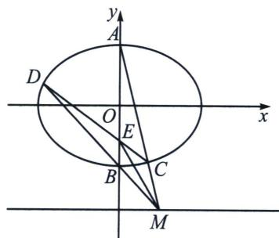

> [!faq]- 《圆锥曲线专题(下册)》例题解析
>
> > [!success]- **【答案】** 详见解析
>
> > [!note]- **【解析】**
> > 解析 (1)记以射线 $OQ$ 为终边的角为 $\theta$ , 则 $R(\cos \theta, \sin \theta)$ , $T(2 \cos \theta, 2 \sin \theta)$ ,
> >
> > 设 $P(x, y)$ ，则 $x=2\cos\theta$ ， $y=\sin\theta$ ，得 $\frac{x^{2}}{4}+y^{2}=\cos^{2}\theta+\sin^{2}\theta=1$ 。故点 P 的轨迹 $\Gamma$ 的方程为 $\frac{x^{2}}{4}+y^{2}=1$ ；
> >
> > 
> >
> > (2)由题意可知，直线 CD 的斜率存在，
> >
> > 连接 BC，根据第三定义 $k_{BC} \cdot k_{AC} = -\frac{1}{4}$ ，由于 $\frac{k_{AC}}{k_{BD}} = \frac{\frac{y_{A} + 2}{m}}{\frac{y_{B} + 2}{m}} = 3$ ，所以 $k_{BC} \cdot k_{BD} = -\frac{1}{12}$ ，将椭圆按照向量 $\overrightarrow{BO} = (0, 1)$ 平移，得： $\frac{x^{2}}{4} + (y - 1)^{2} = 1$ ，即 $\frac{x^{2}}{4} + y^{2} - 2y = 0$ ，令 $C'D' : mx + ny = 1$ ，则： $\frac{x^{2}}{4} + y^{2} - 2y (mx + ny) = 0$ ，同除以 $x^{2}$ 得： $(1 - 2n)\frac{y^{2}}{x^{2}} - 2m\frac{y}{x} + \frac{1}{4} = 0$ ，所以 $k_{BC} k_{BD} = \frac{\frac{1}{4}}{1 - 2n} = -\frac{1}{12}$ ，所以 n = 2，平移回去可知，CD 过定点 $E\left(0, -\frac{1}{2}\right)$ ；故 $S_{\triangle MBE} = \frac{1}{3} S_{\triangle MAE}$ .
> >
> > 解法一：设 $\overrightarrow{MC} = \lambda \overrightarrow{CA}$ ，则 $C\left(\frac{m}{1 + \lambda}, \frac{-2 + \lambda}{1 + \lambda}\right)$ ，代入椭圆方程，有 $\frac{m^2}{4(1 + \lambda)^2} + \frac{(\lambda - 2)^2}{(1 + \lambda)^2} = 1$ ，即 $m^2 = 24\lambda - 12 > 0$ ，解得 $\lambda > \frac{1}{2}$ 。则 $S_{\triangle MCE} = \lambda S_{\triangle ACE}$ ，可得 $S_{\triangle ACE} = \frac{\lambda}{\lambda + 1} S_{\triangle MAE}$ 。故 $\frac{S_{\triangle MCE}}{S_{\triangle MBE}} = \frac{3\lambda}{1 + \lambda} = 3 - \frac{3}{1 + \lambda} \in (1, 3)$ 。
> >
> > 解法二：设 $C(2\cos \theta, \sin \theta)$ ，令 $t = \tan \frac{\theta}{2}$ ， $C: \left(\frac{2(1 - t^2)}{1 + t^2}, \frac{2t}{1 + t^2}\right)$ ，其中 $-1 < \frac{2t}{1 + t^2} < 1$ ， $k_{AC} = -\frac{1 - t}{2(1 + t)}$ ， $AC: y = -\frac{1 - t}{2(1 + t)} x + 1$ ，当 $y = -2$ 时， $x_M = \frac{6(1 + t)}{1 - t}$ ，
> >
> > $$
> > \frac {S _ {\triangle M C E}}{S _ {\triangle M B E}} = \frac {3 (x _ {M} - x _ {C})}{x _ {M}} = 3 - \frac {\frac {1 - t ^ {2}}{1 + t ^ {2}}}{\frac {1 + t}{1 - t}} = 3 - \frac {(1 - t) ^ {2}}{t ^ {2} + 1} = 2 + \frac {2 t}{t ^ {2} + 1} \in (1, 3)
> > $$
