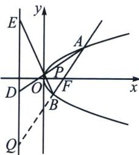

> [!faq]- 《圆锥曲线专题(下册)》例题解析
>
> > [!success]- **【答案】** 详见解析
>
> > [!note]- **【解析】**
> > 解析 (1)由题意, 可得 $AB$ 方程为 $x = \frac{3}{4} y + \frac{p}{2}$ , 设 $A(x_{1}, y_{1}), B(x_{2}, y_{2})$ , 联立方程 $\left\{ \begin{array}{l} y^{2} = 2px \\ x = \frac{3}{4} y + \frac{p}{2} \end{array} \right.$ , 整理得 $2y^{2} - 3py - 2p^{2} = 0$ , 所以 $y_{M} = \frac{1}{2}(y_{1} + y_{2}) = \frac{3}{4} p = \frac{3}{2}$ , 所以 $p = 2$ , 抛物线 $C$ 方程为 $y^{2} = 4x$ .
> >
> > 
> >
> > (2)
> > 解法一：因为点 $A$ 在第一象限，所以由(1)可得 $A(4, 4)$ ， $B\left(\frac{1}{4}, -1\right)$ 。设 $P(a^2, 2a)$ ，因为点 $E$ 在点 $D$ 的上方，所以 $a \in \left(-\frac{1}{2}, \frac{1}{2}\right)$ ，直线 $AP: y - y_1 = \frac{y_1 - 2a}{x_1 - a^2} (x - x_1)$ ，令 $x = -1$ ，可得 $y_D = \frac{-4 + 2ay_1}{2a + y_1} = \frac{-2 + 4a}{a + 2}$ ，同理 $y_E = \frac{-4 + 2ay_2}{2a + y_2} = \frac{-4 - 2a}{2a - 1}$ .
> >
> > (i)延长 $AB$ 交准线于 $Q$ ，可得 $y_{Q} = -\frac{8}{3}$ ，则 $S_{\triangle PAB} = S_{\triangle PDE}$ ，即 $S_{\triangle ADQ} = S_{\triangle BEQ}$ ，因为 $S_{\triangle ADQ} = \frac{1}{2}(y_{D} - y_{Q}) \times 5$ ， $S_{\triangle BEQ} = \frac{1}{2}(y_{E} - y_{Q}) \times \frac{5}{4}$ ，可得 $4(y_{D} - y_{Q}) = (y_{E} - y_{Q})$ ，即 $4\left(\frac{-2 + 4a}{a + 2} + \frac{8}{3}\right) = \left(\frac{-4 - 2a}{2a - 1} + \frac{8}{3}\right)$ ，解得 $a = 0$ ，故存在点 $P(0,0)$ ，使得 $S_{\triangle PAB} = S_{\triangle PDE}$ .
> >
> > （ii）由 $|DE| = y_E - y_D = -5 + 5\frac{3a - 4}{2a^2 + 3a - 2}$ ，令 $h(a) = -5 + 5\frac{3a - 4}{2a^2 + 3a - 2}, a \in \left(-\frac{1}{2}, \frac{1}{2}\right)$ ，则 $h'(a) = \frac{-10(3a + 1)(a - 3)}{(2a^2 + 3a - 2)^2}$ ，所以 $h(a)$ 在 $\left(-\frac{1}{2}, -\frac{1}{3}\right)$ 上单减，在 $\left(-\frac{1}{3}, \frac{1}{2}\right)$ 上单增， $h(a) \geqslant h\left(-\frac{1}{3}\right) = 4$ 此时 $|DE| \geqslant 4$ ，故 $|DE|_{\min} = 4$ 。
> >
> > 注意 抛物线也利用单动点转化时，三角换元失去了优势，正常利用坐标转化即可.
