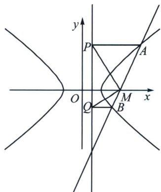

> [!faq]- 《圆锥曲线专题(下册)》例题解析
>
> > [!success]- **【答案】** 详见解析
>
> > [!note]- **【解析】**
> > 解析 (1)证明：设 $E(x_0, y_0), A(x_1, y_1), B(x_2, y_2)$ ，
> >
> > 由题意得：切线 EA 的方程为： $\frac{x_{1}x}{4}-y_{1}y=1$ ，将点 E 代入得： $\frac{x_{1}x_{0}}{4}-y_{1}y_{0}=1$ ，
> >
> > 同理可得： $\frac{x_2x_0}{4} -y_2y_0 = 1$ ，易知点 $A$ ， $B$ 都在直线 $\frac{x_0x}{4} -y_0y = 1$ 上，所以直线 $l$ 的方程为： $\frac{x_0x}{4} -y_0y = 1$
> >
> > 因为直线 l 过点 $M(4,0)$ ，所以 $x_{0}=1$ ，所以点 E 恒在定直线 L：x=1 上；
> >
> > (2)设 $N(1, y_2)$ ，因为 $\overrightarrow{AN} = \lambda \overrightarrow{MA}$ ，所以 $\left\{ \begin{array}{l} 1 - x_1 = \lambda (x_1 - 4) \\ y_3 - y_1 = \lambda y_1 \end{array} \right.$ ，整理得 $\left\{ \begin{array}{l} x_1 = \frac{1 + 4\lambda}{1 + \lambda} \\ y_1 = \frac{y_3}{1 + \lambda} \end{array} \right.$ ，
> >
> > 因为点 $A(x_{1},y_{1})$ 在双曲线上，所以 $\frac{\left(\frac{1 + 4\lambda}{1 + \lambda}\right)^2}{4} -\left(\frac{y_3}{1 + \lambda}\right)^2 = 1$ ，整理得 $12\lambda^2 -4y_3^2 -3 = 0$ ，同理可得 $12\mu^2$ $-4y_3^2 -3 = 0$ ，所以 $\lambda ,\mu$ 是关于 $x$ 的方程 $12x^{2} - 4y_{3}^{2} - 3 = 0$ 的两个实根，所以 $\lambda +\mu = 0$
> >
> > 
> >
> > (3)设 $l: x = ty + 4$ ，与 $C: \frac{x^2}{4} - y^2 = 1$ 联立得： $(t^2 - 4)y^2 + 8ty + 12 = 0$
> >
> > 所以 $y_{1} + y_{2} = -\frac{8t}{t^{2} - 4}, y_{1}y_{2} = \frac{12}{t^{2} - 4}$ ，因为直线 $L$ 的方程为 $x = 1$ ，所以 $P(1, y_1)Q(1, y_2)$ ，
> >
> > 所以 $S_{1} = \frac{1}{2}|AP|\cdot |y_{1}| = \frac{1}{2}|x_{1} - 1|\cdot |y_{1}| = \frac{1}{2}|ty_{1} + 3|\cdot |y_{1}|$ ，同理 $S_{2} = \frac{1}{2}|ty_{2} + 3|\cdot |y_{2}|$ ， $S_{3} = \frac{3}{2}|y_{1} - y_{2}|$ ，
> >
> > $$
> > m = \frac {S _ {1} S _ {2}}{S _ {3} ^ {2}} = \frac {\frac {1}{4} | y _ {1} y _ {2} | \cdot | t ^ {2} y _ {1} y _ {2} + 3 t (y _ {1} + y _ {2}) + 9 |}{\frac {9}{4} (y _ {1} - y _ {2}) ^ {2}} = \frac {\left| \frac {1 2}{t ^ {2} - 4} - \frac {2 4 t ^ {2}}{t ^ {2} - 4} + 9 \right|}{9 \left[ \left(- \frac {8 t}{t ^ {2} - 4}\right) ^ {2} - \frac {4 8}{t ^ {2} - 4} \right]} = \frac {1}{4},
> > $$
> >
> > 故存在 $m = \frac{1}{4}$ ，使得 $S_{1}S_{2} = \frac{1}{4} S_{3}^{2}$
