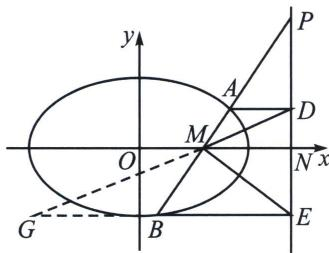
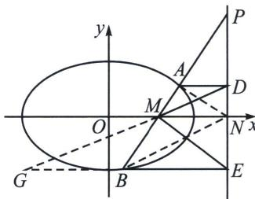

## 六、共轭点面积等比中项模型

椭圆 $\frac{x^2}{a^2} +\frac{y^2}{b^2} = 1(a > 0,b > 0)$ ，过点 $M(m,0)$ 的直线交椭圆于 $A$ ， $B$ 两点，点 $D$ ， $N$ ， $E$ 在 $M$ 对应极线 $x = \frac{a^2}{m}$ 上，且与 $AB$ 交于点 $P$ ， $AD / / MN / / BE$ ，则 $S_{\triangle MDE}^{2} = 4S_{\triangle MAD}S_{\triangle MBE}$ ， $S_{\triangle NAB}^{2} = 4S_{\triangle NAD}S_{\triangle NBE}$

证明：延长 $EB$ 交 $DM$ 于 $G$ ，以 $M$ 为射影中心， $(PN, DE) = -1$ ，由于 $MN // EG$ ，故 $BE = BG$ ，由于 $AD // MN // BE$ ，所以 $\frac{DN}{EN} = \frac{AM}{MB} = \frac{AP}{PB} = \frac{DP}{PE} = \lambda$ ， $\frac{S_{\triangle MAD}}{S_{\triangle MBE}} = \left(\frac{AM}{MB}\right)^2 = \lambda^2$ ， $\frac{S_{\triangle MDE}}{2S_{\triangle MBE}} = \frac{MD}{MG} = \frac{AM}{MB} = \lambda$ ，

所以 $S_{\triangle MDE}^{2} = 4S_{\triangle MAD}\cdot S_{\triangle MBE}$ ；同理可证 $S_{\triangle NAB}^{2} = 4S_{\triangle NAD}\cdot S_{\triangle NBE}$ 。

![[高中/总复习/专题/2026版高中《mst老唐说题》圆锥曲线专题（数学）/下册/第14章_新定义下的面积转化/第三节_面积比值转化问题/六_共轭点面积等比中项模型/例题/Q00053271.md]]
