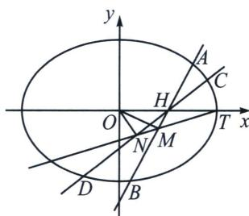

<!-- question-source:start -->
例8 (2025·福建南平·三模 T18) 在平面直角坐标系 $xOy$ 中, 已知椭圆 $E: \frac{x^2}{a^2} + \frac{y^2}{b^2} = 1 (a > b > 0)$ 的右顶点为 $T(2, 0)$ , 过 $E$ 的焦点且垂直于 $x$ 轴的弦长为 2.

(1)求 E 的方程;

(2) 过点 $H(1, 0)$ 作斜率之积为 1 的两条不同的直线 $l_{1}, l_{2}$ , 若 $l_{1}$ 交 $E$ 于 $A$ , $B$ 两点, $l_{2}$ 交 $E$ 于 $C$ , $D$ 两点, $M$ 为 $AB$ 的中点, 直线 $MT$ 与 $CD$ 交于 $N$ 点.

①证明：N 为 CD 的中点；

②求 $\triangle MON$ 面积的最大值.

(1)已知椭圆 $E: \frac{x^2}{a^2} + \frac{y^2}{b^2} = 1 (a > b > 0)$ 的右顶点为 $T(2, 0)$ , 根据椭圆的性质, 右顶点坐标为 $(a, 0)$ , 所以 $a = 2$ . 过椭圆的焦点且垂直于 $x$ 轴的弦长为 2 , 不妨设焦点为 $(c, 0)$ , 将 $x = c$ 代入椭圆方程 $\frac{x^2}{a^2} + \frac{y^2}{b^2} = 1$ , 可得 $\frac{c^2}{a^2} + \frac{y^2}{b^2} = 1$ , 即 $y = \pm \frac{b^2}{a}$ , 那么弦长为 $\frac{2b^2}{a} = 2$ . 把 $a = 2$ 代入 $\frac{2b^2}{a} = 2$ , 可得 $b^2 = 2$ . 所以椭圆 $E$ 的方程为 $\frac{x^2}{4} + \frac{y^2}{2} = 1$ .

(2)①寻找隐藏轨迹小椭圆；设 $M(x, y)$ ，由点差法（过程请自己完成）得： $k_{OM}k_{AB} = -\frac{1}{2}$ ， $\frac{y}{x} \cdot \frac{y}{x-1} = -\frac{1}{2}$ ，即 $\left(x - \frac{1}{2}\right)^{2} + 2y^{2} = \frac{1}{4}$ ，同理，点 N 也符合相同的条件性质，故 N 也在曲线 $\left(x - \frac{1}{2}\right)^{2} + 2y^{2} = \frac{1}{4}$ 上；
由于 $\left\{\begin{aligned}k_{OM}k_{AB}k_{ON}k_{CD}&=(-\frac{1}{2})^{2}\\ k_{AB}k_{CD}&=1\end{aligned}\right.\Rightarrow k_{OM}k_{ON}=\frac{1}{4}$ ，利用齐次化，令MN： $mx+ny=1,\quad x^{2}-x+2y^{2}=0\Leftrightarrow x^{2}+2y^{2}-x(mx+ny)=1$ ，同除以 $x^{2}$ 得： $2\left(\frac{y}{x}\right)^{2}-n\left(\frac{y}{x}\right)+1-m=0$ ，所以 $k_{OM}k_{ON}=\frac{1-m}{2}=\frac{1}{4}$ ，所以 $m=\frac{1}{2}$ ，所以MN过定点T(2,0)，所以直线MT与CD交于点N时，N为CD的中点；

②已知 $|OT|=2$ ， $\triangle MON$ 的面积 $S=\frac{1}{2}|OT|\cdot|y_{M}-y_{N}|=|y_{M}-y_{N}|$ ，

$\left\{ \begin{array}{l} x = ty + 2 \\ x^2 - x + 2y^2 = 0 \end{array} \right. \Rightarrow (t^2 + 2)y^2 + 3ty + 2 = 0, \Delta = 9t^2 - 8(t^2 + 2) = t^2 - 16 > 0$ ，所以 $|t| > 4$ ，令 $m = \sqrt{t^2 - 16} > 0$ ， $|y_M - y_N| = \frac{\sqrt{t^2 - 16}}{t^2 + 2} = \frac{m}{m^2 + 18} = \frac{1}{m + \frac{18}{m}} \leqslant \frac{\sqrt{2}}{12}$ ，当且仅当 $m = 3\sqrt{2}$ ， $t = \pm \sqrt{34}$ 时， $\triangle MON$ 的面积取最大值 $\frac{\sqrt{2}}{12}$ .
<!-- question-source:end -->

![[高中/总复习/专题/2026版高中《mst老唐说题》圆锥曲线专题（数学）/下册/第14章_新定义下的面积转化/第三节_面积比值转化问题/四_由中点隐藏轨迹方程构造面积最值问题/例题/answers/Q00048930A1.md]]
