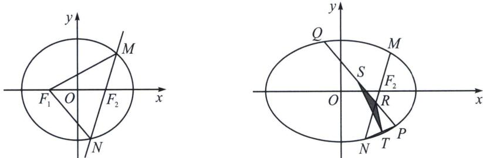
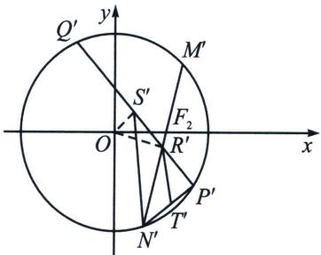

> [!faq]- 《圆锥曲线专题(下册)》例题解析
>
> > [!success]- **【答案】** 详见解析
>
> > [!note]- **【解析】**
> > 解析 (1)由椭圆的定义可得 $\triangle MF_{1}N$ 的周长为 $4a$ , 所以 $4a = 4\sqrt{2}$ , 所以 $a = \sqrt{2}$ . 离心率 $e = \frac{c}{a} = \frac{c}{\sqrt{2}} = \frac{\sqrt{2}}{2}$ , 解得 $c = 1$ , 所以 $b^{2} = a^{2} - c^{2} = 1$ , 所以椭圆 $C$ 的标准方程为 $\frac{x^{2}}{2} + y^{2} = 1$ .
> >
> > 
> >
> > (2)(i)由(1)可得点 $F_{2}$ 坐标 $(1,0)$ ，易得过点 $F_{2}$ 的所有直线与椭圆一定有两个不同的交点，由 $OM \perp ON$ ，
> >
> > 令 $z_{M} = x_{M} + y_{M}\mathrm{i} = r_{1}(\cos \theta +i\sin \theta)$ ，所以 $M(r_1\cos \theta ,r_1\sin \theta)$ ， $z_{N} = x_{N} + y_{N}\mathrm{i} = r_{2}\left(\cos \left(\theta \pm \frac{\pi}{2}\right) + i\sin \left(\theta \pm \frac{\pi}{2}\right)\right),$
> >
> > 所以 $N\left(r_2\cos \left(\theta \pm \frac{\pi}{2}\right), r_2\sin \left(\theta \pm \frac{\pi}{2}\right)\right)$ ，即 $N(\mp r_2\sin \theta, \pm r_2\cos \theta)$ ，设 $O$ 到 $MN$ 距离为 $r$ ，
> >
> > 分别代入椭圆方程得： $\frac{r_{1}^{2}\cos^{2}\theta}{2}+r_{1}^{2}\sin^{2}\theta=1\Rightarrow\frac{1}{r_{1}^{2}}=\frac{\cos^{2}\theta+2\sin^{2}\theta}{2}$ ，同理 $\frac{1}{r_{2}^{2}}=\frac{\sin^{2}\theta+2\cos^{2}\theta}{2}$ ，两式相加得： $\frac{1}{r_{1}^{2}}+\frac{1}{r_{2}^{2}}=\frac{3}{2}=\frac{1}{r^{2}}$ ，故 $r^{2}=\frac{2}{3}$ ，即 $r=|OF_{2}|\sin\angle OF_{2}N=\sin\angle OF_{2}N=\sin\alpha=\frac{\sqrt{6}}{3}$
> >
> > 所以 $k_{MN} = -\tan \alpha = \pm \sqrt{2}$ ，利用点差法（过程省略） $\left\{ \begin{array}{l} k_{OR} k_{MN} = -\frac{1}{2} \Rightarrow k_{OR} = \pm \frac{\sqrt{2}}{4} = \frac{y_R}{x_R} \\ y_R = \pm \sqrt{2}(x_R - 1) \end{array} \right.$ ，综上所述，点 $R$ 的坐标是 $\left(\frac{4}{5}, -\frac{\sqrt{2}}{5}\right)$ 或 $\left(\frac{4}{5}, \frac{\sqrt{2}}{5}\right)$ .
> >
> > （ii）根据对称性△RST面积最大值与点R所在象限无关，不妨设点R的坐标是 $\left(\frac{4}{5},\frac{\sqrt{2}}{5}\right)$ ，此时直线MN的方程可化为 $\sqrt{2}x+y-\sqrt{2}=0$ ， $S_{\triangle RST}=\frac{1}{2}S_{\triangle NRS}$ ， $|NR|=\frac{1}{2}|MN|=\frac{1}{2}\frac{2ab^{2}}{a^{2}-c^{2}\cos^{2}\alpha}=\frac{\sqrt{2}}{1+\sin^{2}\alpha}=\frac{3\sqrt{2}}{5}$ ，
> > 接下来求S的轨迹方程，是一个隐藏的小椭圆， $\left\{\begin{aligned}&k_{OS}k=-\frac{1}{2}\Rightarrow k=-\frac{x}{2y}\\&y-\frac{\sqrt{2}}{5}=k\left(x-\frac{4}{5}\right)\end{aligned}\right.\Rightarrow\frac{\left(x-\frac{2}{5}\right)^{2}}{2}+\left(y-\frac{\sqrt{2}}{10}\right)^{2}=\frac{1}{10}$ 所以利用三角换元，可知 $\left\{\begin{aligned}&x-\frac{2}{5}=\frac{1}{\sqrt{5}}\cos\theta\\&y-\frac{\sqrt{2}}{10}=\frac{1}{\sqrt{10}}\sin\theta\end{aligned}\right.$ ，设点S到直线MN的距离为d，
> > 所以 $d=\frac{\left|\sqrt{2}x+y-\sqrt{2}\right|}{\sqrt{3}}=\frac{\left|\frac{\sqrt{2}}{\sqrt{5}}\cos\theta+\frac{1}{\sqrt{10}}\sin\theta-\frac{\sqrt{2}}{2}\right|}{\sqrt{3}}=\frac{\left|\frac{\sqrt{2}}{2}\sin(\theta+\varphi)-\frac{\sqrt{2}}{2}\right|}{\sqrt{3}}\leqslant\frac{\sqrt{2}}{\sqrt{3}}=r,$ 所以 $S_{\triangle RST}=\frac{1}{2}S_{\triangle NRS}\leqslant\frac{1}{4}|NR|\cdot d_{max}=\frac{\sqrt{3}}{10},\triangle RST$ 面积最大值为 $\frac{\sqrt{3}}{10}.$
> >
> > 
> >
> > 另解(仿射): 作 $\left\{ \begin{array}{l} x' = x \\ y' = \sqrt{2} y \end{array} \right. \Rightarrow (x')^2 + (y')^2 = 2$ , 则 $R'\left(\frac{4}{5}, \frac{2}{5}\right)$ , $k'_{MN'} = \sqrt{2} k_{MN} = -2$ , 如图所示, 由于 $S_{\triangle RST} = \frac{1}{2} S_{\triangle NRS}$ , 所以 $S_{\triangle R'S'T'} = \frac{1}{2} S_{\triangle N'R'S'} = \frac{1}{4} |N'R'| |S'R'| \sin \angle S'R' N' \leqslant \frac{1}{4} |N'R'| |S'R'| \leqslant \frac{1}{4} |N'R'| |OR'\mid$ , 显然根据垂径定理, 当且仅当 $OR' \perp M' N'$ , 过 $R'$ 的直线中与 $M' N'$ 垂直, 即 $S'$ 与 $O$ 重合时, $|OR'| \geqslant |S'R'|$ , 面积最大, $\tan \angle OF_2 R' = 2$ , $|OR'| = |OF_2| \sin \angle OF_2 R' = \frac{2}{\sqrt{5}}$ , $|N'R'| =$ $\sqrt{r^{2}-|OR^{\prime}|^{2}}=\frac{\sqrt{6}}{\sqrt{5}}$ ，所以 $S_{\triangle R'S'T'\max}=\frac{1}{4}|N'R'||OR'|=\frac{\sqrt{6}}{10}$ ，所以 $S_{\triangle RST}=\frac{S_{\triangle NRS}}{\sqrt{2}}\leqslant\frac{\sqrt{3}}{10}$ .
