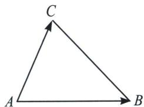

## 一、坐标面积公式推导

在 $\triangle ABC$ 中，已知 $\overrightarrow{AB}=(x_{1},y_{1})$ ， $\overrightarrow{AC}=(x_{2},y_{2})$ ，则 $\triangle ABC$ 的坐标面积公式为 $S_{\triangle ABC}=\frac{1}{2}AB\cdot AC\cdot\sin A=\frac{1}{2}\sqrt{|\overrightarrow{AB}|^{2}|\overrightarrow{AC}|^{2}-(\overrightarrow{AB}\cdot\overrightarrow{AC})^{2}}=\frac{1}{2}|x_{1}y_{2}-x_{2}y_{1}|.$

面积公式的推导不难，处理后续数据成为了关键，我们先看一道高考题.

![[高中/总复习/专题/2026版高中《mst老唐说题》圆锥曲线专题（数学）/下册/第14章_新定义下的面积转化/第二节_坐标面积公式与面积最值/一_坐标面积公式推导/例题/Q00048917.md]]
![[高中/总复习/专题/2026版高中《mst老唐说题》圆锥曲线专题（数学）/下册/第14章_新定义下的面积转化/第二节_坐标面积公式与面积最值/一_坐标面积公式推导/例题/Q00048918.md]]
