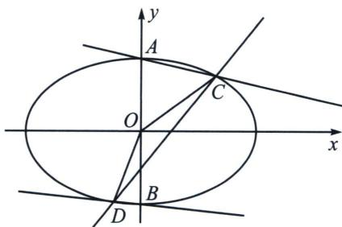

<!-- question-source:start -->
例2 (2025年普通高等学校招生全国统一考试数学预测卷(黑龙江、吉林, 辽宁、内蒙古专版)T18)已知点 $P$ 在圆 $x^{2}+y^{2}=2$ 上运动, 过点 $P$ 作 $x$ 轴的垂线段 $PQ$ , 垂足为 $Q$ , 点 $M$ 满足 $\overrightarrow{QM}=\frac{\sqrt{2}}{2}\overrightarrow{QP}$ , 当点 $P$ 经过圆与 $x$ 轴的交点时, 规定点 $M$ 与点 $P$ 重合.

(1)求动点 M 的轨迹方程 E.

(2)设 A, B 分别是方程 E 表示的曲线 $\Gamma$ 的上、下顶点，C、D 是直线 $y=kx+m$ 与曲线 $\Gamma$ 的两个交点.

①若直线 AC 的斜率 $k_{AC}$ 与直线 BD 的斜率 $k_{BD}$ 满足 $k_{AC}=3k_{BD}$ ，求证：直线 CD 过定点.

②当 k, m 变化时、试探究 $\triangle OCD(O$ 为坐标原点 $)$ 的面积是否存在最大值？若存在，请求出最大值；若不存在，请说明理由.

(1) 设 $M(x, y)$ , $P(x_0, y_0)$ , 则 $Q(x_0, 0)$ , 由 $\overrightarrow{QM} = \frac{\sqrt{2}}{2}\overrightarrow{QP}$ , 得 $\overrightarrow{QP} = \sqrt{2}\overrightarrow{QM}$ , 即 $(0, y_0) = \sqrt{2}(x - x_0, y)$ , 所以 $\left\{ \begin{array}{l} x - x_0 = 0 \\ \sqrt{2}y = y_0 \end{array} \right.$ , 所以 $\left\{ \begin{array}{l} x_0 = x \\ y_0 = \sqrt{2}y \end{array} \right.$ , 则 $P(x, \sqrt{2}y)$ , 因为点 $P$ 在圆 $x^2 + y^2 = 2$ 上运动, 所以 $x^2 + (\sqrt{2}y)^2 = 2$ , 整理得 $\frac{x^2}{2} + y^2 = 1$ , 当点 $P$ 经过圆与 $x$ 轴的交点时, 同样成立, 所以动点 $M$ 的轨迹方程为 $\frac{x^2}{2} + y^2 = 1$ ;

(2)①设 $C(\sqrt{2}\cos \theta_1,\sin \theta_1)$ ， $D(\cos \theta_{2},\sin \theta_{2})$ ， $k_{AC} = \frac{\sin\theta_1 - 1}{\sqrt{2}\cos\theta_1} = -\frac{1 - \tan\frac{\theta_1}{2}}{1 + \tan\frac{\theta_1}{2}} = -\frac{1 - t_1}{1 + t_1}, k_{BD} = \frac{\sin\theta_2 + 1}{\sqrt{2}\cos\theta_1} =$

$\frac{1 + \tan\frac{\theta_2}{2}}{1 - \tan\frac{\theta_1}{2}} = \frac{1 + t_2}{1 - t_2}, k_{AC} = 3k_{BD}\Leftrightarrow 4 + 2(t_1 + t_2) + 4t_1t_2 = 0$ ，对比 $CD$ 的两点对合式方程（自证），

$$
\frac {x}{\sqrt {2}} (1 - t _ {1} t _ {2}) + y (t _ {1} + t _ {2}) = 1 + t _ {1} t _ {2}, \text {一定有} \frac {4}{1 + \frac {x}{\sqrt {2}}} = \frac {2}{- y} = \frac {4}{1 - \frac {x}{\sqrt {2}}} \Rightarrow \left\{ \begin{array}{l l} x = 0 \\ y = - \frac {1}{2} \end{array} ; \right.
$$

②设 $C(x_{1},y_{1})$ ， $D(x_{2},y_{2})$ ，由于 $C$ 、 $D$ 、 $P\left(0, - \frac{1}{2}\right)$ 三点共线， $\frac{y_1 + \frac{1}{2}}{x_1} = \frac{y_2 - y_1}{x_2 - x_1}$ ， $y_{1}x_{2} - y_{2}x_{1} =$ $-\frac{1}{2} (x_{2} - x_{1})$ ， $S_{\triangle OCD} = \frac{1}{2}|y_1x_2 - y_2x_1|\leqslant \frac{1}{2}\sqrt{\left(\frac{x_1^2}{2} + y_1^2\right)(2y_2^2 + x_2^2)} = \frac{\sqrt{2}}{2}$ ，当且仅当 $\left|\frac{y_1y_2}{x_1x_2}\right| = \frac{1}{2}$ 时，即 $\frac{y_1y_2}{x_1x_2}$ $= -\frac{1}{2}$ 取等，所以 $\triangle OCD$ 的面积存在最大值，最大值为 $\frac{\sqrt{2}}{2}$
<!-- question-source:end -->

![[高中/总复习/专题/2026版高中《mst老唐说题》圆锥曲线专题（数学）/下册/第14章_新定义下的面积转化/第二节_坐标面积公式与面积最值/一_坐标面积公式推导/例题/answers/Q00048918A1.md]]
