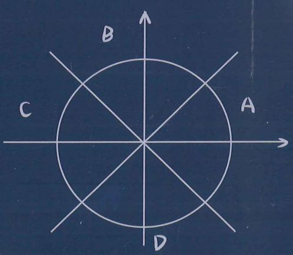
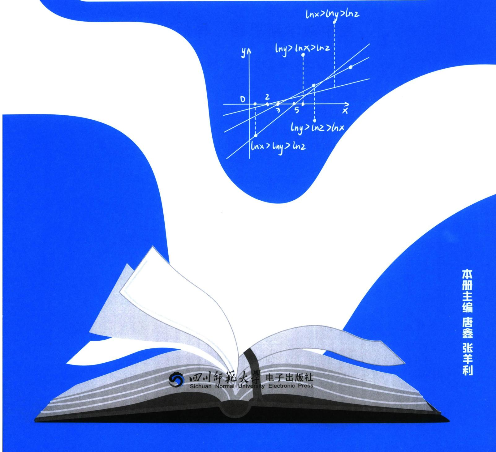
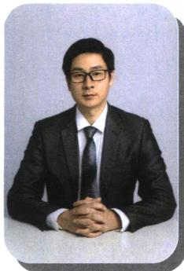
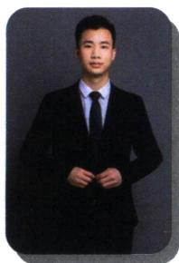
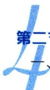

<!-- source-part:1 pages:1-80 -->

# 高中数学新思路 导数专题（上）

本册主编唐鑫张羊利

四川師範大學 电子出版社
Sichuan Normal University Electronic Press

老唐说题团队教研产品  
《高考数学满分突破—秒系列123》  
《高中数学新思路—复习专题第一轮》  
《高中数学新思路—复习专题第二轮》  
《高中数学新思路—同步系列123》

《高中数学新思路 — 圆锥曲线专题》  
《MST新思路高中数学新定义 组合与概率统计专题》

《高中物理新思路 力学篇》

《高中物理新思路 电学篇》

《高中物理新思路 综合实验篇》

## 高中数学新思路 导数专题（上）

# 高中数学新思路 导数专题

主编 唐鑫 张羊利

责任编辑 胡丽娜

封面设计 老唐说题工作室

出版发行 四川师范大学电子出版社

社 址 四川省成都市锦江区静安路5号

邮政编码 610068

电话 028-84767799(总编室) 028-84769668(发行部)

网址 www.scnup.com

光盘生产 大连华录影音实业有限公司

手册印制 长沙湘之印彩色印刷有限公司

文本尺寸 $210 \mathrm{~mm} \times 285 \mathrm{~mm}$

印 张 29.25

字 数 470 千字

版 次 2024年1月第1版

印 次 2025年7月第3次印刷

I S B N 978-7-89541-149-4

本手册为电子出版物配套手册,为尊重阅读习惯而制,如发生质量问题,读者请与我们联系本出版物中部分未能联系上的图文作者请与本社联系,以便支付稿酬
■版权所有 侵权必究■

# 《高中数学新思路 导数专题》

# 编委会

主编 唐鑫 张羊利

副主编 李俊虎 魏国浩 郭润仙 高翠

廖志发 李秉泽 熊翼 李弦裴

程海波 王仁正 杜松奎 李惟清

施小平 谭鸣 陈庆安 老K

编 委 丁兆龙 吴 斌 徐剑锋 高 斌

吴家伟 周晓燕 刘恺锐 张凯莉

向茂荣 秦伟见 庞 博 翟学强

李诗瑾 谭林华 唐阳 付笛生

蔡 涛 罗毕壬 任 升 梁士伟

罗 成 王 奎 陈 金 钱立达

王雷 赵军芳 韩壮壮 向涛

魏长松 冯齐友 唐自辉 赵拾伟

卫才良 兰天浩 梅议文 王佳星

罗传奇 欧阳斌斌

泱泱数海，浩浩微澜，导数之思，妙不可言。看思维之玄微，究变化之无穷。析数理于毫末，探乾坤于掌中。前创微元，开之鸿蒙；吾辈研习，继贤之风。十法既陈，万象可攻；书文以述，思变以通。

同构之法，妙在形同。左右相顾，异曲同工。指对相伴，乘除相融。构造得宜，疑难冰释；变形得当，繁复消空。观其式形，察其源宗，庖丁解牛，游刃从容。

切线为界，分水之岭。割线逼近，瞬时率明。凹凸判断，走势可定。一划之间，天地两清。函数变化，尽在掌心。几何解读，代数落英。数形结合，拐点界定。

找点之术，如探玄珠。试值二分，逐步趋逐。主客分析，转换迅速。等效零点，全局可图。譬如破阵，先夺其枢。三项转化，综合频出。飘带隐藏，必依其途。

放缩有度，张弛合宜。大小适度，因题而施。切线找点，恰如其意。如制良弓，劲而不弃。如烹小鲜，熟而不腻。分而治之，证明简易。保值分析，解参飘逸。

数之较量，差商为凭。函数单调，增减可征。作差观变，泰勒先行。大小估算，逼近交锋。函数构造，指对成风。奇偶交辉，单调锁定。积分构造，逆向与共。

双元并立，纠缠难分。主客易位，比值代更。韦达转换，乱麻可理。固定变量，迷雾渐澄。譬如弈棋，先占要津。又如治水，疏导为能。函数构造，偏移可期。

显点如星，璀璨可寻。零点极值，直指核心。方程可解，答案自临。然须谨防，题设陷阱，显中有隐，不可轻心。极点失效，探路成荫。参变分离，浪沙淘金。

隐点若渊，深藏不现。方程难解，须借极限。放缩逼近，渐露真面。耐心者得，含参转换，如探龙珠，必至深渊。差值放缩，隐点上岸。复杂含参，极点探甘。

数列递推，导数为桥。离散连续，代换高超。归纳奠基，转换登高。极限拆解，隐隐可招。放缩转换，隔项相消；数形相辅，等比构造。积式代换，取对灵巧。

正弦余弦，起伏如涛。周期变幻，极值难料。导数一落，波动皆凋。最值所在，一目昭昭。细审其性，慢推其妙，指对结合，尽化烟消。精度升级，周期后绕。

导数之海，浩瀚无涯。十法为舟，思维作槎。勤学精思，必至其华。执此利器，无以复加。题如破竹，下探深挖，高考之巅，青云可踏！

MST 教研组全体成员

2025. 7.8 于武当山金顶

唐鑫昵称老唐，MST《老唐说题》创始人，《高考数学满分突破》系列丛书主编，《高中数学新思路》系列丛书主编。善于归纳总结并提炼精髓，将复杂问题简单化，抽象问题形象化和具体化。

受邀于衡水二中，正定中学，青岛二中，烟台一中，安阳一中，昆明一中，遵义四中，柳铁一高，钦州二中，惠东高级中学等国内重点高中讲座，广受好评！

## 张羊利

张平利 MST《老唐说题》团队创始人之一，MST《高考数学满分突破》、《高中数学新思路》系列从书主编。广东省重点中学教师，在各大自媒体(ID：利哥数学)有广大的影响力。先后受邀到浙江省天台中学、贵州省遵义四中、云南省昆明一中、云南师大附中镇雄中学、广西柳铁一中、河北省衡水二中、四川省德阳五中、广西省钦州二中、广东省惠东高级中学、湖南省郴州一中、河南省实验中学、河南省郑州四中、河南省洛阳一高、山东省菏泽一中、河北省邢

台一中、湖南省湘潭县一中、山西省康杰中学、广东省清远一中等众多学校开展讲座，深受广大师生的好评。

## 李俊虎

李俊虎 毕业于长沙理工大学数学系，参与编写 MST 新思路系列图书。在高中一线教学多年，教学风格严谨幽默，被学生称为虎哥。在教学中发现高中教考分离严重，高层次学生难以从日常教学中获取足够养分，因而转型教学设计研究。加入 MST 后，深入挖掘探路，找点，放缩，定比点差等方法，从一个更深的角度去探讨题目的逻辑。受邀于

山东日照一中，莱芜一中，章丘四中，攸县一中，灵璧中学，河南清北集训营讲座，深受好评，助力芊芊孩子战胜高考圆锥导数压轴题。

## 魏国浩

魏国浩 南开大学硕士研究生毕业，中学数学教师；山东理工大学特聘讲师，数学奥林匹克竞赛教练员，中国数学会会员；曾任多家教育研究所兼职研究员，多家教辅主编及编委。MST《老唐说题》创始人之一。

针对高中各年级数学教学有丰富的经验，教学成绩显著，善于发现学生的闪光点，对学生进行有的放矢的教育。

善于钻研更快、更巧的高中数学解题方法并推广应用，以自己独有的方法推导并整理《平面法向量的求法》《一步搞定错位相减》《导数双变

量问题综合探究》等五十余种高考题中独有的解法，并归纳整理《高考解题黄金模板》系列共54篇解题方法以及相关应用。

## 郭润仙

郭润仙 高中数学高级教师。所教班级数学高考成绩一直名列大理州第一；曾带出2011届李仕强、杨施薇大理州高考文理状元，2014届杨佯等多名大理州高考状元；培养了杨施薇、余建希、丰峰等多名清华、北大学子；辅导的蔡金明、马遥等多名学生获省级数学竞赛奖。

参与了省内外重要数学刊物的编辑，主编《高中数学同步周练（AB卷）》，《高中数学兵法500条》和《数学教学通讯》增刊的编委。发表数十篇论文。

## 高翠

尚 幸 毕业于华中师范大学数学系，毕业至今一直在惠东高级中学任教，从教十余年，她始终以一颗热爱数学、热爱学生之心坚守教育教学一线，有11年实验班教学经验，多名学子考入上海交大、浙江大学、武汉大学、南京大学、华中科技大学、中山大学等名校，深受学生、家长、同行的一致好评，是县骨干教师、优秀班主任、优秀备课组长，也是县名师工作室成员。

在教学教研方面，她勤于思考、善于钻研，先后在惠州市说课比赛中

荣获一等奖；惠州市优秀论文评选中荣获一等奖；惠东县解题比赛、说题比赛、综合能力大赛中均荣获第一名；参与多项市县课题研究。

## 李秉泽

哈尔滨师范大学硕士毕业，MST《老唐说题》系列丛书副主编，MST《老唐说题》理科体系研发核心教研员。高中数学高级教师，曾任大庆重点中学教研组组长，多篇优秀论文深得全国广大教师认可。连续多年受邀到各地培训青年教师，对于教学理解独特，把生活与教学完美地融合到一起。多年一线教学培养出一大批的优秀学子，累计数百名C9学子，北师大、华中师大、哈师大等优秀师范院校的学子数不胜数。

## 熊翼

熊翼 重庆八中高级教师，重庆市优秀班主任，重庆市骨干教师，重庆市渝北区优秀青年干部，教育部新时代中小学学科领军教师示范性培训(2023—2024)培养对象，全国高中青年教师赛课一等奖(现场展示最优秀选手)。

《班主任理论与实践》第三期封面人物。三次受邀做客《重庆卫视科教频道》。

工作 18 年，担任班主任工作 18 年，18 次被评为“优秀班主任”，7 年初中，11 年高中，8 届毕业班，连续三轮毕业班，带出三名重庆市状元，全国唯一。

## 李弦裴

李弦荣 为学溪教育创始人，数学老师、学业规划师、心理咨询师、全球职业规划师。MST 老唐说题系列图书主编、副主编、《四川走进名校小升初历年招生考试真题》副主编、《四川走进名校摸底分班真卷》副主编。MST 老唐说题核心成员(分管学业规划部、出版部、四川总部)、四川壹牛家长圈首席课程顾问、四川金榜路志愿特邀学科讲座老

师、四川清北家长圈首席规划布局专家。从事成都教育领域十余年，是超两百位清北复交浙学生的老师。善长解决中等生、优生压轴题板块的归纳总结、细节提升等问题，对于高三学生擅长从学生课业强度、心理适应以及刷题方案分析给出高效学习方案。

## 王仁正

王仁正 新疆维吾尔自治区特级教师，正高职称；上海师范大学和喀什大学硕士生导师，自治区第十一批突出贡献优秀专家，自治区“天山英才”教学名师，喀什地区教学名师。长期从事高中数学教育与研究，曾获自治区级、地区级、县市级竞赛课、优质课一等奖30次，研究成果获奖50余项，获奖和发表论文40余篇，主持和参与各类课题17余项。

杜松奎 高中数学教师，高评委专家，省市区优秀教师、班主任，特级教师，县级优秀党员、优秀基层党支部书记、十佳青年、兼职教研员等，家庭教育指导师，师范大学研究生导师，客座讲师、校外实习生指导教师，高中生创新能力大赛全国优秀指导教师，科创优秀指导师，校竞赛教研组组长，青年教师指导师，名师工作室指导师，数学奥赛教练，一直致力于教育教学研究和师资培养，以及优生培养与研究，参与国家、

省、市级课题和教学专题研究，有 30 多篇文章获奖或刊发，有 10 多个课题结题，有 3 项课题获政府奖，与教育同行研究高考强基计划培训，解决学生成长中的一些问题，探索家校共育。

## 程海波

在海波 来自中国教育名城——湖北黄冈，学生时代，便在全国初中数学竞赛、全国高中数学联赛中获奖，2006年大学数学系毕业后，便从事高中数学教学工作，目前，在头条、抖音、腾讯、B站等各大平台累计粉丝超过100万！从教18年来，桃李满天下，带出了几百名学生考入牛津、剑桥、哈佛、斯坦福、港大、清华、北大等常青藤名校，无数学生考入985, 211等全国高校，上课生动有趣、思维活跃，方法独特新颖，善于因材施教、举一反三，深受学生们喜爱，独特的教学方法与体系，造福全国无数学子！

座右铭：没有教不好的学生，只有不会教的老师！愿一生致力于数学教育，帮助全国更多的学生！

## 李惟清

荣获高等数学竞赛、数学建模竞赛全国奖项，硕士研究生毕业。从事高中数学教学十余年，大批学生考入清北、C9名校，985、211。擅长进行教学体系设计，构建知识架构体系，化繁为简的处理高考重点难点，独创“核心考点题型归纳教学法”和“高考数学速解法”；擅长一题多解，培养学生做题的综合能力，引导学生探索数学、钻研数学！独立编写《高中数学常考必考题型清单》，参与编写MST《老唐说题》系列丛书中《高中数学新思路——导数专题》《高中数学新思路——圆锥曲线专题》。

## 施小平

施小平 安徽宣城人，理学硕士，助理研究员，长期从事中、高考及竞赛数学解题教学研究。2018年以来在《数学教学》《数学通讯》《数理天地》《中学生数学》等期刊发表论文数篇。在今日头条、抖音、百家号、B站上免费开设高考数学每日一题系列讲题，讲题风格由浅入深、通俗易懂，深受广大学生喜爱！

## 廖志发

廖志友 重庆知名培训学校特级教师，大区教研组组长，从事数学教学近十年。提分有道，所带学生多名考入重大、浙大等985、211名校。在专业方面，精准把握高考重难点，擅长对知识点梳理各个板块经典题型的归纳总结，形成了一套较为完整教学体系。主编《高考数学培优专题系列之导数》《微专题锦集》，参编《高中数学新思路·秒杀系列123》，担任秒系列《高中数学新思路复习专题一轮二轮》副主编，担任《高中数学新思路123》副主编。

## 谭鸣

谭鸣 中学高级教师，常年在示范高中高三任教并负责年级管理，培养出多名清华、北大学生。市教书育人楷模、青年科技人才、基础教育名师、五一劳动奖章获得者，全国高中数学联赛省级优秀辅导员。

## 高斌

尚斌 潜心教学 22 年，深入教学一线，教学风格独特，曾获区级教学新秀、优秀复课教师。一直专注于教学能力的研读与实践，善于激发学生兴趣，调动学生学习热情。始终秉持爱心与责任共举，助力学生知识与能力同行，连续 15 年担任毕业班数学教学，工作成绩显著，是学生追逐梦想的指明灯和引路人。

## 上册

第1章 技能篇——导数基本技能

第一节 同构函数的基础应用 …… 1
一、六大函数基本模型 …… 1
二、六大函数的衍生模型 …… 3
三、零点成等差与等比模型 …… 6
四、指对同构体系 …… 10
考点1：构造单调函数 $e^x + x$ 或 $x + \ln x$ …… 10
考点2：构造单调函数 $e^x - x (x > 0)$ 或者 $e^{-x} + x$ …… 12
考点3：构造单调函数 $xe^x (x > 0)$ 或 $xe^x + x$ …… 14
考点4：构造区间单调函数 $\frac{e^x}{x} (x > 1)$ 或 $\frac{x}{e^x} (x > 1)$ …… 17
考点5：构造单调双曲正弦（飘带）与双曲
余弦同构函数 …… 18
考点6：构造任意单调同构函数 …… 20
考点7：双元同构的单调性转化 …… 21
考点8：不完整同构与不等式上下界构造
…… 22
考点9：同构与估值 …… 23
第二节 切线函数的基本应用 …… 24
一、两大基本切线式 …… 24
二、指数的切线找点 …… 26
三、朗博同构引发的切线放缩 …… 28
四、由 $\ln x \leqslant x - 1$ 引起的切线找点 …… 29
第三节 指对处理的基本方法 …… 31
一、对数单身狗 …… 31
二、指对找基友 …… 32
三、切线与最值等效转化 …… 35第四节 三次函数的基本理论 …… 39  
一、三次函数的极值与拐点 …… 39  
二、三次函数四段论 …… 42  
第四节 泰勒展开的基本应用 …… 46  
一、常见的泰勒展开式 …… 47  
1. $\mathrm{e}^x$ 的泰勒展开 …… 47  
2. $\ln (x + 1)$ 与 $\ln x$ 的泰勒展开 …… 48  
3. 三角函数的泰勒展开 …… 49  
4. 分式函数与幂函数展开 …… 49  
二、泰勒展开与双曲正弦余弦函数（含飘带函数） …… 50  
三、泰勒展开与估值 …… 51  
第五节 帕德逼近的基本原理 …… 54  
一、常见的帕德逼近 …… 54  
二、帕德逼近与估值 …… 57  
三、高阶帕德逼近与偏移综合 …… 58  

第2章 技能篇——导数的切线方程  
第一节 基本切线方程 …… 60  
一、基本切线求法与应用 …… 60  
1. 在某点处的切线方程 …… 60  
2. 过某点处的切线方程 …… 62  
二、直线与曲线的距离问题 …… 65  
三、牛顿——拉夫逊方法的应用 …… 66  
第二节 函数的切线界定 …… 70  
一、凹凸性与切线 …… 70  
二、三次函数拐点与切线条数界定 …… 73  
1. 拐点与拐点切线 …… 73  
2. 三次函数切线条数 …… 75  
三、任意函数拐点与渐近线对切线条数界定 …… 78  
第三节 切线的秘密 …… 85  
一、公切线的恒等关系 …… 85  
二、平行曲线的公切线 …… 86

三、同构与公切线……87
四、公切线的几何解读……88
五、分段函数的公切线……91
六、包络线与切线范围……92
七、指对公切线与定值问题……94
1. 关于为 $y=a^{x}$ 与 $y=\log_{a}x$ 的交点个数与公切线……94
2. $e^{x}$ 与 $\ln x$ 公切线的切点数据关系…
……95

第3章 小题篇——抽象函数的构造

第一节 原函数与导函数的周期性构造 … 101
一、函数的对称性与周期的关系 …… 101
二、原函数与导函数周期的关系 …… 101
三、双函数原函数导函数周期性构造 … 103
四、借助导函数来寻找对称和周期 …… 104
五、原函数含有 x 导致导函数对称中心不在坐标轴 …… 104
六、 $f(a+mx)$ 和 $f(a+x)$ 对称轴不变与 $f(mx)$ 和 $f(x)$ 对称轴倍增性 …… 105
七、对称性锁定和调整 …… 106

第二节 抽象函数单调性构造 …… 107
一、常见构造 …… 107
1. 幂函数基础构造…… 108
2. 由指数找基友引出的 $f'(x)\pm n f(x)$ 构造…… 109
3. 三角函数基础构造…… 112
4. 对数函数基础构造…… 115
二、函数性质锁定 …… 116
1. 对称中心与对称轴对单调性锁定…… 116
2. 共对称中心对单调性调整…… 117
三、奇偶性锁定 …… 118
1. 奇函数锁定…… 119
2. 偶函数锁定…… 119
3. 对称轴与对称中心锁定构造…… 120

第三节 抽象函数构造的逆向思维 …… 121
一、分式函数构造 …… 121
考点1: $\frac{f(x)}{x^{m}+x^{n}}$ 型反向构造 …… 121
二、幂指对反向求导（积分）构造 …… 122
考点1: 幂函数型 …… 122
考点2: $\frac{1}{x}$ 型逆向转化为 $\ln x+C$ …… 124
考点3: $\ln x+1$ 逆向转化为 $x\ln x+C$ 考点4: $\frac{\ln x}{x}$ 型逆向转化为 $\frac{1}{2}(\ln x)^{2}+C$ 124  
考点5: $f(x)f'(x)$ 型逆向转化为 $\frac{1}{2}f(x)^{2}+C$ 125  
考点6: $xe^{x}$ 逆向转化为 $(x-1)e^{x}+C$ 125  
考点7: 整体代换与符号确定 126  
第4章 小题篇——比大小  
第一节 指数与对数比大小 128  
一、指数与指数函数比大小 128  
1. 转化为同底或者同幂 128  
2. 关于 $a^{b}$ 与 $b^{a}$ 比大小 129  
3. 二项式定理展开比大小 130  
4. 关于 $(a-x)^{a+x}, a^{a}, (a+x)^{a-x}$ 比大小 130  
二、对数与对数函数比大小 131  
1. 转化为同底数或者同真数 131  
2. 构造糖水不等式比大小 132  
三、利用六大同构函数比大小 133  
四、数形结合比大小 137  
五、直线与指数和差函数交点问题 139  
第二节 利用泰勒展开和帕德逼近比大小 141  
一、泰勒展开与数值估算 141  
二、帕德逼近与飘带函数对上下界锁定 142  
三、三角函数的切割线锁定 144  
四、微元法与比大小 145  
五、极值偏移与比大小 147  
第5章 小题篇——数形结合  
第一节 数形结合与恒成立 150  
一、切线与距离问题 150  
1. 构造平行切线的最小距离 150  
2. 朗博同构构造切线制造最小距离差 151  
二、反函数构造水平距离差问题 152  
三、不同函数包裹性解决恒成立能成立问题 153  
四、双变量问题 155  
考点1: $a^{2}+b^{2}$ 转化为柯西不等式问题 155  
考点2: 双参数涉及公切点定值问题 155

考点3：三角函数切割线与切点比大小问题 …… 156
考点4：双参数比值利用零点比大小 … 157
考点5：单参数分离不同凹凸性函数利用零点比大小 …… 159
考点6：双参数和与差利用切点比大小 …… 160
考点7：双参数乘积利用切线找点和基本不等式妙解 …… 161
五、关于乘积型 $f(x)g(x)$ 探路 …… 163
1. 单调函数共零点型 …… 163
2. 构造 $\max\{g(x), h(x)\}\leqslant m$ 型 ……
…… 163
3. 构造 $g(x)_{\max}\leqslant m\leqslant h(x)_{\min}$ 型 ……
…… 164
第二节 数形结合与零点问题 …… 165
一、零点与等效零点 …… 165
考点1：参变分离 …… 165
考点2：参变半分离与模块函数分析 … 168
考点3：定零点与变化零点 …… 169
二、嵌套函数与零点 …… 170
考点1：判断嵌套函数零点个数 …… 170
考点2：根据零点个数判断参数取值范围 …… 173
考点3：零点和积定值问题 …… 174
三、原函数与反函数综合零点问题 …… 176
考点1：不动点与稳定点 …… 176
考点2：原函数与反函数交点个数问题 …… 178
第三节 整点问题 …… 181
考点1：整点问题，直曲分离与数形结合 …… 181

第6章 综合篇——新三板斧（放缩、找点、分而治之）
第一节 指对三角的放缩应用 …… 184
考点1：指数常用放缩式及推导 …… 184
考点2：对数常见放缩及推导 …… 186
考点3：三角常见放缩及推导 …… 189
第二节 保值性原理 …… 193
一、保值性原理 …… 193
问题一：证不等式恒成立 …… 193二、同构保值性的数据分析 …… 196
三、数据特点与方法选取 …… 197
四、保值性与极点效应 …… 201
五、双变量与保值性 …… 202
第三节 分而治之的上下函数选取 …… 203
一、分而治之的原理与方法选取 …… 203
二、含指对的上下函数选取 …… 206
考点1：六大基础函数VS六大基础函数 …… 206
考点2：六大基础函数VS常规二次三次函数 …… 207
考点3： $e^{x}$ VSxlnx …… 208
考点4： $x^{n}e^{x}$ VSlnx …… 209
三、函数变形后的分而治之 …… 210
考点5：需要放缩估值的 $\frac{e^{x}-1}{x}$ 和 $\frac{e^{x}-1}{x^{2}}$ 考点6：分区间凹凸反转的分而治之 …… 211
四、三角体系中的分而治之 …… 212
考点1：构造单调三角函数进行或者最值界定 …… 212
考点2：三角借助泰勒展开放缩后的分而治之 …… 213
考点3：三角借助朗博同构后的分而治之 …… 215
第四节 找点体系与原理解析 …… 215
一、找点灵魂三问 …… 215
问题一：什么是放缩取点？ …… 215
问题二：哪些方程是高中阶段可解的？ …… 215
问题三：如何将不可解方程转化为可解方程？ …… 216
问题四：取点只能解决零点与零点个数问题吗？ …… 216
二、找点原理 …… 216
三、锁界与放缩 …… 217
三、等效零点方程与界限锁定 …… 218
四、单极值双零点的主客体分析 …… 219
五、单极值点指数函数与幂函数零点取点 …… 222
1. 通过零点等价方程转化根式…… 222
2. 通过零点等价方程转化平方式…… 223
六、三项变量的主客体分析 …… 224
七、放缩取点与不等式证明 …… 226
八、偏移取点 …… 229

九、放缩取点二分法升级精度 …… 235

第7章 综合篇——显点探路

第一节 端点效应探路 …… 238
恒成立之端点效应 …… 238
1. 端点探路＋矛盾取点 …… 238
2. 端点探路＋指数找基友 …… 241
3. 端点效应之参变分离 …… 242
4. 双端点效应之中间零点模型 …… 244

第二节 极点效应探路 …… 248
一、开区间极点效应 …… 248
1. 双参数的极点效应 …… 250
2. 朗博同构在 $x_0 + \ln x_0 = 0$ 处的极点效应 …… 251
3. 导函数极点效应 …… 251
4. 极点效应失效分析 …… 253

二、极大值和极小值的界定 …… 255
1. 高阶导函数本质解读 …… 255
2. 利用泰勒展开式的界定极值 …… 257

第三节 极值显点探路与零点个数问题 … 261
一、零点探路之显点效应 …… 261
二、利用显点效应来构造极值点零点不等式 …… 266

第8章 综合篇——隐点探路

第一节 构造极点效应解决含参恒成立 … 273
考点1：单位置参数参变分离与隐点效应 …… 273
考点2：隐点效应处理双位置参数 … 276

第二节 最大整数解问题，特殊点探路与隐零点思想 …… 278

第三节 隐点效应与极值点不等式证明 … 285
考点1：常数型 …… 285
考点2：含参数(变量)型 …… 288
考点3：插值放缩解决不同函数的隐零点比大小 …… 292
考点4：复杂含参的参变转化极点效应探路 …… 295

## 下册

## 第9章 导数与双变量

第一节 极值和差 …… 299
一、极值之和以参数为主元 …… 299
二、极值之差 …… 302
考点1：转化为 $x_{1}$ 为主元的构造 …… 302
1. $f(x_{1})-f(x_{2})$ 型 …… 303
2. $f(x_{1})-\lambda f(x_{2})$ 型 …… 307
3. $f(x_{1})-\lambda x_{2}$ 型 …… 307
4. $\frac{f(x_{1})}{x_{2}}$ 型 …… 308
考点2：比值换元构造与差值换元构造 …… 310
考点3：放缩法构造极值之差 …… 314
三、六大同构函数的比值换元 …… 316
四、比值换元与不对称零点和积最值问题 …… 321
第二节 极值点偏移 …… 326
一、对称化构造 …… 326

1. 极值点偏移显极值点和型构造 …… 328
2. 极值点偏移隐极值点和型构造 …… 330
3. 极值点偏移积型构造 …… 331
二、对数均值不等式与指数均值不等式 …… 333
1. 常规 ALG 不等式 …… 333
2. ALG 不等式符号反向用加法原理 …… 336
3. ALG 不等式常数项构造与调整 …… 336
4. 砍一半：根号 ALG 不等式与三角放缩交汇 …… 337
5. 两次使用 ALG 不等式 …… 339
三、零点偏移构造 …… 339
四、单调性调整与阿达玛积分不等式 …… 341
1. 和型 $x_{1} + x_{2} > 2x_{0}$ 构造 $F(x) = x^{2} - 2x_{0}x + \lambda f(x)$ …… 341

2. 阿达玛积分不等式…… 341
①代征式不含参，直接调整…… 342
②代证式含参，消参调整…… 346
3. 积型函数单调性调整…… 348
4. 积型乘除构造 $F(x) = \frac{f(x)}{x + \frac{m}{x}}$ 单调函数…… 350

第三节 零点差直线拟合问题 …… 350

一、双零点处切线夹 $x_2 - x_1 < x_4 - x_3$ 构造
…… 351

二、单零点处和拐点外切线夹构造与单零点+切线探路 …… 353

三、双零点割线夹 $x_2 - x_1 > x_4 - x_3$ 构造
…… 355

四、单零点和极值点形成曲线夹 $x_2 - x_1 > x_4 - x_3$ 构造 …… 358

考点1： $f(x)$ 极小值模型 …… 359

考点2： $f(x)$ 极大值模型 …… 359

五、切线+割线夹构造 $x_1 + x_2 < x_3 + x_4$ 与 $x_1 + x_2 > x_3 + x_4$ 问题 …… 362

第四节 拟合体系 …… 363

一、极值点和型偏移与二次函数构造 … 364

二、极值点积型偏移与对勾函数构造 … 366

三、涉及双零点偏移的 $x \ln x$ 同构函数拟合
…… 368

四、指数对数函数的常见拟合函数 …… 370

考点1：常数的极值点 …… 372

考点2：含参的极值点 …… 373

五、合理有效利用帕德逼近拟合函数 … 376

六、对勾与二次的强制转换 …… 378

七、组合型偏移与三元偏移 …… 380

八、变量转化为单调函数的调整函数 … 389

第五节 拐点偏移 …… 390

第六节 浙江风格的双变量 …… 395

一、高阶帕德逼近的应用 …… 395

二、泰勒展开与加强 …… 399

三、泰勒展开构造追加函数 …… 401

四、双变量恒成立探路 …… 403

第七节 双元问题调整与主元法 …… 404

函数 Hölder（赫尔德）连续性 …… 404第10章 导数不等式与数列综合

第一节 导数与数列递推 …… 409

一、极值点与数列构造 …… 409

1. 由极值点隐零点代换构成的数列递推 …… 409

2. 由极值点方程构造的列项求和 …… 410

3. 由三角极值点方程构造的多零点问题 …… 410

二、切线方程与数列构造 …… 412

1. 由过定点切线方程构造的数列 …… 412

2. 牛顿法作切线与近似值计算 …… 414

3. 分式平方递推与牛顿数列 …… 418

4. 牛顿数列与面积计算 …… 421

第二节 切线放缩型 …… 422

一、切线放缩求和型 VS 和式代换 …… 422

1. $\frac{1}{n+1}<\ln\left(1+\frac{1}{n}\right)<\frac{1}{n}$ 型 …… 422

2. $\ln\sqrt{n+1}>1-2(\sqrt{n+1}-\sqrt{n})$ 型 …… 426

3. $\sin\frac{1}{n+1}<\ln\left(1+\frac{1}{n}\right)<\sin\frac{1}{n}<\frac{1}{n}$ 型 …… 429

4. $\ln\frac{n+1}{n}<\tan\frac{1}{n}<\ln\frac{n}{n-1}$ 型 …… 433

5. $\frac{x}{e^x}$ 构造的切线放缩型 …… 433

6. 以 $\sin x \geqslant \frac{2}{\pi} x$ 割线构造型 …… 434

二、构造裂项相消型 …… 435

1. 接龙型 $\frac{1}{n}-\frac{2}{n^2}<\ln\left(1+\frac{1}{n}\right)<\frac{1}{n}$ …… 435

2. 接龙型 $\frac{2}{2n-1}-\frac{2}{(2n-1)^2}<\ln\frac{2n+1}{2n-1}<\frac{2}{2n-1}$ …… 437

3. $\cos\frac{1}{n}>1-\frac{1}{2n(n-1)}$ 或 $\cos\frac{1}{n}>1-\frac{2}{4n^2-1}$ 型 …… 438

4. 隔项相消 $\frac{1}{2e^n-1}<\frac{1}{2}\left(\frac{1}{n}-\frac{1}{n+2}\right)$ 型， $e^x<\frac{1}{1-x}$ 型 …… 440

三、构造等比数列放缩型 …… 441
1. 等比 $\ln\left(1+\frac{1}{q}\right)\left(1+\frac{1}{q^2}\right) \cdots \left(1+\frac{1}{q^n}\right)<\frac{1}{q-1}(q>1)$ 型 …… 441
5. $e^{1-n} \geqslant \left(\frac{1}{n}\right)^n > \sin\left(\frac{1}{n}\right)^n > \ln\left[1+\left(\frac{1}{n}\right)^n\right]$ 型 …… 442
四、积式代换型 …… 446
1. $|\sin^2 x \sin^2 2x \sin^2 4x \cdots \sin^2 2^n x|$ 型 …… 446
2. $\left(\frac{1}{n}\right) \cdot \left(\frac{2}{n}\right)^2 \cdot \left(\frac{3}{n}\right)^3 \cdots \left(\frac{n-1}{n}\right)^{n-1}$ 型 …… 447
第三节 飘带函数型 …… 448
一、飘带函数 $\ln x < \frac{1}{2}\left(x - \frac{1}{x}\right)(x > 1)$ 常规型 …… 448
1. 令 $x = n$ 型 …… 448
2. 令 $x = 1 + \frac{1}{n}$ 型 …… 449
3. 令 $x = n(n+1)$ 型 …… 452
二、飘带函数根式 $\ln x < \sqrt{x} - \frac{1}{\sqrt{x}}(x > 1)$ 型 …… 452
1. 令 $x = 1 + \frac{1}{n}$ 接龙型 …… 452
2. 令 $x = 1 + \frac{2}{n}$ 隔项型 …… 455
3. 根式飘带放缩与帕德逼近数列放缩综合与估值问题 …… 456
三、帕德逼近 $\ln x > \frac{2(x-1)}{x+1}(x > 1)$ 型 …… 457
1. 令 $x = \frac{2n+1}{2n-1}$ …… 457
2. 构造 $\ln \frac{2n+1}{2n-1} > \frac{1}{n} > \frac{1}{\sqrt{n^2+n}}$ 裂项相消型 …… 459
3. 令 $x = \frac{n}{n-1}$ 型 …… 460
四、斯特林公式与特殊的导数与数列类型 …… 461
第四节 导数与数列迭代放缩与求和 … 462
一、基于琴生不等式下的数列迭代求和 …… 462二、基于隐零点放缩下的数列迭代求和体系
…… 463
三、不动点蛛网图下的单调性证明与伪等比
探路体系 …… 467

第11章 三角与导数综合

第一节 三角函数与零点综合 …… 471
考点1：三角混合 $x\sin x$ 与 $x\cos x$ 型
…… 471
1. 三角零点证明分区间型…… 471
2. 参变分离型…… 472
3. 高精度第二周期见分晓型…… 473
考点2：三角VS对数 …… 476
1. 关于 $\sin x$ 与 $\ln (x + 1)$ …… 476
2. $x - \ln x - 1$ 与三角函数分而治之 … 480
3. $x\sin x$ 与 $\ln (x + 1)$ …… 481
考点3：三角VS指数 …… 483
1. 0处泰勒展开型 …… 483
2. 关于 $\frac{x}{e^x}, x e^x$ 与 $\sin x$ 零点 …… 485
3. 关于指数和正切组合零点…… 489

第二节 三角函数恒成立问题 …… 490
一、基于25新一卷的，三角恒成立解读
…… 490
二、三角恒成立与探路思想 …… 493
考点1：端点效应模型 …… 493
考点2：极点效应模型 …… 498
考点3：原函数极点效应失效 …… 501
考点4：隐点效应模型 …… 502
三、三角恒成立与放缩思想 …… 503

第三节 三角函数与数列综合 …… 504
考点1：基于 $\sin x$ 与 $\ln (1 + x)$ …… 504
考点2：基于 $\cos x \sim 1 - \frac{1}{2} x^2$ 的放缩 … 506
考点3：基于弦切互化的数列综合放缩
…… 506
考点4：三角+数列与零点综合 …… 508
考点5：三角泰勒展开与数列综合 … 511
考点6：积式代换补充 …… 512

第四节 三角函数与双元杂谈 …… 513
考点1：三角偏移结合和差化积的放缩
…… 513
考点2：三角与飘带结合，同一法的应用
…… 514

![[高中/总复习/专题/2026版高中《mst老唐说题》导数专题（数学）/上册/第01章_技能篇_导数基本技能/第01章_技能篇_导数基本技能.md]]
![[高中/总复习/专题/2026版高中《mst老唐说题》导数专题（数学）/上册/第02章_技能篇_导数的切线方程/第02章_技能篇_导数的切线方程.md]]
![[高中/总复习/专题/2026版高中《mst老唐说题》导数专题（数学）/上册/第03章_小题篇_抽象函数的构造/第03章_小题篇_抽象函数的构造.md]]
![[高中/总复习/专题/2026版高中《mst老唐说题》导数专题（数学）/上册/第04章_小题篇_比大小/第04章_小题篇_比大小.md]]
![[高中/总复习/专题/2026版高中《mst老唐说题》导数专题（数学）/上册/第05章_小题篇_数形结合/第05章_小题篇_数形结合.md]]
![[高中/总复习/专题/2026版高中《mst老唐说题》导数专题（数学）/上册/第06章_综合篇_新三板斧/第06章_综合篇_新三板斧.md]]
![[高中/总复习/专题/2026版高中《mst老唐说题》导数专题（数学）/上册/第07章_综合篇_显点探路/第07章_综合篇_显点探路.md]]
![[高中/总复习/专题/2026版高中《mst老唐说题》导数专题（数学）/上册/第08章_综合篇_隐点探路/第08章_综合篇_隐点探路.md]]
