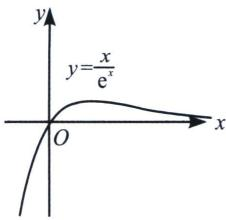
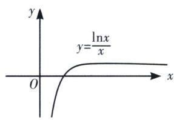
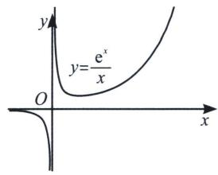
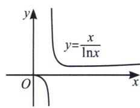

> [!faq]- 《导数专题(上册)》例题解析
>
> > [!success]- **【答案】** 详见解析
>
> > [!note]- **【分析】**
> > 本题未单列分析。
>
> > [!note]- **【解析】**
> > 解析 由题意得： $\ln x + \frac{k}{x}\geqslant 2 + \frac{1 - \mathrm{e}}{x}\Leftrightarrow x\ln x - 2x\geqslant 1 - \mathrm{e} - k\Rightarrow \mathrm{e}^2\frac{x}{\mathrm{e}^2}\ln \frac{x}{\mathrm{e}^2}\geqslant 1 - \mathrm{e} - k$ 由同构函数 $\mathrm{e}^2\frac{x}{\mathrm{e}^2}\ln \frac{x}{\mathrm{e}^2}\geqslant -\mathrm{e}$ ，故 $k\geqslant 1$
> > 如图 3: $y = \frac{x}{\mathrm{e}^x} = x \cdot \mathrm{e}^{-x} = -f(-x)$ , 即将 $f(x)$ 关于原点对称后得到 $y = \frac{x}{\mathrm{e}^x}$ , 故可得 $y = \frac{x}{\mathrm{e}^x}$ 在区间 $(-∞, 1)$ 单调递增, 在区间 $(1, +∞)$ 单调递减, 当 $x = 1$ 时, $y_{\max} = \frac{1}{\mathrm{e}}$ .
> > 如图 4: $\frac{\ln x}{x} = -\ln x^{-1} \cdot x^{-1} = -f(-\ln x)$ , 实现了凹凸反转, 原来最小值反转后变成了最大值, 或者令 $h(x) = \frac{x}{e^x}$ , $h(\ln x) = \frac{\ln x}{x}$ , 当 $\ln x \in (1, +\infty)$ , 即 $x \in (e, +\infty)$ 单调递减, 当 $\ln x \in (-\infty, 1)$ , 即 $x \in (0, e)$ 单调递增, $y_{\max} = \frac{1}{e}$ .
> > 
> > 图3
> > 
> > 图4
> > 
> > 图 5
> > 
> > 图6
> > 如图 5: $y = \frac{\mathrm{e}^{x}}{x} = -\frac{1}{-x \cdot \mathrm{e}^{-x}} = -\frac{1}{f(-x)} (x > 0)$ , 属于分式函数, 将 $\frac{1}{f(x)}$ 关于原点对称后得到, 故可得 $y = \frac{\mathrm{e}^{x}}{x}$ 在区间 (0, 1) 单调递减, 在区间 (1, +∞) 单调递增, 当 $x = 1$ 时, $y_{\min} = e$ ; 当 $x < 0$ 时, $y < 0$ .
> > 如图 6：令 $h(x)=\frac{\mathrm{e}^{x}}{x}$ ， $h(\ln x)=\frac{x}{\ln x}(x>1)$ ，故可得 $y=\frac{x}{\ln x}$ 在区间 $(1,\mathrm{e})$ 单调递减，在区间 $(\mathrm{e},+\infty)$ 单调递增，当 x=e 时， $y_{\min}=e$ 。当 0<x<1 时，y<0。
