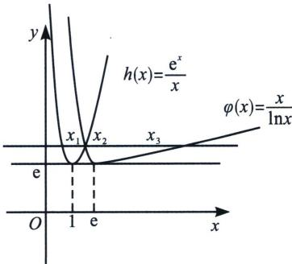

> [!faq]- 《导数专题(上册)》例题解析
>
> > [!success]- **【答案】** BCD
>
> > [!note]- **【解析】**
> > 解析 对于 A，由 $f(x) \geqslant 0$ 恒成立得 $m \leqslant \frac{e^{x}}{x}$ 在 $(0, +\infty)$ 上恒成立，令 $h(x) = \frac{e^{x}}{x} (x > 0)$ ，则 $m \leqslant$ $h(x)_{\min}, h'(x)=\frac{(x-1)e^{x}}{x^{2}}$ ，令 $h'(x)<0$ ，得0<x<1；令 $h'(x)>0$ ，得x>1，故 $h(x)$ 在(0,1)上单调递减，在 $(1,+\infty)$ 上单调递增，所以 $h(x)_{\min}=h(1)=e$ ，即 $m\leqslant e$ ，故A错误；
> >
> > 对于B，易知 $m > \mathrm{e}$ ， $\left\{ \begin{array}{l}x_{1} = m\ln x_{1}\\ x_{2} = m\ln x_{2} \end{array} \right.\Rightarrow \frac{x_{2} - x_{1}}{\ln x_{2} - \ln x_{1}} = m <   \frac{x_{1} + x_{2}}{2}\Rightarrow x_{1} + x_{2} > 2m > 2\mathrm{e},$ B正确；
> >
> > 对于 C，由选项 AB 可知 $h(x)$ ， $\varphi(x)$ 的单调性，且具有相同的极小值 e，可作出大致图象如图，
> >
> > 
> >
> > 若函数 $f(x)$ 和 $g(x)$ 共有两个不同的零点，即 $h(x)$ ， $\varphi(x)$ 与 $y=m$ 共有两个交点，显然，当且仅当 $m=e$ 时，满足题意，故 C 正确；
> >
> > 对于 D，右函数 $f(x)$ 和 $g(x)$ 共有三个不同的零点，则 y=m 经过 $h(x)$ 与 $\varphi(x)$ 的交点，如图所示，因为 $h(x)=\frac{\mathrm{e}^{x}}{x}=\frac{\mathrm{e}^{x}}{\ln\mathrm{e}^{x}}=\varphi(\mathrm{e}^{x})$ ，所以 $\varphi(\mathrm{e}^{x_{1}})=h(x_{1})=\varphi(x_{2})$ ，因为 $0<x_{1}<1$ ，所以 $1<\mathrm{e}^{x_{1}}<\mathrm{e}$ ，又 $1<x_{2}<\mathrm{e}$ ，且 $\varphi(x)$ 在 $(1,\mathrm{e})$ 上单调递减，故 $e^{x_{1}}=x_{2}$ ，同理： $e^{x_{2}}=x_{3}$ ，即 $x_{2}=\ln x_{3}$ ，又由 $h(x_{1})=\varphi(x_{3})$ 得 $\frac{e^{x_{1}}}{x_{1}}=\frac{x_{3}}{\ln x_{3}}$ ，故 $x_{1}\cdot x_{3}=e^{x_{1}}\ln x_{3}=x_{2}^{2}$ ，故 D 正确。
> >
> > 故选 **BCD**.
