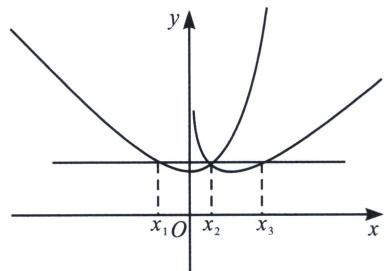

> [!faq]- 《导数专题(上册)》例题解析
>
> > [!success]- **【答案】** 详见解析
>
> > [!note]- **【解析】**
> > 解析 (1)当 $a \leqslant 0$ 时, $f(x)$ 单调递增, $g(x)$ 单调递减, 无最小值, 所以 $a > 0$
> >
> > $f'(x)=\mathrm{e}^{x}-a,\ g'(x)=a-\frac{1}{x},\ f(x)_{\min}=f(\ln a)=a-a\ln a,\ g(x)_{\min}=g\left(\frac{1}{a}\right)=1+\ln a$ ，由题知 $a-a\ln a=1+\ln a$ ，即 $\ln a=\frac{a-1}{a+1}$ ，设 $h(x)=\ln x-\frac{x-1}{x+1},\ h'(x)=\frac{1}{x}-\frac{2}{(x+1)^{2}}=\frac{x^{2}+1}{x(x+1)^{2}}>0$ ，所以 $h(x)$ 单调递增，又 $h(1)=0$ ，所以 $h(x)$ 有唯一零点x=1，故a=1.
> >
> > 
> >
> > (2)先证 $y=f(x)$ 与 $y=g(x)$ 恰有一个交点，设 $F(x)=f(x)-g(x)=\mathrm{e}^{x}+\ln x-2x$ ，由(1)知 $e^{x}\geqslant x+1$ ， $F'(x)=\mathrm{e}^{x}+\frac{1}{x}-2\geqslant x+1+\frac{1}{x}-2\geqslant1>0$ ，所以 $F(x)$ 单调递增， $F(1)=\mathrm{e}-2>0$ ，又 $F(x)=\mathrm{e}^{x}+\ln x-2x<\mathrm{e}+\ln x=0$ ，取 $x=e^{-e}$ ， $F(e^{-e})<0$ ，所以 $F(x)$ 有唯一零点，记作 $x_{2}$ ，由 $e^{x_{1}}-x_{1}=b$ ， $e^{x_{2}}-x_{2}=b$ 及 $x_{2}-\ln x_{2}=b\Leftrightarrow e^{\ln x_{2}}-\ln x_{2}=b$ ，得 $x_{1}=\ln x_{2}$ ；
> >
> > 由 $e^{x_{2}}-x_{2}=b,\quad x_{2}-\ln x_{2}=b$ 及 $x_{3}-\ln x_{3}=b\Leftrightarrow e^{\ln x_{3}}-\ln x_{3}=b$ ，得 $x_{2}=\ln x_{3}$ ；
> > 由 $e^{x_{2}}-x_{2}=x_{2}-\ln x_{2}$ ，得 $e^{x_{2}}+\ln x_{2}=2x_{2}$ ，即 $x_{3}+x_{1}=2x_{2}$ .
