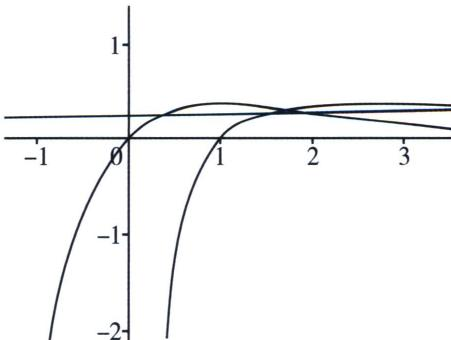

> [!faq]- 《导数专题(上册)》例题解析
>
> > [!success]- **【答案】** 详见解析
>
> > [!note]- **【解析】**
> > 解析 (1)由同构函数 $f(x)=\frac{x}{e^{x}}$ 的极值点为1，极大值为 $\frac{1}{e}$ ， $g(x)=\frac{\ln x}{x}$ 的极值点为e，极大值为 $\frac{1}{e}$ ；(2)令 $h(x)=\mathrm{e}^{x}\ln x-x^{2}$ ，当0<x<1， $h(x)=\mathrm{e}^{x}\ln x-x^{2}<0$ ，无零点，当x>1， $h'(x)=\mathrm{e}^{x}\left(\ln x+\frac{1}{x}\right)-2x>\mathrm{e}^{x}-2x>0$ ，(自证)， $h(1)=-1<0$ ， $h(e)=\mathrm{e}^{e}-\mathrm{e}^{2}>0$ ，故存在唯一 $x_{2}\in(1,e)$ 使得 $h(x)=0$ ，所以 $h(x)$ 有唯一零点，即 $y=f(x)$ 、 $y=g(x)$ 有唯一交点；
> >
> > (3)图像如图对于常数 $a \in \left(0, \frac{1}{\mathrm{e}}\right)$ , 直线 $y = a$ 和曲线 $y = f(x)$ 、 $y = g(x)$ 共有三个不同交点， $(x_1, x_2, x_3, x_{4})$
> >
> > a）、 $(x_{2}, a)$ 、 $(x_{3}, a)$ ，所以 $a=f(x_{2})$ 所以 $f(x_{1})=f(x_{2})=g(x_{2})=g(x_{3})$ ， $0<x_{1}<1<x_{2}<x_{3}$
> >
> > 
> >
> > $$
> > f (x _ {1}) = g (x _ {2}) \Leftrightarrow x _ {1} = \ln x _ {2}, f (x _ {2}) = g (x _ {3}) \Leftrightarrow x _ {2} = \ln x _ {3}
> > $$
> >
> > 所以 $x_{1}x_{3}=e^{x_{2}}\ln x_{2}=x_{2}^{2}$ ，即 $x_{1}$ 、 $x_{2}$ 、 $x_{3}$ 成等比数列.
