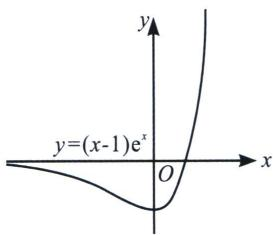
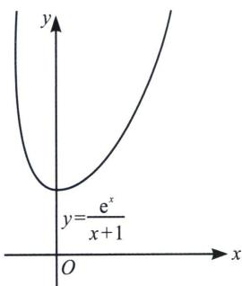
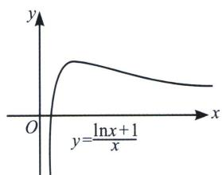
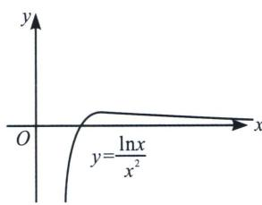

## 二、六大函数的衍生模型

我们利用这六大基本函数来分析一些与之相关函数的单调性和最值，我们举几个例子，如下：

如图 7: $(x-1)\cdot\mathrm{e}^{x}=\mathrm{e}\cdot(x-1)\cdot\mathrm{e}^{x-1}=\mathrm{e}f(x-1)$ ，即将 $f(x)=xe^{x}$ 向右平移 1 个单位，再将纵坐标扩大为原来的 e 倍，故可得 $y=(x-1)\cdot\mathrm{e}^{x}$ 在区间 $(-∞,0)$ 单调递减，在区间 $(0,+∞)$ 单调递增，当 x=0 时， $y_{\min}=-1$ .

如图8：令 $f(x) = \frac{\mathrm{e}^x}{x}$ ， $y = \frac{\mathrm{e}^x}{x + 1} = \frac{1}{\mathrm{e}} \frac{\mathrm{e}^{x + 1}}{x + 1} = \frac{1}{\mathrm{e}} f(x + 1) (x > 0)$ ，将 $f(x)$ 左移一个单位，再将纵坐标缩小为原来的 $\frac{1}{\mathrm{e}}$ 倍，故可得 $y = \frac{\mathrm{e}^x}{x + 1}$ 在区间 $(-1, 0)$ 单调递减，在区间 $(0, +\infty)$ 单调递增，当 $x = 0$ 时， $y_{\min} = 1$ .

如图9：令 $f(x) = \frac{\ln x}{x}$ ， $\frac{\ln x + 1}{x} = e\frac{\ln ex}{ex} = ef(ex)$ ，当 $ex \in (e, +\infty)$ ，即 $x \in (1, +\infty)$ 单调递减，当 $ex \in (0, e)$ ，即 $x \in (0, 1)$ 单调递增， $y_{\max} = 1$ .

如图10：令 $f(x) = \frac{\ln x}{x},\frac{\ln x}{x^2} = \frac{1}{2}\frac{\ln x^2}{x^2} = \frac{1}{2} f(x^2)$ ，当 $x^{2}\in (\mathrm{e}, + \infty)$ ，即 $x\in (\sqrt{\mathrm{e}}, + \infty)$ 单调递减，当 $x^{2}\in (0,\mathrm{e})$ ，即 $x\in (0,\sqrt{\mathrm{e}})$ 单调递增， $y_{\mathrm{max}} = \frac{1}{2\mathrm{e}}.$

  
图 7

  
图8

  
图9

  
图10

![[高中/总复习/专题/2026版高中《mst老唐说题》导数专题（数学）/上册/第01章_技能篇_导数基本技能/第一节_同构函数的基础应用/二_六大函数的衍生模型/例题/Q00046926.md]]
![[高中/总复习/专题/2026版高中《mst老唐说题》导数专题（数学）/上册/第01章_技能篇_导数基本技能/第一节_同构函数的基础应用/二_六大函数的衍生模型/例题/Q00046927.md]]
![[高中/总复习/专题/2026版高中《mst老唐说题》导数专题（数学）/上册/第01章_技能篇_导数基本技能/第一节_同构函数的基础应用/二_六大函数的衍生模型/例题/Q00046928.md]]
![[高中/总复习/专题/2026版高中《mst老唐说题》导数专题（数学）/上册/第01章_技能篇_导数基本技能/第一节_同构函数的基础应用/二_六大函数的衍生模型/例题/Q00046929.md]]
![[高中/总复习/专题/2026版高中《mst老唐说题》导数专题（数学）/上册/第01章_技能篇_导数基本技能/第一节_同构函数的基础应用/二_六大函数的衍生模型/例题/Q00046930.md]]
![[高中/总复习/专题/2026版高中《mst老唐说题》导数专题（数学）/上册/第01章_技能篇_导数基本技能/第一节_同构函数的基础应用/二_六大函数的衍生模型/例题/Q00046931.md]]
![[高中/总复习/专题/2026版高中《mst老唐说题》导数专题（数学）/上册/第01章_技能篇_导数基本技能/第一节_同构函数的基础应用/二_六大函数的衍生模型/例题/Q00046932.md]]
![[高中/总复习/专题/2026版高中《mst老唐说题》导数专题（数学）/上册/第01章_技能篇_导数基本技能/第一节_同构函数的基础应用/二_六大函数的衍生模型/例题/Q00046933.md]]
