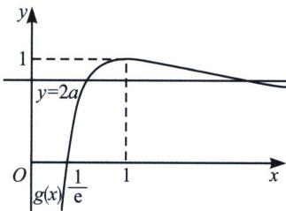

> [!faq]- 《导数专题(上册)》例题解析
>
> > [!success]- **【答案】** D
>
> > [!note]- **【解析】**
> > 解析 $f(x) = \sqrt{x} - \ln x - m, x > 0, m = \sqrt{x} - \ln x$ ，令 $t = \sqrt{x}$ ，则 $m = t - \ln t^2 = \ln \frac{e^t}{t^2} = 2\ln \frac{e^{\frac{t}{2}}}{t} = 2\ln \frac{1}{2}$ $\cdot \frac{e^{\frac{t}{2}}}{\frac{t}{2}} \geqslant 2\ln \frac{e}{2}$ ，当且仅当 $\frac{t}{2} = 1$ 时取等，实数 $m$ 的范围为 $[2 - 2\ln 2, +\infty)$ 。故选 D.
> >
> > 关于 $\frac{\mathrm{e}^x}{x^n}$ 的最值问题， $\frac{\mathrm{e}^x}{x^n} = \left(\frac{\mathrm{e}^{\frac{x}{n}}}{\frac{x}{n}}\right)^n\cdot \frac{1}{n^n}\geqslant \left(\frac{\mathrm{e}}{n}\right)^n$ ，当且仅当 $x = n$ 时取得最小值；
> >
> > 同理， $x^{n}e^{x}=\left(\frac{x}{n}e^{\frac{x}{n}}\right)^{n}\cdot n^{n}$ ，当 $n=2k-1(k\in\mathbb{N}^{*})$ 时，能取得最小值 $-\left(\frac{n}{e}\right)^{n}$ ；当 $n=2k(k\in\mathbb{N}^{*})$ 时，若 x<0，能取到最大值 $\left(\frac{n}{e}\right)^{n}$ ，都是当且仅当 x=n 取到.
> >
> > ## 例14 (山西省沁县中学 2024-2025 学年高三上学期 1 月期末 T11) 设函数 $f(x) = x \ln x$ , $g(x) = \frac{f'(x)}{x}$ ，给定下列命题
> > - **①**：不等式 $g(x)>0$ 的解集为 $\left(\frac{1}{\mathrm{e}},+\infty\right)$ ；
> > - **②**：函数 $g(x)$ 在 $(0,\mathrm{e})$ 单调递增，在 $(\mathrm{e},+\infty)$ 单调递减；
> > - **③**：$x\in\left[\frac{1}{e},1\right]$ 时，总有 $f(x)<g(x)$ 恒成立；
> > - **④**：若函数 $F(x)=f(x)-ax^{2}$ 有两个极值点，则实数 $a\in(0,1)$ .
> > 则正确的命题的个数为
> > A. 1 B. 2 C. 3 D. 4
> >
> > 解析 因为函数 $f(x) = x \ln x$ ，所以 $f'(x) = \ln x + 1$ ，令 $h(x) = \frac{\ln x}{x}$ ，则 $g(x) = \frac{\ln x + 1}{x} = e \cdot \frac{\ln ex}{ex} = eh(ex)$ ，对于①， $g(x) > 0$ 即 $\frac{\ln x + 1}{x} > 0, \ln x + 1 > 0$ ，即 $x > \frac{1}{e}$ 故正确，对于②， $h(x)$ 在(0，e)单调递增，故 $eh(ex)$ 在 $ex \in (0, e)$ 时，即 $x \in (0, 1)$ 时递增，故错误；
> > - **对于③**：，当 $x \in \left[\frac{1}{e}, 1\right]$ 时， $f(x)$
> >
> > 单调递增， $f(x) \leqslant 0$ ，当且仅当 $x = 1$ 时取等，故 $g(x) \geqslant 0$ ，当且仅当 $x = \frac{1}{\mathrm{e}}$ 时取等，故 $f(x) < g(x)$ ，故②正确；
> > - **对于④**：，若函数 $F(x) = f(x) - ax^2$ 有 2 个极值点，则 $F'(x) = f'(x) - 2ax$ 有 2 个零点，即 $\ln x + 1 - 2ax = 0$ ， $2a = \frac{\ln x + 1}{x} = g(x) = \mathrm{eh}(\mathrm{ex})$ ，即 $y = 2a$ 与 $y = g(x)$ 有两个交点，如图所示， $g(x) \in (0, 1)$ ，即 $a \in \left(0, \frac{1}{2}\right)$ 满足题意，故错误，综上，只有①③正确，故选 B.
> >
> > 
> >
> > 关于 $\mathrm{e}^x + x, x + \ln x$ 的同构问题，只需知道这两个结构都是递增的即可
