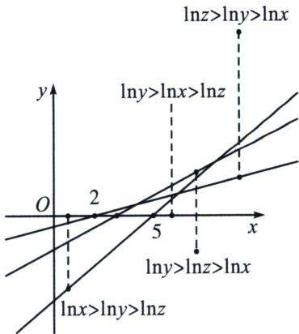

> [!faq]- 《导数专题(上)》例题解析
>
> > [!success]- **【答案】** B
>
> > [!note]- **【分析】**
> > 本题未单列分析。
>
> > [!note]- **【解析】**
> > 解析 法一(特值): 设 $2 + \log_2 x = 3 + \log_3 y = 5 + \log_5 z = k$ , 所以有 $\log_2 x = k - 2, x = 2^{k-2}$ , 同理 $y = 3^{k-3}, z = 5^{k-5}$ , 当 $k = 3$ 时, 有 $x > y > z$ , 当 $k = 5$ 时, 有 $y > x > z$ . 当 $k = 8$ 时, 有 $y > z > x$ . 选 A. 法二(构造函数): $2 + \log_2 x = 3 + \log_3 y = 5 + \log_5 z$ , 所以 $\frac{\ln x}{\ln 2} = \frac{\ln y}{\ln 3} + 1 = \frac{\ln z}{\ln 5} + 3 = k - 2$ , 所以 $\left\{ \begin{array}{l} \ln x = (k - 2) \ln 2 \\ \ln y = (k - 3) \ln 3, \text{故仅需比较} \ln x, \ln y \text{以及} \ln z \text{的大小, 作图,} \\ \ln z = (k - 5) \ln 5 \end{array} \right.$
> > 
> > 易知，只有 B 不可能，故本题选 B.
> > 当然，对于 A 可采用同构估值判断，令 $g(t)=(k-t)\ln t$ ， $g'(t)=-\ln t+1-\frac{k}{t}$ ，显然当 $k\geqslant1$ ， $g'(t)<0$ ， $g(t)\downarrow$ ， $g
