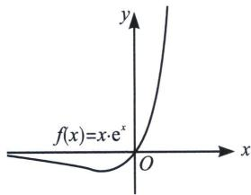
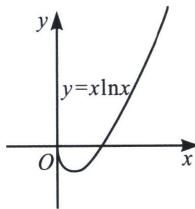

## 第一节 同构函数的基础应用

## 一、六大函数基本模型

如图1，如果 $f(x)=xe^{x}$ ， $f'(x)=(x+1)\cdot e^{x}$ ，故 $f(x)$ 在区间 $(-∞,-1)$ 单调递减，在区间 $(-1,+∞)$ 单调递增， $f(x)_{\min}=f(-1)=-\frac{1}{e}$ .

同理，如图2： $x\ln x=e^{\ln x}\cdot\ln x=f(\ln x)$ ，当 $\ln x\in(-\infty,-1)$ ，即 $x\in\left(0,\frac{1}{e}\right)$ 单调递减，当 $\ln x\in(-1,+\infty)$ ，即 $x\in\left(\frac{1}{e},+\infty\right)$ 单调递增， $y_{\min}=-\frac{1}{e}$ .

  
图1

  
图2

![[高中/总复习/专题/2026版高中《mst老唐说题》导数专题（数学）/上册/第01章_技能篇_导数基本技能/第一节_同构函数的基础应用/例题/Q00046269.md]]
![[高中/总复习/专题/2026版高中《mst老唐说题》导数专题（数学）/上册/第01章_技能篇_导数基本技能/第一节_同构函数的基础应用/例题/Q00046270.md]]
![[高中/总复习/专题/2026版高中《mst老唐说题》导数专题（数学）/上册/第01章_技能篇_导数基本技能/第一节_同构函数的基础应用/例题/Q00046271.md]]
![[高中/总复习/专题/2026版高中《mst老唐说题》导数专题（数学）/上册/第01章_技能篇_导数基本技能/第一节_同构函数的基础应用/例题/Q00046272.md]]
![[高中/总复习/专题/2026版高中《mst老唐说题》导数专题（数学）/上册/第01章_技能篇_导数基本技能/第一节_同构函数的基础应用/例题/Q00046273.md]]
![[高中/总复习/专题/2026版高中《mst老唐说题》导数专题（数学）/上册/第01章_技能篇_导数基本技能/第一节_同构函数的基础应用/例题/Q00046274.md]]
![[高中/总复习/专题/2026版高中《mst老唐说题》导数专题（数学）/上册/第01章_技能篇_导数基本技能/第一节_同构函数的基础应用/例题/Q00046275.md]]
![[高中/总复习/专题/2026版高中《mst老唐说题》导数专题（数学）/上册/第01章_技能篇_导数基本技能/第一节_同构函数的基础应用/例题/Q00046276.md]]
![[高中/总复习/专题/2026版高中《mst老唐说题》导数专题（数学）/上册/第01章_技能篇_导数基本技能/第一节_同构函数的基础应用/例题/Q00046277.md]]
![[高中/总复习/专题/2026版高中《mst老唐说题》导数专题（数学）/上册/第01章_技能篇_导数基本技能/第一节_同构函数的基础应用/例题/Q00046278.md]]
![[高中/总复习/专题/2026版高中《mst老唐说题》导数专题（数学）/上册/第01章_技能篇_导数基本技能/第一节_同构函数的基础应用/例题/Q00046279.md]]
![[高中/总复习/专题/2026版高中《mst老唐说题》导数专题（数学）/上册/第01章_技能篇_导数基本技能/第一节_同构函数的基础应用/例题/Q00046280.md]]
![[高中/总复习/专题/2026版高中《mst老唐说题》导数专题（数学）/上册/第01章_技能篇_导数基本技能/第一节_同构函数的基础应用/例题/Q00046281.md]]
![[高中/总复习/专题/2026版高中《mst老唐说题》导数专题（数学）/上册/第01章_技能篇_导数基本技能/第一节_同构函数的基础应用/例题/Q00046282.md]]
![[高中/总复习/专题/2026版高中《mst老唐说题》导数专题（数学）/上册/第01章_技能篇_导数基本技能/第一节_同构函数的基础应用/例题/Q00046283.md]]
![[高中/总复习/专题/2026版高中《mst老唐说题》导数专题（数学）/上册/第01章_技能篇_导数基本技能/第一节_同构函数的基础应用/例题/Q00046284.md]]
![[高中/总复习/专题/2026版高中《mst老唐说题》导数专题（数学）/上册/第01章_技能篇_导数基本技能/第一节_同构函数的基础应用/例题/Q00046285.md]]
![[高中/总复习/专题/2026版高中《mst老唐说题》导数专题（数学）/上册/第01章_技能篇_导数基本技能/第一节_同构函数的基础应用/例题/Q00046286.md]]
![[高中/总复习/专题/2026版高中《mst老唐说题》导数专题（数学）/上册/第01章_技能篇_导数基本技能/第一节_同构函数的基础应用/例题/Q00046287.md]]
![[高中/总复习/专题/2026版高中《mst老唐说题》导数专题（数学）/上册/第01章_技能篇_导数基本技能/第一节_同构函数的基础应用/例题/Q00046288.md]]
![[高中/总复习/专题/2026版高中《mst老唐说题》导数专题（数学）/上册/第01章_技能篇_导数基本技能/第一节_同构函数的基础应用/例题/Q00046289.md]]
![[高中/总复习/专题/2026版高中《mst老唐说题》导数专题（数学）/上册/第01章_技能篇_导数基本技能/第一节_同构函数的基础应用/例题/Q00046290.md]]
![[高中/总复习/专题/2026版高中《mst老唐说题》导数专题（数学）/上册/第01章_技能篇_导数基本技能/第一节_同构函数的基础应用/例题/Q00046291.md]]
![[高中/总复习/专题/2026版高中《mst老唐说题》导数专题（数学）/上册/第01章_技能篇_导数基本技能/第一节_同构函数的基础应用/例题/Q00046292.md]]
![[高中/总复习/专题/2026版高中《mst老唐说题》导数专题（数学）/上册/第01章_技能篇_导数基本技能/第一节_同构函数的基础应用/例题/Q00046293.md]]
![[高中/总复习/专题/2026版高中《mst老唐说题》导数专题（数学）/上册/第01章_技能篇_导数基本技能/第一节_同构函数的基础应用/例题/Q00046294.md]]
![[高中/总复习/专题/2026版高中《mst老唐说题》导数专题（数学）/上册/第01章_技能篇_导数基本技能/第一节_同构函数的基础应用/例题/Q00046295.md]]
![[高中/总复习/专题/2026版高中《mst老唐说题》导数专题（数学）/上册/第01章_技能篇_导数基本技能/第一节_同构函数的基础应用/例题/Q00046296.md]]
![[高中/总复习/专题/2026版高中《mst老唐说题》导数专题（数学）/上册/第01章_技能篇_导数基本技能/第一节_同构函数的基础应用/例题/Q00046297.md]]
![[高中/总复习/专题/2026版高中《mst老唐说题》导数专题（数学）/上册/第01章_技能篇_导数基本技能/第一节_同构函数的基础应用/例题/Q00046298.md]]
![[高中/总复习/专题/2026版高中《mst老唐说题》导数专题（数学）/上册/第01章_技能篇_导数基本技能/第一节_同构函数的基础应用/例题/Q00046299.md]]
![[高中/总复习/专题/2026版高中《mst老唐说题》导数专题（数学）/上册/第01章_技能篇_导数基本技能/第一节_同构函数的基础应用/例题/Q00046300.md]]
![[高中/总复习/专题/2026版高中《mst老唐说题》导数专题（数学）/上册/第01章_技能篇_导数基本技能/第一节_同构函数的基础应用/例题/Q00046301.md]]
![[高中/总复习/专题/2026版高中《mst老唐说题》导数专题（数学）/上册/第01章_技能篇_导数基本技能/第一节_同构函数的基础应用/例题/Q00046302.md]]
![[高中/总复习/专题/2026版高中《mst老唐说题》导数专题（数学）/上册/第01章_技能篇_导数基本技能/第一节_同构函数的基础应用/例题/Q00046303.md]]
![[高中/总复习/专题/2026版高中《mst老唐说题》导数专题（数学）/上册/第01章_技能篇_导数基本技能/第一节_同构函数的基础应用/例题/Q00046304.md]]
![[高中/总复习/专题/2026版高中《mst老唐说题》导数专题（数学）/上册/第01章_技能篇_导数基本技能/第一节_同构函数的基础应用/例题/Q00046305.md]]
![[高中/总复习/专题/2026版高中《mst老唐说题》导数专题（数学）/上册/第01章_技能篇_导数基本技能/第一节_同构函数的基础应用/例题/Q00046306.md]]
![[高中/总复习/专题/2026版高中《mst老唐说题》导数专题（数学）/上册/第01章_技能篇_导数基本技能/第一节_同构函数的基础应用/例题/Q00046307.md]]
![[高中/总复习/专题/2026版高中《mst老唐说题》导数专题（数学）/上册/第01章_技能篇_导数基本技能/第一节_同构函数的基础应用/例题/Q00046308.md]]
![[高中/总复习/专题/2026版高中《mst老唐说题》导数专题（数学）/上册/第01章_技能篇_导数基本技能/第一节_同构函数的基础应用/例题/Q00046309.md]]
![[高中/总复习/专题/2026版高中《mst老唐说题》导数专题（数学）/上册/第01章_技能篇_导数基本技能/第一节_同构函数的基础应用/例题/Q00046310.md]]
![[高中/总复习/专题/2026版高中《mst老唐说题》导数专题（数学）/上册/第01章_技能篇_导数基本技能/第一节_同构函数的基础应用/例题/Q00046311.md]]
![[高中/总复习/专题/2026版高中《mst老唐说题》导数专题（数学）/上册/第01章_技能篇_导数基本技能/第一节_同构函数的基础应用/例题/Q00046312.md]]
![[高中/总复习/专题/2026版高中《mst老唐说题》导数专题（数学）/上册/第01章_技能篇_导数基本技能/第一节_同构函数的基础应用/例题/Q00046313.md]]
![[高中/总复习/专题/2026版高中《mst老唐说题》导数专题（数学）/上册/第01章_技能篇_导数基本技能/第一节_同构函数的基础应用/例题/Q00046314.md]]
![[高中/总复习/专题/2026版高中《mst老唐说题》导数专题（数学）/上册/第01章_技能篇_导数基本技能/第一节_同构函数的基础应用/例题/Q00046315.md]]
![[高中/总复习/专题/2026版高中《mst老唐说题》导数专题（数学）/上册/第01章_技能篇_导数基本技能/第一节_同构函数的基础应用/例题/Q00046316.md]]
![[高中/总复习/专题/2026版高中《mst老唐说题》导数专题（数学）/上册/第01章_技能篇_导数基本技能/第一节_同构函数的基础应用/例题/Q00046317.md]]
![[高中/总复习/专题/2026版高中《mst老唐说题》导数专题（数学）/上册/第01章_技能篇_导数基本技能/第一节_同构函数的基础应用/例题/Q00046318.md]]
![[高中/总复习/专题/2026版高中《mst老唐说题》导数专题（数学）/上册/第01章_技能篇_导数基本技能/第一节_同构函数的基础应用/例题/Q00046319.md]]
![[高中/总复习/专题/2026版高中《mst老唐说题》导数专题（数学）/上册/第01章_技能篇_导数基本技能/第一节_同构函数的基础应用/例题/Q00046320.md]]
![[高中/总复习/专题/2026版高中《mst老唐说题》导数专题（数学）/上册/第01章_技能篇_导数基本技能/第一节_同构函数的基础应用/例题/Q00046321.md]]
![[高中/总复习/专题/2026版高中《mst老唐说题》导数专题（数学）/上册/第01章_技能篇_导数基本技能/第一节_同构函数的基础应用/例题/Q00046322.md]]
![[高中/总复习/专题/2026版高中《mst老唐说题》导数专题（数学）/上册/第01章_技能篇_导数基本技能/第一节_同构函数的基础应用/例题/Q00046323.md]]
![[高中/总复习/专题/2026版高中《mst老唐说题》导数专题（数学）/上册/第01章_技能篇_导数基本技能/第一节_同构函数的基础应用/例题/Q00046324.md]]
![[高中/总复习/专题/2026版高中《mst老唐说题》导数专题（数学）/上册/第01章_技能篇_导数基本技能/第一节_同构函数的基础应用/例题/Q00046325.md]]
