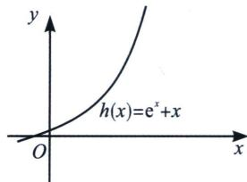
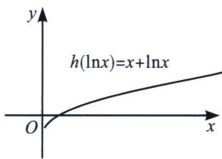
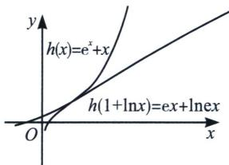

考点1：构造单调函数 $\mathrm{e}^x + x$ 或 $x + \ln x$

如图， $h(x)=x+e^{x}\Rightarrow h(\ln x)=x+\ln x$ ，易知 $h(x)$ 为单调增函数(图1)，则 $h(\ln x)=x+\ln x$ 也为单调增函数(图2)，我们知道 $x\geqslant\ln x+1$ ，故一定有 $h(x)=x+e^{x}\geqslant h(\ln x+1)=ex+\ln ex$ （图3）

  
图1

  
图2

  
图3

若 $h(x)$ 在区间 D 上具备单调性，则 $h(p(x))\geqslant h(q(x))$ 时，一定有 $p(x)\geqslant q(x)$ （或者 $p(x)\leqslant q(x)$ ）；

常见的单调性母函数模板：

① $h(x)=a^{x}+x(a>1)$ 在定义域内单调递增；

![[高中/总复习/专题/2026版高中《mst老唐说题》导数专题（数学）/上册/第01章_技能篇_导数基本技能/第一节_同构函数的基础应用/考点1_构造指数对数单调函数/例题/Q00046940.md]]
![[高中/总复习/专题/2026版高中《mst老唐说题》导数专题（数学）/上册/第01章_技能篇_导数基本技能/第一节_同构函数的基础应用/考点1_构造指数对数单调函数/例题/Q00046941.md]]
![[高中/总复习/专题/2026版高中《mst老唐说题》导数专题（数学）/上册/第01章_技能篇_导数基本技能/第一节_同构函数的基础应用/考点1_构造指数对数单调函数/例题/Q00046942.md]]
![[高中/总复习/专题/2026版高中《mst老唐说题》导数专题（数学）/上册/第01章_技能篇_导数基本技能/第一节_同构函数的基础应用/考点1_构造指数对数单调函数/例题/Q00046943.md]]
![[高中/总复习/专题/2026版高中《mst老唐说题》导数专题（数学）/上册/第01章_技能篇_导数基本技能/第一节_同构函数的基础应用/考点1_构造指数对数单调函数/例题/Q00046944.md]]
![[高中/总复习/专题/2026版高中《mst老唐说题》导数专题（数学）/上册/第01章_技能篇_导数基本技能/第一节_同构函数的基础应用/考点1_构造指数对数单调函数/例题/Q00046945.md]]
![[高中/总复习/专题/2026版高中《mst老唐说题》导数专题（数学）/上册/第01章_技能篇_导数基本技能/第一节_同构函数的基础应用/考点1_构造指数对数单调函数/例题/Q00046946.md]]
![[高中/总复习/专题/2026版高中《mst老唐说题》导数专题（数学）/上册/第01章_技能篇_导数基本技能/第一节_同构函数的基础应用/考点1_构造指数对数单调函数/例题/Q00046947.md]]
