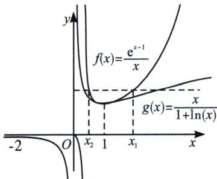
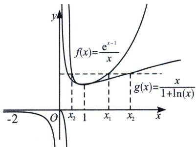
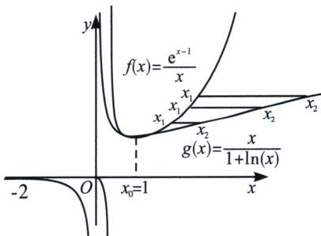

> [!faq]- 《导数专题(上册)》例题解析
>
> > [!success]- **【答案】** 详见解析
>
> > [!note]- **【分析】**
> > 本题未单列分析。
>
> > [!note]- **【解析】**
> > 解析 由题意 $g(x)=\frac{x}{1+\ln x}=\frac{x}{\ln(\mathrm{e}x)}=\frac{\mathrm{e}^{\ln(\mathrm{e}x)-1}}{\ln(\mathrm{e}x)}$ ，故 $g(x)=f(1+\ln x)$ ，因为 $x\geqslant1+\ln x$ ，故 $f(x)\geqslant f(1+\ln x)$ ，且x=1时，如下图， $f(x)$ 与 $g(x)$ 都是先减后增，且同时取得极小值1；在递减区间时， $f(1+\ln x)$ 图像更为陡；在递增区间时， $f(x)$ 图像更为陡；
> > 
> > 
> > 
> > 因为 $f(x_{1})=g(x_{2})=f(1+\ln x_{2})$ .
> > - **①**：若 $1 + \ln x_{2} < 0$ ，即 $0 \leqslant x_{2} < \frac{1}{e}$ ，则 $f(x_{1}) - f(1 + \ln x_{2}) < 0$ ，此时 $x_{1} < 0$ ，因为函数 $f(x)$ 在 $(-∞, 0)$ 上单调递减，则 $x_{1} = 1 + \ln x_{2} < x_{2}$ ;
> > - **②**：若 $0 < 1 + \ln x_{2} < 1$ ，即 $\frac{1}{e} < x_{2} < 1$ ，由于函数 $f(x)$ 在 $(0, 1)$ 上递减，在 $(1, +\infty)$ 上递增，则存在 $x_{1} > 1$ ，使得 $f(x_{1}) = f(1 + \ln x_{2})$ ，此时 $1 + \ln x_{2} < x_{2} < 1 < x_{1}$ ，存在 $x_{1} \in (0, 1)$ ，使得 $f(x_{1}) = f(1 + \ln x_{2})$ ，此时 $x_{1} = 1 + \ln x_{2} < x_{2} < 1$ ;
> > - **③**：若 $l + \ln x_{2} = 1$ ，即 $x_{2} = 1$ ，则 $f(x) = f
