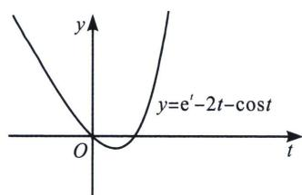
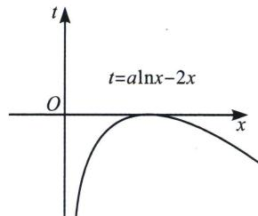

> [!faq]- 《导数专题(上册)》例题解析
>
> > [!success]- **【答案】** $(0,2e]$
>
> > [!note]- **【解析】**
> > 解析 $x^{a} \geqslant 2\mathrm{e}^{2x}f(x) + \mathrm{e}^{2x}\cos [f(x)] \Leftrightarrow \mathrm{e}^{\mathrm{a}\ln x - 2x} - 2f(x) - \cos [f(x)] \geqslant 0 \Leftrightarrow \mathrm{e}^{f(x)} - 2f(x) - \cos [f(x)] \geqslant 0$ ，令 $t = f(x)$ ，则 $g(t) = \mathrm{e}^{t} - 2t - \cos t$ ， $g'(t) = \mathrm{e}^{t} - 2 + \sin t$ ，设 $h(t) = \mathrm{e}^{t} - 2 + \sin t$ ，则 $h'(t) = \mathrm{e}^{t} + \cos t$ ，当 $t \leqslant 0$ 时， $\mathrm{e}^{t} \leqslant 1$ ， $\sin t \leqslant 1$ ，且等号不同时成立，则 $g'(t) < 0$ 恒成立，当 $t > 0$ 时， $\mathrm{e}^{t} > 1$ ， $\cos t \geqslant -1$ ，则 $h'(t) > 0$ 恒成立，则 $g'(t)$ 在 $(0, +\infty)$ 上单调递增，又因为 $g'(0) = -1$ ， $g'(1) = \mathrm{e}^{-2 + \sin 1 > 0}$ ，因此存在 $t_0 \in (0, 1)$ ，使得 $g'(t_0) = 0$ ，当 $0 < t < t_0$ 时， $g'(t) < 0$ ，当 $t > t_0$ 时， $g'(t) > 0$ ，所以函数 $g(t)$ 在 $(- \infty, t_0)$ 上单调递减，在 $(t_0, +\infty)$ 上单调递增，又 $g(0) = 0$ ，作出函数 $g(t)$ 的图象如下：
> >
> > 
> >
> > 
> >
> > 根据复合嵌套函数知识可得，当 $t=a\ln x-2x\leqslant0$ 恒成立时才能满足题意，①当 a<0 时， $f(x)$ 在 $(0,+\infty)$ 上单调递减，当 $x\to0^{+}$ 时， $f(x)\to+\infty$ ，当 $x\to+\infty$ 时， $f(x)\to-\infty$ ，故 $t=f(x)\in\mathbb{R}, g(t_{0})<0$ ，不合题意；
> > - **②**：当 a>0 时，由 $f'(x)<0$ 得 $x>\frac{a}{2}$ ，由 $f'(x)<0$ 得 $0<x<\frac{a}{2}$ ，函数 $f(x)$ 在 $\left(0,\frac{a}{2}\right)$ 上单调递增，在 $\left(\frac{a}{2},+\infty\right)$ 上单调递减， $f(x)_{\max}=f\left(\frac{a}{2}\right)=a\ln\frac{a}{2}-a$ ，当 $a\ln\frac{a}{2}-a\leqslant0$ 时，即当 $0<a\leqslant2e$ 时， $g(t)\geqslant0$ 恒成立，符合题意，故答案为： $(0,2e]$ .
